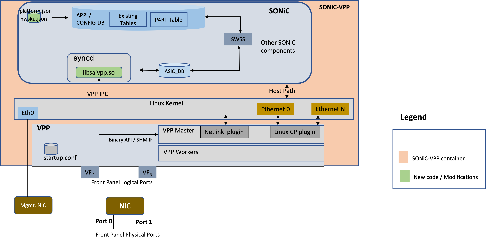
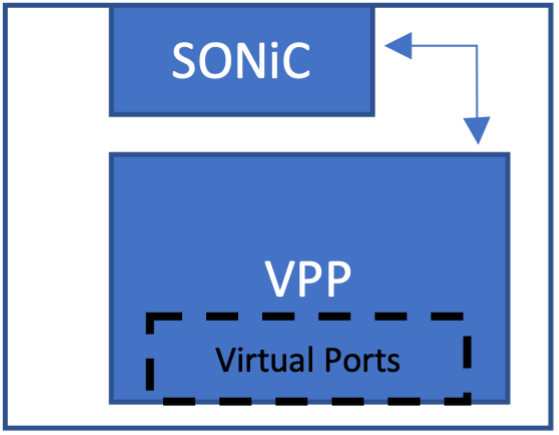
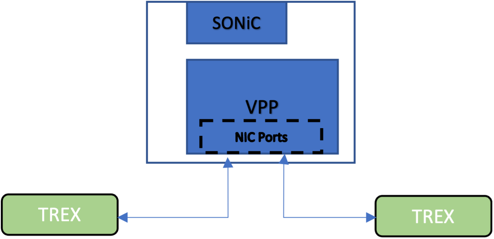

# SONIC VPP Platform HLD
Rev v0.2

**Caveat**- Document is work in progress. 


<br/>
<br/>

## Table of Contents

1. [Revisions](#item-1)
2. [Scope](#item-2)
3. [Definitions/Abbreviations](#item-3)
4. [Introduction](#item-4)
5. [Usecases Targeted](#item-5)
6. [Proposed Solution](#item-6)
7. [Architecture Overview](#item-7)
8. [vpp libsai](#item-8)
9. [Theory of Operation](#item-9)
10. [VPP Datapath ](#item-10)
    - [startup.conf](#item-101)
    - [VPP Features](#item-102)
    - [How is VPP Consumed](#item-103)
11. [SONIC-VPP Communication](#item-11)
    - [API Semantics](#item-111)
    - [Sample API translation for IP Route](#item-112)
12. [Interfaces](#item-12)
    - [Front-panel Port Create Flow](#item-121)
    - [Host Path handling](#item-122)
    - [Interface Create Flow by Type](#item-123)
13. [Repositories](#item-13)
14. [Configuration and Management](#item-14)
15. [VPP Restart](#item-15)
16. [Warm and Fastboot Design Impact](#item-16)
17. [Packaging](#item-17)
18. [Restrictions/Limitations](#item-18)
19. [Testing](#item-19)

<br/>
<br/>

<a id="item-1"></a>
## Revisions

| Rev | Date | Author(s) |
|-----|------|-----------|
|v0.1 | 03/28/2023 | Shashishar Patil (Cisco), Sameer Nanajkar (Cisco) |
|v0.2 | 06/02/2025 | Yue (Fred) Gao (Cisco), Akeel Ali (Cisco) |


<br/>
<br/>

<a id="item-2"></a>
## Scope
This document describes the high level design of integrating VPP data path into SONiC. It provides
 - Theory of operation
 - Details of what needs to be added/modified in the SONiC framework

<br/>

<a id="item-3"></a>
## Definitions/Abbreviations
**VPP**: Vector Packet Processing (VPP) technology based high performance packet processing stack that can run on commodity CPUs. For more details see [What is VPP](https://wiki.fd.io/view/VPP/What_is_VPP%3F)

**SRIOV**: Single Root I/O virtualization (SRIOV) is a PCIe extension that allows a device (e.g. NIC) to separate access to its resources among various hardware functions

**VF**: Virtual Function

**PF**: Physical Function

**SAI**: Switch Abstraction Interface (SAI) is a standardized interface which allows programming and managing different switch ASICs in a vendor-independent fashion.


<br/>
<br/>

<a id="item-4"></a>
## Introduction
There is a need for a new SONiC software datapath that is 
 - Performant and feature rich 
 - Addresses the limitations of SONiC Virtual Switch
 - Packaged in various form factors (*e.g. single container, multi container, VM*) along with SONiC control plane
 - Used as a SONiC development vehicle
 - Runs on multiple commodity hardware (*x86, ARM, Intel/Mellanox/other NICs*)     

 
<a id="item-5"></a>
## Use Cases Targeted
 - SONiC Development Vehicle
 - Virtual Gateway 
 - Services (*Stateful Firewall, NAT, IPSec, DPI, etc*) 
 - Scaled Testing

 
<a id="item-6"></a>
## Proposed Solution
Replace SONiC *Virtual Switch* with **VPP**. **VPP (Vector Packet Processor)** is a packet processing development platform for high performance network applications. It runs in user space and creates a vector of packet indices and processes them using directed graph nodes resulting in a highly performant solution. VPP is an open source project. For more details see [What is VPP](https://s3-docs.fd.io/vpp/23.06/)

 
<a id="item-7"></a>
## Architecture Overview

Figure below shows the architecture of SONiC-VPP where SONIC components and VPP run in a single container.



There are NO changes to the SONiC system architecture. VPP fits in the same manner VS platform did. To integrate with VPP a new platform called `VPP' is added. 

The salient aspects of the architecture are listed below
 - A new platform called vpp is added to SONiC under platform/vpp in sonic-buildimage. sonic-vpp image can be built using PLATFORM=vpp.
 - vpp runs as a Linux process inside syncd container.
 - SONIC interacts with VPP to configure features, get statistics, get asynchronous notifications (e.g. link down events)
 - There is no change to the way SONiC operates. The configurations are handled by SONiC control plane components and updated into ASIC_DB.  
 - vpp libsai in syncd process communicates with the VPP process using [VPP Binary APIs](https://docs.fd.io/vpp/17.10/api_doc.html). 
 - The Linux network name space is shared between SONIC components and VPP. Note- This will not be applicable for a few scenarios (e.g. when they run in different containers)
 - The VPP plugin *Linux CP plugin* is used for host path and maps the front panel ports to corresponding Linux interfaces (tap).
 - Note: The VPP *Netlink plugin* is not currently used. This plugin allows sync'ing of interface state from Linux to VPP. Instead, we rely on SONiC SAI calls to update the VPP state.
 - A platform service `sonic-platform-modules-vpp` configures vpp interfaces based on vm interface setup during boot time.

<a id="item-8"></a>
## vpp libsai
This library implements the SAI SDK for VPP data path platform. It is responsible for
  - Setting up VPP IPC with VPP process. 
  - Translate SAI API requests to VPP Binary API requests and dispatch them via VPP IPC
  - Maintain state as needed
  - Translate the incoming notifications from the VPP data path container to SONiC message and forward them to control plane.
  - Pull or process the metrics from VPP data path and return the metrics to SAI stats-debug layer.

From SONiC 2025.05 release, vpp libsai has been merged with vs libsai in sonic-sairedis. There are 2 main reasons.
  - Removing duplicate code. Original vpp libsai source code is copied from vs libsai. There 128 files but only 21 files are created or modified for vpp. The rest of the files are common code between vs and vpp.
  - Keeping vpp libsai code up to date. Above common code is modified from time to time when sai version is upgraded or syncd behavior changed. By removing the copy of the common code in vpp libsai, we keep it always up to date.

Here are the changes in combining vpp and vs libsai.
  - Moving SONiC-VPP libsai code to sonic-sairedis/vslib/vpp
  - Making SwitchStateBase of vpp a subclass of SwitchStateBase in vs, called SwitchVpp
  - SwitchVpp is the 6th virtual switch type in vslib. It is instantiated by syncd based on switch type `SAI_VS_SWITCH_TYPE_VPP` in sai.profile

<a id="item-9"></a>
## Theory of Operation

## Container image
 - The `start_sonic_vpp.sh` script when run, 
    - Generates the VPP configuration file based on specified inputs (i.e. interface list, etc)
    - Launches the SONIC VPP container

launches the SONIC-VPP container and generates the following configuration files 
   - SONiC configuration files platform.json, hwsku.json, config_db.json
   - VPP configuration file with the specified NIC ports, CPU cores, Memory, etc 
 - `start_sonic.sh` starts the supervisord daemon
 - SONiC processes are spawned 
 - VPP process is started with the generated `startup.conf` file. 
 - vpp libsai establishes communication with VPP 
 - The front panel ports become visible as EthernetX tap interfaces to SONiC
 - vpp libsai establishes connection with VPP and configures the data path
 - The system is ready

## VM image


<a id="item-10"></a>
## VPP Data Path 
VPP is responsible for the following functions
 - Managing the network ports (*e.g. tap interfaces, SRIOV Virtual Functions, VT-D Pass through ports*)
 - Fast packet IO using DPDK
 - Feature processing (*routing, switching, tunnels, QoS, ACL, etc*)
 - Notifying events (*e.g. link flap*) to vpp libsai
 - Host path packet handling
 - Portability across multiple commodity CPU architectures (*Intel, AMD, ARM*) and NICs (*Intel, Mellanox, etc*)
 
It has two functional parts.

 - Master Thread\
   Takes care of handling configuration requests from syncd to program the VPP datapath structures using [VPP Binary APIs](https://docs.fd.io/vpp/17.10/api_doc.html). Care needs to be taken so that the control path-data path messaging design doesn't overwhelm this thread. There is only one master thread. The queries, get requests, sent by clients are processed by the Master thread. The master thread also sends asynchronous notifications, say interface link going down to the client application/s.
   
 - Data Workers\
   They handle the packet/flow processing needed by the features enabled. The packets ingress and egress from the worker threads. Each worker is instantiated as a POSIX thread. The number of workers is configurable at VPP boot time (*via startup.conf*). 

For performance reasons the master and worker threads can be pinned to CPU cores.  

<a id="item-101"></a>
### startup.conf
This file can be tailored to configure the VPP network stack as desired. For more details on configuration options see [startup.conf](https://my-vpp-docs.readthedocs.io/en/latest/gettingstarted/users/configuring/startup.html). In the current design the script *vpp_init.sh* reads the VPP configuration parameters from a file and generates the *startup.conf* file. The *vpp_init.sh* file is invoked when the container is launched by `supervisord`. In future the configuration parameters will come from CONFIG DB. 

<a id="item-102"></a>
### VPP Features
See link for [VPP Supported Features](https://s3-docs.fd.io/vpp/25.06/aboutvpp/featurelist.html). Over time SONIC-VPP will match the features supported by SONIC. See TODO.md for details on execution phasing.  

<a id="item-103"></a>
### How is VPP consumed
Starting from SONiC 2025.05 release, prebuilt vpp for SONiC is downloaded from [buildkite](https://buildkite.com/organizations/sonic-vpp/packages) at the time of building sonic-vpp image. The vpp packages are built from vpp source code plus patches under platform/vpp/vppbld/vpp.patch. The patch includes a custom plugin for tunnel termination ACL, which is not yet ready to be upstreamed to FDio. For the changes that are in the process of upstreaming to FDio, they can be added to the patch temporarily. 

When there is a need to upgrade prebuilt vpp, either to update base vpp version or apply a new vpp patch, one can follow the [instructions](https://github.com/sonic-net/sonic-platform-vpp/blob/main/vppbld/README.md).

<a id="item-11"></a>
## SONIC - VPP Communication

<a id="item-111"></a>
### API Semantics
The SAI APIs are a set of CRUD operations on an Object type (~100+). Each object type has specific attributes.

VPP supports a message passing interface called VPP Binary APIs. VPP supports the following method types 
 - Request/Reply\
   (1 request -> 1 reply)
 - Dump/Detail\
   (1 request -> N replies) 
 - Events
   (1 request -> 1 reply + N notifications) 

The number of VPP binary APIs is around 1900. For details see [VPP Binary APIs](https://docs.fd.io/vpp/17.10/api_doc.html) 

The SAI APIs need to be translated to the corresponding VPP API/s. Figure below shows the end-end communication path 

     ------------     config   ----------  config notify      -------------------  Req (sync)       ---------
     |  SONiC   |   -------->  |  Redis | -------------->     |  vpp libsai   | ---------------> |  VPP   |  Events
     |          |              |ASIC DB | <--------------     |   xlate logic   | <--------------  |        | <------
     ------------              ---------- config resp/notify  ------------------   Resp/Notify     ---------

The flow is 
 - All configuration, updates get reflected in ASIC_DB
 - Any updates to ASIC_DB triggers the libsaiapp.so in syncd process. There is a translation logic here that maps the SAI APIs to VPP binary APIs. 
 - There is a Request-Response pattern between the vpp libsai and VPP. VPP sends back a response to each request. It returns an OK in case the API was processed successfully. In case of error the vpp libsai propagates the error via the SAI API error response message to the control plane.

The API  mapping is often non-trivial and requires state to be maintained for objects configured. The fact the VPP unlike SAI does not support 
 - Single attribute update or
 - Bulk updates

making the translation non-trivial.  

<a id="item-112"></a>
### Sample API translation for IP Routes

| SONIC Operation |  SAI API  | VPP APIs |
------------------|-----------|----------|
|Route Add | `create_route_entry` | `vl_api_ip_route_add_del_t (ADD, route)` |
|Bulk Route Add | `create_route_entries` | `for all routes {`</br> `    vl_api_ip_route_add_del_t (ADD, route)`</br> } |
|Route Modify | `set_route_entry_attribute` | `vl_api_ip_route_add_del_t (DEL, oldroute)`</br> `vl_api_ip_route_add_del_t (ADD, newroute)`  |
|Route Delete | `remove_route_entry` | `vl_api_ip_route_add_del_t (DEL, route)` |
|Route Get | `get_route_entry_attribute` | `vl_api_ip_route_lookup_t (prefix)` |
|Bulk Route Get | `get_route_entries_attribute` | `vl_api_ip_route_dump_t` |

<a id="item-12"></a>
## Interfaces 
SONIC-VPP sees the interfaces exposed to it as front panel ports. Interfaces that can be exposed to SONIC-VPP are
 - VEth interfaces 
 - Virtual Functions (VF) of a NIC in SRIOV mode 
 - Front panel ports of a NIC in Passthrough mode (VT-D)

The interfaces are specified at the time of SONIC-VPP container/VM instantiation. These interfaces are managed by VPP. The VPP Request/Response APIs deal with port statistics, configurations etc while the notification mechanism deals with events like link flap etc. These front panel ports are exposed to SONIC control plane via Tap interfaces. There is a 1:1 mapping between the front panel ports and tap interfaces (i.e. seen as network interfaces in the Linux network namespace). 

              -------------------------------------
              |     SONIC Control Plane           |
              -------------------------------------
                  |                           |
              ----------                   ---------
              |  Tap 1 |                   | Tap 2 |
              ----------                   ---------
                  | 1:1                       |  1:1     Link events to vpp libsai
                  |                           |          ^ 
              ----------                   ---------     |
              |  VF 1  |                   | VF 2  |  ---| 
              ----------                   ---------             where
                  |                           |                     VF's are SONIC front panel ports
                  -----------------------------                     PF is NIC physical port
                  | Physical Function (PF)    |
                  -----------------------------
                             |
                         NIC Port 0 


<a id="item-121"></a>
### Front-panel Port Create Flow

1. First, on system boot, the `vpp-cfg-init` file will detect the available ports (eth1 up to eth32) and will generate the configuration files and environment variables needed to provision them in VPP and SONiC. The `vpp-cfg-init` script will generate the following files:

    a. `syncd_vpp_env`: contains environment variables for VPP.
    ```
    DPDK_DISABLE=n
    VPP_DPDK_PORTS=0000:00:04.0,0000:00:05.0
    SONIC_NUM_PORTS=2
    VPP_PORT_LIST=eth1,eth2
    NO_LINUX_NL=y
    ```
    b. `sonic_vpp_ifmap.ini`: maps SONiC Ethernet interfaces to VPP port names.
   ```
   Ethernet0 bobm0
   Ethernet4 bobm1
   ```
   c. `config_db.json`: the SONiC configuration database based on the detected ports.
   ```
		  "PORT": {
		    "Ethernet0": {
		     ...
		    },
		    "Ethernet4": {
		     ...
		    }
		  },
   ```

2. Second, the `vpp-port-config` systemd service runs and invokes `vpp_ports_setup.sh` to bind the ports to the required driver for VPP/DPDK.

    a. Input: `syncd_vpp_env`

    b. Output: Updated drivers, eg.
    ```
    cisco@vpp-01:~$ lspci -k -s 0000:00:04.0
    00:04.0 Ethernet controller: Red Hat, Inc. Virtio network device
            Subsystem: Red Hat, Inc. Virtio network device
            Kernel driver in use: uio_pci_generic
            Kernel modules: virtio_pci
    ```

3. Third, on `syncd`, the `vpp_init.sh` file is invoked by `supervisord` to generate the VPP startup configuration (with the appropriate port configs) to launch VPP.

   a. Input: `syncd_vpp_env`

   b. Output: startup config and vpp launched
   ```
   ...
			dpdk {
			        dev 0000:00:04.0 {
			            name bobm0
			        }
			        dev 0000:00:05.0 {
			            name bobm1
			        }
   ...
   ```

4. Finally, SONiC loads the startup `config_db.json`, which triggers `SAI_OBJECT_TYPE_HOSTIF` create calls for each front-panel port defined in the config. These calls are passed on to VPP's `configure_lcp_interface` which will create the corresponding tap interfaces and pair them with the corresponding VPP DPDK interface using the mapping from `sonic_vpp_ifmap.ini`.

<a id="item-122"></a>
### Host path handling 
 - Inbound packets\
   Packets are intercepted by VPP data path and injected into SONiC network namespace. The injection of packets is currently done via the Linux CP plugin of VPP. This works as the SONIC and VPP are packaged into a single container and share the same network namespace. In future we need to support scenario of non shared network namespaces (e.g. when SONiC and VPP run in separate containers or different machines). 

 - Outbound packets\
   Packets generated by SONiC control plane are intercepted from the Linux kernel and forwarded to VPP datapath to be sent out on the appropriate front panel port. In shared namespace scenarios this is made possible by the Linux CP plugin of VPP. In future we need to support the non-shared network namespace scenarios. 

### Special Case: Handling Non-Tap Interfaces

The front panel interfaces are created as tap interfaces and used by the Linux CP plugin directly to be paired with the associated VPP phy interface. This pairing allows inbound and outbound packets to flow seamlessly between them.

Other interfaces created by SONiC on the Host (like PortChannels and Loopback interfaces) cannot be used directly by the Linux CP plugin as they are not tap interfaces. To get around this, we let the Linux CP plugin instantiate a dummy tap interface which is paired with the associated phy interface on VPP. This dummy tap interface then has all of its ingress punted traffic redirected to the corresponding host interface using Linux tc filters.

For example, a PortChannel10 will have a corresponding dummy tap interface (be10) created by the Linux-CP plugin and which will receive BondEthernet10 punted traffic. A tc filter will then redirect ingress traffic from this be10 interface to the PortChannel10. Using this approach, LACP packets are successfully received by the PortChannel and its operational status is updated accordingly.

<a id="item-123"></a>
### Interface Create Flow by Type

The following table summarizes the flow from configuration to VPP/LCP API for different interface types.

| Interface Type | Configuration | SAI | VPP | LCP | TC Redirect |
|----------------|---------------|-----|-----|-----|-------------|
| **Front-Panel** | Loaded from `config_db.json` | `\|c\|SAI_OBJECT_TYPE_HOSTIF:oid:0xd000000000080`<br>`SAI_HOSTIF_ATTR_NAME=Ethernet0`| *vpp intf pre-created using generated `startup.conf` | `lcp_itf_pair_add_del(vpp_ifname,EthernetX)`<br><br>>`itf-pair: [0] bobm0 tap4096 Ethernet0 10 type tap` | N/A |
| **PortChannel** | sudo config portchannel add PortChannel10<br>sudo&nbsp;config&nbsp;portchannel&nbsp;member&nbsp;add&nbsp;PortChannel10&nbsp;Ethernet4 | `\|c\|SAI_OBJECT_TYPE_LAG:oid:0x2000000000095`<br>`\|c\|SAI_OBJECT_TYPE_LAG_MEMBER:oid:0x1b000000000096`<br>`SAI_LAG_MEMBER_ATTR_LAG_ID=oid:0x2000000000095` | `bond_create`<br>`bond_add_member` | `lcp_itf_pair_add_del(BondEthernetX,beX)`<br><br>>`itf-pair: [4] BondEthernet10 tap4099 be10 16 type tap` | `beX`<br>--><br>`PortChannelX` |
| **Loopback** | sudo config interface ip add Loopback0 10.0.0.1/32 | `\|c\|SAI_OBJECT_TYPE_ROUTE_ENTRY:{"dest":"10.0.0.1/32","` | `create_loopback_instance`<br>`sw_interface_add_del_address` | `lcp_itf_pair_add_del(loopX,tap_LoopbackX)`<br><br>>`itf-pair: [2] loop0 tap4098 tap_Loopback0 13 type tap` | `tap_LoopbackX`<br>--><br>`LoopbackX` |
| **Subinterface** | sudo config subinterface add Ethernet0.10 10 | `\|c\|SAI_OBJECT_TYPE_ROUTER_INTERFACE:oid:0x6000000000094`<br>`SAI_ROUTER_INTERFACE_ATTR_TYPE=SAI_ROUTER_INTERFACE_TYPE_SUB_PORT` | `create_subif`| `lcp_itf_pair_add_del` automatically invoked with `lcp-auto-subinf` enabled<br><br>>`itf-pair: [3] bobm0.10 tap4096.10 Ethernet0.10 14 type tap` | N/A, shares parent tap |

    
<a id="item-13"></a>
## Repositories
This design adds the following new repositories:
 - sonic-platform-vpp

It has no modifications to existing SONiC repositories. 

<a id="item-14"></a>
# Configuration and Management

<a id="item-141"></a>
## CLI/YANG model
There are no CLI changes introduced by SONiC-VPP. 

<a id="item-142"></a>
## Config DB Enhancements
There will be configuration entries to configure VPP. This is a future item. 


<a id="item-15"></a>
<br/>
# VPP Restart
TBD

<a id="item-16"></a>
<br/>
# Warmboot and Fastoot Design impact
TBD

<a id="item-17"></a>
<br/>
# Packaging & Footprint
SONiC-VPP is packaged into
 - Single Container\
 - VM\
 

<a id="item-18"></a>
## Restrictions and Limitations
Initial releases supports limited functionality and features. Over time more features will be added. The following limitations apply
 - Single container

Details of execution plan can be found [here](https://github.com/sonic-net/sonic-platform-vpp/blob/main/TODO.md)

<a id="item-19"></a>
## Testing
Below test frameworks are planned:
  *  SONiC Unit tests per component: will be run as part of each of the SONiC components being built
  *  SONiC PTF for the SONiC system: will be run on the SONiC PTF test topology for container form factor, VM and bare metal form factor systems.
  *  Inhouse test framework: this will do the image validation, features testing on a container or VM based DUT.
  *  VPP data path Performance testing: This is exclusively for testing the VPP features and data path performance validation of a VPP image. This is to qualify the base VPP image for SONiC integration.
 
## Four test topologies are planned for running the above test frameworks

1. The physical and virtual T1/T1-LAG topology detailed in SONiC PTF testbed document. The T1/T1-LAG topology only runs the SONiC PTF.
2. Simple topology based on virtual SONiC-VPP DUT runs Inhouse developed sanity tests.
 
 
 
3. Bare metal system running SONiC-VPP image with Physical NICs. The inhouse test frame will test features and performance on this topology



4. VPP image features and data path performance testbed. TBD
 
The test frameworks and topologies will be made part of the Jenkins test pipeline and newly built images (nightly, weekly etc.) are subjected to this pipeline.
 
## Troubleshooting
There are some SONiC tools to debug SONiC side of functionality such as show commands, redis-dump, log files /var/log/syslog, /var/log/swss/ etc. You can connect gdb to the running processes and get useful debug information provided the image is built with INSTALL_DEBUG_TOOLS=y option.
 
For vpp data path troubleshooting a user can invoke vppctl to connect to VPP and run a CLI. Other option is to run “show platform vpp” command to see the working of vpp. “show platform” command of SONiC is extended to support vpp platform side of commands.

## References

[SONiC system architecture](https://github.com/sonic-net/SONiC/wiki/Architecture)\
[What is VPP](https://s3-docs.fd.io/vpp/23.06/)\
[VPP Binary API](https://docs.fd.io/vpp/17.10/api_doc.html)

