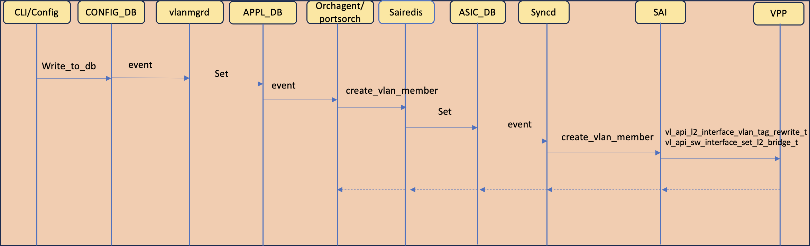
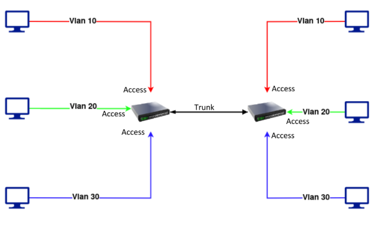
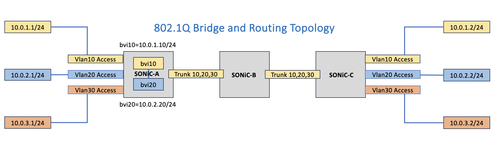

# SONIC VPP Vlan Bridging
Rev v0.1

 
 

## Table of Contents

1. [Revisions](#item-1)
2. [Scope](#item-2)
3. [Definitions/Abbreviations](#item-3)
4. [Introduction](#item-4)
5. [vlan member add call flow](#item-5)
6. [802.1Q bridge domain Testing](#item-6)
7. [802.1Q VLAN Routing](#item-7)
8. [802.1Q VLAN Routing Testing](#item-8)

 
 

## Revisions

| Rev | Date | Author(s) |
|-----|------|-----------|
|v0.1 | 25/12/2023 | Bendrapu Balareddy (Cisco), Sameer Nanajkar (Cisco) |
|v0.2 | 29/01/2024 | Bendrapu Balareddy (Cisco), Sameer Nanajkar (Cisco) |

 
 

## Scope
This document describes the high level design of integrating vlan bridging functionality between SONIC and VPP. It provides
 - 802.1ad - TODO (not supported yet)
 - 802.1Q bridging
 - 802.1Q BVI interface for vlan routing

 

## Definitions/Abbreviations
**VPP**: Vector Packet Processing (VPP) technology based high performance packet processing stack that can run on commodity CPUs. For more details see [What is VPP](https://wiki.fd.io/view/VPP/What_is_VPP%3F)

**VLAN**:  Virtual LAN

 
 

## Introduction
SONiC supports 802.1ad and 802.1q bridging support. This document's first version describes the 802.1q bridging 
 - Access port
   config vlan member add -u <portname> creates an un tagged bridge port. This will be translated to vpp in two steps
   1. creates a bridge with given vlan id as bridge id if the bridge with given id doesnot exist.
   2. set the port as member of bridge with appropriate tag rewrite
 - Trunk port
   config vlan member add  <portname> creates a tagged port bridge port. This will be translated to vpp in three steps
   1. creates a bridge with given vlan id as bridge id if the bridge with given aid does not exist.
   2. vpp trunk port operation is achieved through vlan subinterface. A subinterface is created for this vlan id. Note
      that this subinterface is only specific to vpp and does not appear in SONiC control plane data bases.
   3. set the vlan subinterface as bridge port
 - BVI port and 802.1Q routing
   config interface ip add/remove <vlan interface name> creates/removes BVI port on VPP 802.1Q bridge as below
   1. create a bvi interface with bvi<vlan bridge domain id> suffix 
   2. set the bvi port as member port of bridge domain to which Vlan interface belongs to.
   3. set the tag-rewrite as access port
   4. configure the IP address on to BVI interface
   5. Add subnet route for the IP of the BVI interface
   6. Enable the vlan bridge domain arp termination

## vlan member addition callflows

## 802.1Q Bridge Domain Test Topology
 
 

## 802.1Q VLAN routing
  SONiC enables VLAN routing by configuring an IP address on the VLAN interface. If the VLAN interface has members to it then there will be bridge domain created
with vlan members as bridge domain ports. When an IP is configured on this VLAN interface then it should route the traffic from it's members using the VLAN IP address.
It also should take care of vlan tags rewrite for the traffic coming from VLAN members or sending on VLAN members. This is achieved by creating a BVI interface on
corresponding vlan bridge domain and programming the IP of VLAN on to BVI interface. BVI interface tag-rewrite is enabled to push 802.1q tags. This pops the tags of 
the traffice when leaving the BVI interface and pushes the tag for the traffic coming on to BVI interface.
 

## 802.1Q VLAN Routing Test Topology
 
 

## FDB Entry ADD,DEL,FLUSH
SONIC supports ADD, DEL, FLUSH of Dynamic Entries on the control plane. This is now merged with VPP feature to support ADD,DEL,FLUSH on VPP as data plane. The MAC address learnt dynamically on VPP can now be Flushed via by PORT ID (Interfaces) or VLAN ID (bridge ID) or by default Flush on all interfaces and VLAN IDs. Currently we support Flushing of only Dynamic Entries on VPP. Whereas ADD/DEL can be done from SONiC as part of swssconfig file.

## Troubleshooting
There are some SONiC tools to debug SONiC side of functionality such as show commands, redis-dump, log files /var/log/syslog, /var/log/swss/ etc. You can connect gdb to the running processes and get useful debug information provided the image is built with INSTALL_DEBUG_TOOLS=y option.
 
For vpp data path troubleshooting a user can invoke vppctl to connec to VPP and run a CLI. Other option is to run “show platform vpp” command to see the working of vpp. “show platform” command of SONiC is extended to support vpp platform side of commands.

## References

[SONiC system architecture](https://github.com/sonic-net/SONiC/wiki/Architecture)\
[What is VPP](https://s3-docs.fd.io/vpp/23.06/)

