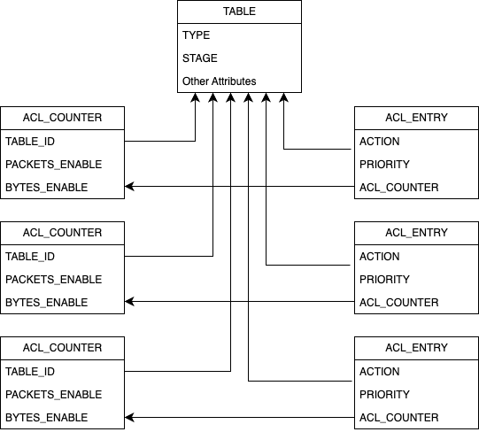

# SONiC-VPP saivpp ACL counters handling

ACL counters require dealing with multiple components and turning on few knobs.

The ACL counters are supported by way of FLEX counters in SONiC and by default disabled by the system.

## ACL counter configuration and monitoring commands

The counters collection can be toggled by the command
```
counterpoll acl enable/disable
```
Poll interval can be specified using
```
counterpoll acl interval [INTERVAL IN MS]
```

To disaplay ACL tables, rules and counters below commands will be of help
```
show acl table
show acl rule
aclshow -a
```
[ACL FLEX counters design document](https://github.com/sonic-net/SONiC/blob/master/doc/acl/ACL-Flex-Counters.md)
## FLEX counter operational part

The syncd flex module tracks the configuration of per feature counters by the FLEX_COUNTER_DB (redis db numbered 5).
The below DB entry activates/deactivates ACL counters collection polling. Every feature has a similar entry in this DB.

```
  "FLEX_COUNTER_GROUP_TABLE:ACL_STAT_COUNTER": {
    "value": {
      "FLEX_COUNTER_STATUS": "enable",
      "POLL_INTERVAL": "10000",
      "STATS_MODE": "STATS_MODE_READ"
    }
  },
```

Each rule in an ACL has one COUNTER  configuration (below). If there 10 ACL and each ACL has say 10 rules then there will
be 10 * 10 = 100 souch COUNTER entries in the DB.
The below is one of the counters entry which corresponds to a rule in an ACL which activates the collection of stats
for this counter object. The SAIVPP layer is responsible for finding the mapping for thie COUNTER to the actual ACL rule(ACE).

```
  "FLEX_COUNTER_TABLE:ACL_STAT_COUNTER:oid:0x90000000000b3": {
    "type": "hash",
    "value": {
      "ACL_COUNTER_ATTR_ID_LIST": "SAI_ACL_COUNTER_ATTR_BYTES,SAI_ACL_COUNTER_ATTR_PACKETS"
    }
  }
```

The Actual stats/counters collected thus far are stored in COUNTERS_DB(redis db number 2).
The above aclshow command collects the stats from this DB to present them to the user.

## syncd-saivpp counters collection

syncd uses AttrContext->collectData to get the counters for the ACL. The SwitchStateBase::get is called instead of getStats.
The object type queries is SAI_OBJECT_TYPE_ACL_COUNTER which corresonds to the COUNTER in the FLEX_COUNTER_DB.

The saivpp builds a mapping  from SAI_OBJECT_TYPE_ACL_COUNTER to acl rule info such as VPP acl index, rule index, table oid etc.
during the ACL configuration in the VPP. This info is later used while querying ACL counters from VPP.
VPP statistics module requires VPP acl index and rule (ACE) index to fetch the counters.

The below diagram depicts the relation between ACl table, rules and the corresponding ACL counter objects.


