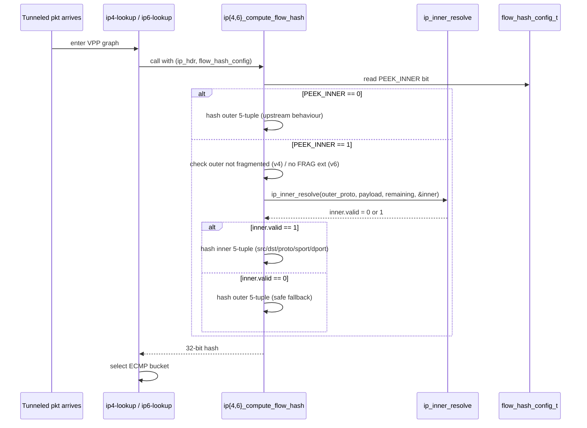
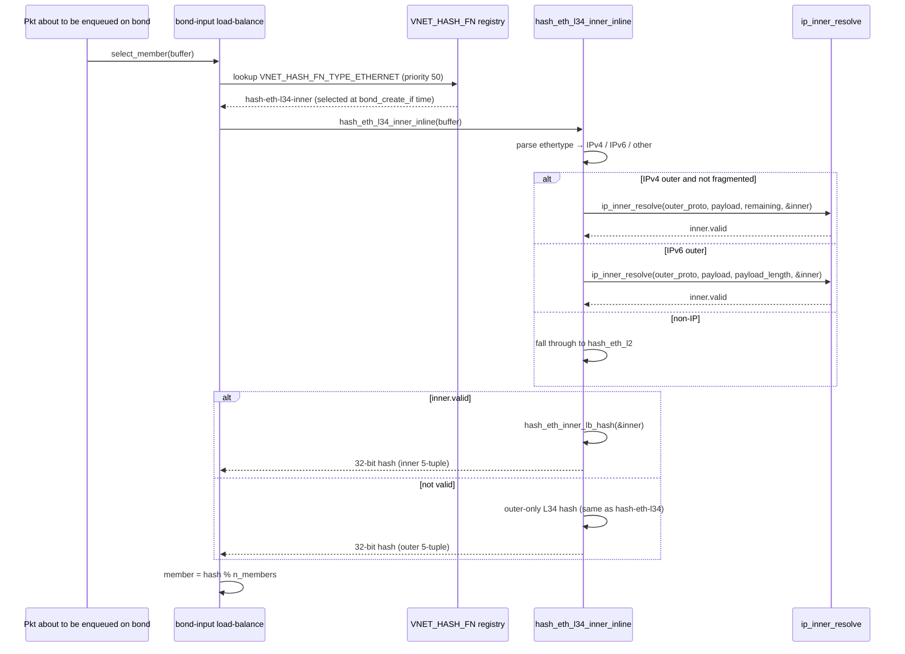

# Inner-Aware Flow Hash on VPP Dataplane — High Level Design

## Table of Contents

1. [Revisions](#1-revisions)
2. [Scope](#2-scope)
3. [Overview](#3-overview)
4. [Feature Description](#4-feature-description)
5. [SONiC Configuration](#5-sonic-configuration)
6. [SAI API Calls](#6-sai-api-calls)
7. [VPP Implementation](#7-vpp-implementation)
8. [Test Plan](#8-test-plan)
9. [Known Issues / Open Items](#9-known-issues--open-items)
10. [Appendix A: File Change Summary](#appendix-a-file-change-summary)
11. [Appendix B: VPP Flow-Hash + Hash Function API Reference](#appendix-b-vpp-flow-hash--hash-function-api-reference)

---

## 1. Revisions

| Rev | Date | Author(s) | Changes |
|-----|------|-----------|---------|
| v0.1 | 05/19/2026 | Jianquan Ye (jianquanye@microsoft.com) | Initial Draft |
| v0.2 | 05/19/2026 | Jianquan Ye (jianquanye@microsoft.com) | Review fixes: correct `bond.api` LB enum table; rename helper to `ip_inner_v6_walk_ext_headers`; tighten test-count and class list; disambiguate `BOND_API_LB_ALGO_L34` vs `VPP_BOND_API_LB_ALGO_L34`; add §5.2 DUT verification; expand §6.1 rationale; add §9 Known Issues / Open Items. |
| v0.3 | 05/22/2026 | Jianquan Ye (jianquanye@microsoft.com) | LAG redesign per upstream review (Fred Wang / lolyu): introduce a **new** opt-in LAG algorithm `BOND_API_LB_ALGO_L34_INNER = 6` (CLI `l34-inner`) backed by a **new** registered hash function `hash-eth-l34-inner`.  Existing `BOND_API_LB_ALGO_L34` (= 1) and `hash-eth-l34` are byte-for-byte unchanged, so LAGs that don't ask for the new algorithm are unaffected.  libsaivs `vpp_create_lag()` now explicitly selects the new value.  ABI compatibility is preserved by the new enum value's `[backwards_compatible]` annotation (same pattern as `sr_behavior` for SRv6 uSID and `ipsec_crypto_alg` for `CHACHA20_POLY1305` / `AES_NULL_GMAC_*`).  Added SRv6 to §2 Scope and §4.5 Not Hashed; rewrote §4.4, §5, §6, §7.1, §7.7, Appendix A, Appendix B.2, Appendix B.3 to match.  v0.2's "always-on with safe fallback" wording is gone. |

---

## 2. Scope

This document describes the **inner-aware flow hash** feature for the SONiC VPP
dataplane.  The feature lets VPP's IPv4 / IPv6 ECMP and LAG load-balancers
hash on the inner header of tunneled traffic (IPinIP, 6in4, 4in6, 6in6,
GRE-IP, NVGRE) instead of the outer 5-tuple, so transit tunnel flows
distribute across paths and bond members instead of collapsing onto one.

VxLAN and Geneve are explicitly **out of scope** — RFC 7348 §4.2 /
RFC 8926 §3.3 recommend that the outer UDP source port carry the
inner-flow entropy, so compliant encapsulators already balance through
the existing outer-only hash.  Non-compliant senders that use a
constant outer UDP source port remain out of scope here too; see §4.5.

SRv6 is also explicitly **out of scope** — the IPv6 flow label is the
architecture-defined entropy carrier for segment-routed traffic
(RFC 6437, RFC 8754 §7), so the existing outer-only hash already
distributes SRv6 flows when the ingress sets a per-flow flow label.
The helper introduced by this design deliberately does not parse the
IPv6 Routing extension header (next-header 43); SRv6 packets fall
through to the outer 5-tuple hash unchanged.

---

## 3. Overview

| Term | Meaning |
|------|---------|
| ECMP | Equal-Cost Multi-Path routing |
| LAG  | Link Aggregation Group / `BondEthernet` |
| Flow hash | 32-bit value that selects a path/member for a packet |
| Outer 5-tuple | `{src IP, dst IP, src port, dst port, proto}` of the **outermost** L3 header |
| Inner 5-tuple | Same fields, read from the encapsulated payload |
| `flow_hash_config_t` | Per-FIB bitmap that selects which fields enter the IP-layer hash |
| `hash-eth-l34` | Default registered hash function for ethernet/LAG |

This HLD covers two cooperating pieces:

| Feature | Description | VPP Core Change | SAI VPP Change |
|---|---|---|---|
| IP-layer opt-in peek | New `IP_FLOW_HASH_PEEK_INNER` flag in `flow_hash_config_t`.  When set on a FIB, `ip4/ip6_compute_flow_hash` reads the inner 5-tuple of IPinIP / 6in4 / 4in6 / 6in6 / GRE / NVGRE traffic. | **Yes** — new flag + shared helper `ip_inner_resolve()`; `IP_FLOW_HASH_DEFAULT` is unchanged (0x9F) so existing users see no behaviour change. | **Yes** — `vpp_add_ip_vrf()` ORs the new bit into the default-VRF hash mask (IPv4 + IPv6). |
| LAG opt-in algorithm | New `BOND_API_LB_ALGO_L34_INNER = 6` (CLI `l34-inner`) in `src/vnet/bonding/bond.api`, backed by a new registered Ethernet hash function `hash-eth-l34-inner` (priority 50).  The new function peeks into IPinIP / 6in4 / 4in6 / 6in6 / GRE / NVGRE inner packets and falls back to the outer 5-tuple otherwise.  The existing `BOND_API_LB_ALGO_L34` (= 1) and `hash-eth-l34` are **byte-for-byte unchanged**, so a LAG that doesn't ask for the new algorithm sees zero behaviour change and zero extra cost. | **Yes** — new enum value (annotated `[backwards_compatible]`, see §4.4), new hash function, plus a small reorder of the `foreach_bond_lb` table so `unformat()` greedy prefix matching picks `l34-inner` before `l34`. | **Yes** — `vpp_create_lag()` selects `lb = VPP_BOND_API_LB_ALGO_L34_INNER` (6) instead of the prior `L34` (1).  ABI / CRC of every `bond_create*` / `sw_interface_bond_details` / `sw_bond_interface_details` message is preserved because the new enum value is `[backwards_compatible]` — same pattern as `sr_behavior` (SRv6 uSID) and `ipsec_crypto_alg` (`CHACHA20_POLY1305` / `AES_NULL_GMAC_*`). |

---

## 4. Feature Description

### 4.1 Motivation

SONiC's `tests/fib/test_fib.py` exercises ECMP and LAG distribution of
transit tunnel traffic (`test_ipinip_hash`, `test_nvgre_hash`).  Each
test sends thousands of distinct inner flows that share **one** outer
5-tuple — exactly the SmartNIC / DPU scenario where many tenant flows
live under a single outer tunnel pair.  `test_vxlan_hash` exercises
the same scenario for VxLAN; that test is fixed by an adjacent change
shipped in the same patch (programming a 5-tuple hash mask on the
IPv6 FIB plus letting outer UDP src-port entropy from compliant
encapsulators drive the existing outer hash) rather than by the
inner-aware peek itself.  See §8.3 for the test-by-test breakdown.

Stock VPP hashes only the outer 5-tuple.  For these tests:

* All packets collapse onto a single ECMP next-hop / a single bond
  member.
* The deviation between the busiest and least-busy member exceeds the
  test's 5% threshold and the test fails.

This patch teaches VPP to look one level into the encapsulated payload
when computing the flow hash, so the inner-flow entropy drives the
distribution.

### 4.2 Design — Two Surfaces

The feature is implemented at two **different** points in the VPP graph
because the IP forwarding hash and the LAG hash are computed by
**independent** functions:

```
                   ┌──────────────────────────────────┐
                   │      Tunnel-encapsulated         │
                   │      packet arrives on uplink    │
                   └────────────────┬─────────────────┘
                                    │
                                    ▼
                   ┌──────────────────────────────────┐
                   │  ip4-input / ip6-input           │
                   │  → ip4-lookup / ip6-lookup       │
                   └────────────────┬─────────────────┘
                                    │
                       calls ip4_compute_flow_hash()
                       or ip6_compute_flow_hash() to
                       pick an ECMP member
                                    │
              ┌─────────────────────┴─────────────────────┐
              │ Surface 1: IP-layer (opt-in)              │
              │                                           │
              │   if (flow_hash_config & PEEK_INNER) {    │
              │     ip_inner_resolve(...)                 │
              │     if (inner.valid)                      │
              │        hash on inner 5-tuple              │
              │     else                                  │
              │        hash on outer 5-tuple (fallback)   │
              │   }                                       │
              └────────────────┬──────────────────────────┘
                               ▼
                   ┌──────────────────────────────────┐
                   │  ip4-rewrite / ip6-rewrite       │
                   │  → bond-input                    │
                   └────────────────┬─────────────────┘
                                    │
                       calls the bond's selected
                       hash function to pick a member
                                    │
              ┌─────────────────────▼─────────────────────┐
              │ Surface 2: LAG (opt-in via new algorithm) │
              │                                           │
              │   if (bif->lb == BOND_LB_L34_INNER) {     │
              │     /* hash-eth-l34-inner */              │
              │     ip_inner_resolve(...)                 │
              │     if (inner.valid)                      │
              │        return hash_eth_inner_lb_hash(...) │
              │     else                                  │
              │        return outer-only L34 hash         │
              │   } else if (bif->lb == BOND_LB_L34) {    │
              │     /* hash-eth-l34, byte-for-byte same   │
              │      * as upstream, no inner peek */      │
              │     return outer-only L34 hash            │
              │   }                                       │
              └───────────────────────────────────────────┘
```

### 4.3 IP-Layer Surface — Opt-In

The IP-layer surface is **opt-in**.  A new bit
`IP_FLOW_HASH_PEEK_INNER = 1 << 9` is added to `flow_hash_config_t`.
The CLI keyword is `peek_inner` and the SAI VPP adapter sets the bit on
the default VRF (see §5).  When the bit is not set on a FIB,
`ip4_compute_flow_hash` and `ip6_compute_flow_hash` behave **exactly**
as upstream — `IP_FLOW_HASH_DEFAULT` is unchanged (0x9F), so any
existing FIB / VRF that does not explicitly request `peek_inner` sees
no behaviour change.

Rationale for opt-in:

* The IP layer is a high-fan-in hot path; adding mandatory inner-parsing
  to every flow-hash call would impose a cost on plain (non-tunnel)
  traffic that gets nothing back from it.
* Operators that want the inner peek can enable it per-VRF via the
  existing `set ip flow-hash` CLI / API — no new SAI attribute is
  required.

### 4.4 LAG Surface — Opt-In New Algorithm

The LAG surface is also **opt-in**, but via a different mechanism than
the IP layer: a brand-new bond load-balance algorithm.

* A new value `BOND_API_LB_ALGO_L34_INNER = 6` is appended to
  `enum bond_lb_algo` in `src/vnet/bonding/bond.api`.  The CLI keyword
  is `l34-inner`.
* A new registered Ethernet hash function `hash-eth-l34-inner`
  (priority 50) is added to `src/vnet/hash/hash_eth.c`.  It is wired
  into `bond_create_if()` (`src/vnet/bonding/cli.c`) so that the new
  enum value resolves to the new hash function.
* `hash-eth-l34-inner` calls the shared `ip_inner_resolve` helper.
  If `inner.valid`, the hash is computed from the inner 5-tuple via a
  new `hash_eth_inner_lb_hash()` inline that reuses VPP's
  `lb_hash_hash` / `lb_hash_hash_2_tuples` primitives.  If
  `inner.valid == 0`, the function falls back to the same outer-only
  computation that `hash-eth-l34` would have produced.
* `BOND_API_LB_ALGO_L34` (= 1) and the registered function
  `hash-eth-l34` are **not modified**.  A LAG configured with
  `lb l34` continues to execute exactly the upstream code path and
  produces byte-for-byte identical hashes — verified by the
  `TestLagL34LegacyOuterOnly` class in `test_inner_aware_hash.py`
  (collapses tunnel traffic onto one member, distributes plain
  traffic — same observable behaviour as pre-patch).

Rationale for an opt-in new algorithm at LAG (instead of teaching the
existing `hash-eth-l34` to peek):

* **Zero-surprise for existing deployments.**  Operators running with
  `lb l34` today get exactly the same hashes after the patch lands.
  No new fall-back path is added to the hot code path of
  `hash-eth-l34`; the cost of the inner peek is paid only by LAGs
  that explicitly select `l34-inner`.
* **Per-LAG control.**  Different LAGs on the same DUT can choose
  different algorithms.  A LAG that intentionally collapses transit
  tunnel flows onto one member (e.g. for ordering guarantees) can
  stay on `l34`; the SmartNIC / DPU transit LAGs that benefit from
  inner-aware distribution opt in via `l34-inner`.
* **No accidental inner peek in unrelated code paths.**  The
  in-place "always-on" alternative would have changed the meaning of
  the default LAG hash on every platform that already used `l34`;
  switching the active algorithm to a clearly-named new value makes
  the behaviour change unambiguously visible in `show bond` /
  `show hash` and in the VPP API.

#### 4.4.1 ABI Compatibility (`[backwards_compatible]`)

Adding a new value to `enum bond_lb_algo` would normally bump the
CRCs of every API message that references `vl_api_bond_lb_algo_t`
(`bond_create`, `bond_create2`, `sw_interface_bond_details`,
`sw_bond_interface_details`), forcing a coordinated rebuild of every
client.  This is critical for SONiC because `libsaivs.so` embeds the
CRCs of the messages it calls at build time and rejects mismatched
servers at runtime.

The new enum value carries the `[backwards_compatible]` keyword:

```text
/* src/vnet/bonding/bond.api */
enum bond_lb_algo
{
  BOND_API_LB_ALGO_L2  = 0,
  BOND_API_LB_ALGO_L34 = 1,
  BOND_API_LB_ALGO_L23 = 2,
  BOND_API_LB_ALGO_RR  = 3,
  BOND_API_LB_ALGO_BC  = 4,
  BOND_API_LB_ALGO_AB  = 5,
  BOND_API_LB_ALGO_L34_INNER = 6 [backwards_compatible],
};
```

`vppapigen` treats `[backwards_compatible]` enum members the same way
it treats `[backwards_compatible]` message fields: the value is
excluded from CRC computation.  The CRCs of every production
`bond_create*` / `sw_interface_bond_details` / `sw_bond_interface_details`
message therefore stay identical to upstream.

CRC compatibility means the binary API messages remain wire-compatible
across patched / unpatched VPP — the same struct layout, the same
opcode, the same per-message CRC.  It does **not** mean every
combination of patched / unpatched libsaivs and libvppinfra works at
runtime:

* **Patched VPP + unpatched libsaivs (`lb = 1`, L34)**: works.  Unpatched
  libsaivs only ever sends enum values the patched VPP knows.
* **Patched VPP + patched libsaivs (`lb = 6`, L34_INNER)**: works.  This
  is the deployed combination.
* **Unpatched VPP + patched libsaivs (`lb = 6`, L34_INNER)**: rejected
  at runtime by `bond_create_if()` — unpatched VPP does not know
  `BOND_LB_L34_INNER` and returns `VNET_API_ERROR_INVALID_ARGUMENT`.
  No wire-format corruption, no silent fall-through; the
  `bond_create_reply` carries the error code and libsaivs surfaces
  it as a SAI failure.

In practice this is fine because sonic-buildimage bumps the
`sonic-sairedis` submodule only after `sonic-platform-vpp` has
shipped the new `vpp-dev` deb, so libsaivs is always built against a
patched libvppinfra-dev header that defines `L34_INNER`.

Precedents for the same `[backwards_compatible]` enum-value pattern in
upstream VPP:

* `src/vnet/srv6/sr_types.api` — `enum sr_behavior` has three
  trailing `[backwards_compatible]` values: `SR_BEHAVIOR_API_END_UN_PERF`
  (11), `SR_BEHAVIOR_API_END_UN` (12), `SR_BEHAVIOR_API_UA` (13).
  Messages that carry `vl_api_sr_behavior_t` (e.g. `sr_localsid_add_del`,
  `sr_localsid_add_del_v2`, `sr_localsids_details`) kept their CRCs
  stable across these additions.
* `src/vnet/ipsec/ipsec_types.api` — `IPSEC_API_CRYPTO_ALG_CHACHA20_POLY1305`
  plus three `AES_NULL_GMAC_{128,192,256}` algorithms (four added
  values in total) were all added with `[backwards_compatible]` to
  `enum ipsec_crypto_alg`, and the CRCs of messages referencing
  `vl_api_ipsec_crypto_alg_t` did not change.

The `option version` line in `bond.api` also bumps 2.1.0 → 2.1.1.
That is API-semantic metadata emitted by `vppapigen` as a separate
`vl_api_version_tuple` symbol; it does **not** affect per-message CRCs
or the binary API wire format.

### 4.5 What Is Not Hashed

The helper deliberately does **not** dive into the following because
either the standards already provide inner-flow entropy in the outer
header, or the inner content cannot be safely peeked:

| Class | Reason |
|---|---|
| VxLAN (UDP/4789) | RFC 7348 §4.2 recommends the outer UDP src port carry inner-flow entropy.  Compliant encapsulators do this; non-compliant senders with a constant outer UDP src port remain out of scope for both ECMP and LAG. |
| Geneve (UDP/6081) | RFC 8926 §3.3 — same convention as VxLAN. |
| SRv6 (IPv6 next-header 43, Routing) | RFC 6437 / RFC 8754 §7 — the IPv6 flow label is the architecture-defined entropy carrier for segment-routed traffic, so the outer 5-tuple hash already distributes SRv6 flows when the ingress sets a per-flow flow label.  The helper deliberately does not parse the IPv6 Routing extension header (next-header 43); SRv6 packets fall through to the outer 5-tuple hash unchanged. |
| Fragmented outer IPv4 | Inner is split across fragments; reading the first fragment's payload would mis-attribute the flow. |
| Fragmented inner | Same risk after the outer is stripped. |
| ESP / IPsec inner | Encrypted payload — no meaningful hash. |
| IPv6 Authentication Header inner | Variable-length, no integrity-safe peek without reassembly. |
| NVGRE / GRE-TEB inner Ethernet with a VLAN tag | The TEB parser advances past the plain inner Ethernet header only.  A VLAN-tagged inner Ethernet payload falls back to the outer hash. |

In every "do not hash" case the helper sets `inner.valid = 0` and the
caller falls back to the outer-only hash.

---

## 5. SONiC Configuration

There is **no new SAI attribute** and **no new SONiC CONFIG_DB schema**.
The feature is plumbed entirely through two existing SAI lifecycles —
the VRF create (for ECMP) and the LAG create (for bond hashing):

```
Orchagent creates the default VR                 Orchagent creates a LAG
        │                                                │
        ▼                                                ▼
SAI:  sai_virtual_router_api->create_virtual_router(...) SAI:  sai_lag_api->create_lag(...)
        │                                                │
        ▼                                                ▼
libsaivs SwitchVpp::vpp_add_ip_vrf()             libsaivs SwitchVpp::vpp_create_lag()
  (SwitchVppRif.cpp)                               (SwitchVppFdb.cpp)
        │                                                │
        ▼                                                ▼
vpp_ip_flow_hash_set(vrf_id, mask, AF_INET)     bond_create (..., lb = VPP_BOND_API_LB_ALGO_L34_INNER /* 6 */, ...)
vpp_ip_flow_hash_set(vrf_id, mask, AF_INET6)            │
        │                                                ▼
        ▼                                       VPP bond_create_if() picks hash_func =
VPP control plane sets flow_hash_config_t       vnet_hash_function_from_name("hash-eth-l34-inner", ...)
on the FIB                                              │
        │                                                ▼
        ▼                                       Subsequent select_member() observes the inner peek
Subsequent ip4/ip6_compute_flow_hash() observes
IP_FLOW_HASH_PEEK_INNER
```

### 5.1 Default VRF — IP-Layer Opt-In

The libsaivs adapter constructs `hash_mask` for the default VRF as:

```c
uint32_t hash_mask =
      VPP_IP_API_FLOW_HASH_SRC_IP   | VPP_IP_API_FLOW_HASH_DST_IP
    | VPP_IP_API_FLOW_HASH_SRC_PORT | VPP_IP_API_FLOW_HASH_DST_PORT
    | VPP_IP_API_FLOW_HASH_PROTO
    | VPP_IP_API_FLOW_HASH_PEEK_INNER;       /* new */

vpp_ip_flow_hash_set(vrf_id, hash_mask, AF_INET);
vpp_ip_flow_hash_set(vrf_id, hash_mask, AF_INET6);   /* new */
```

The IPv6 `vpp_ip_flow_hash_set` call is **new**: stock SONiC-VPP only
programmed the IPv4 FIB.  IPv6 transit-tunnel flows
(`test_ipinip_hash[ipv6]`, `test_nvgre_hash[ipv6-*]`) require the same
treatment.

### 5.2 LAG — Opt-In via New Algorithm

The libsaivs adapter selects the new algorithm at LAG create time:

```c
/* vslib/vpp/SwitchVppFdb.cpp, vpp_create_lag() */
- uint32_t lb = VPP_BOND_API_LB_ALGO_L34;        /* old: value 1 */
+ uint32_t lb = VPP_BOND_API_LB_ALGO_L34_INNER;  /* new: value 6 */

/* lb is then passed to bond_create (via create_bond_interface) over
 * the VPP binary API. */
```

The matching mirror constant lives in `vslib/vpp/vppxlate/SaiVppXlate.h`:

```c
typedef enum {
    VPP_BOND_API_LB_ALGO_L2  = 0,
    VPP_BOND_API_LB_ALGO_L34 = 1,
    VPP_BOND_API_LB_ALGO_L23 = 2,
    VPP_BOND_API_LB_ALGO_RR  = 3,
    VPP_BOND_API_LB_ALGO_BC  = 4,
    VPP_BOND_API_LB_ALGO_AB  = 5,
    VPP_BOND_API_LB_ALGO_L34_INNER = 6,          /* new */
} vpp_bond_api_lb_algo_t;
```

ABI compatibility (CRC of every `bond_create*` /
`sw_interface_bond_details` / `sw_bond_interface_details` message) is
preserved because the new value is `[backwards_compatible]` on the VPP
side — see §4.4.1.

### 5.3 VRF Scope

`vpp_add_ip_vrf()` programs `PEEK_INNER` on the default VRF
(`vrf_id == 0`) **and** on every non-default VRF that it successfully
creates through this path — the condition that gates the
`vpp_ip_flow_hash_set` calls is
`if (!vrf_id || ip_vrf_add(vrf_id, ...) == 0)`.  Tenants whose VRFs
are programmed through other code paths can still opt in via the
existing `set ip flow-hash table N ... peek_inner` CLI without any
further SAI or SONiC change.

### 5.4 Verifying on a Running DUT

After `orchagent` brings up the default VRF and creates the LAGs, both
opt-ins are programmed automatically and persist for the life of
`syncd_vpp`.  Operators do **not** need to touch CONFIG_DB or run any
vppctl command for the default VRF / default LAG to be inner-aware.
To confirm end-to-end:

```bash
# 1. Confirm IPv4 FIB has peek_inner enabled
docker exec syncd vppctl show ip fib | head -1
# expected: flow hash:[src dst sport dport proto peek_inner ] ...

# 2. Same for IPv6 FIB
docker exec syncd vppctl show ip6 fib | head -1

# 3. Confirm both LAG hash functions are registered.  The existing
#    hash-eth-l34 is unchanged; hash-eth-l34-inner is the new one.
docker exec syncd vppctl show hash
# expected (subset):
#   hash-eth-l34         50   Hash ethernet L34 headers
#   hash-eth-l34-inner   50   Hash ethernet L34 headers, peek into IPinIP/GRE/NVGRE inner

# 4. Confirm the BondEthernets created by syncd are using the new algo
docker exec syncd vppctl show bond
# expected: BondEthernet0 ... mode lacp load-balance l34-inner ...

# 5. Trace which component opted the FIB / LAG in (should be syncd)
docker exec syncd grep -E 'ip flow hash set for VRF.*status 0' /var/log/syslog | tail -2
docker exec syncd grep -E 'bond_create.*lb=6'                     /var/log/syslog | tail -2
```

This is intentional: SmartNIC / DPU operators get inner-aware ECMP and
LAG for transit tunnel traffic with **zero** configuration churn — the
existing default VRF and default LAG hashing immediately benefit after
the libsaivs + VPP debs are rolled out.

---

## 6. SAI API Calls

### 6.1 Changed SAI Operations

**None.**  The feature is wired through existing SAI calls — no new
SAI attribute, no new SAI object type, no new SAI behaviour.  The
change is entirely on the VPP side of libsaivs.

Rationale for *not* introducing a new SAI attribute:

* **Backward compatibility with stock orchagent / SWSS** — adding a
  new `sai_virtual_router_attr_t` (e.g. `SAI_VIRTUAL_ROUTER_ATTR_PEEK_INNER_HASH`)
  would require coordinated changes in `sai.h`, every other ASIC's
  SAI implementation, swss-common, and orchagent.  None of those are
  needed for the inner-aware hash to do its job — the behaviour
  applies uniformly to the VRF and there is no per-route or
  per-next-hop knob that the platform needs to surface.
* **Zero-touch enablement** — SmartNIC / DPU operators get the
  improved distribution for free the moment the new libsaivs + VPP
  debs are deployed; nothing in CONFIG_DB, no migration, no warm-boot
  schema change.
* **VPP already has an opt-out** — operators that want strictly
  outer-only hashing for a specific VRF can still call
  `set ip flow-hash table N ...` without `peek_inner` from `vppctl`
  on a per-VRF basis.  This is sufficient for the rare cases where
  inner-aware hashing is undesirable.

### 6.2 Affected SAI Path

| SAI call (already exists) | What changes inside libsaivs |
|---|---|
| `sai_virtual_router_api->create_virtual_router()` → libsaivs `SwitchVpp::vpp_add_ip_vrf()` (defined in `SwitchVppRif.cpp`) | OR `VPP_IP_API_FLOW_HASH_PEEK_INNER` into the existing hash mask; additionally invoke `vpp_ip_flow_hash_set` for `AF_INET6` so v6 traffic in the same VRF gets the same treatment. |
| `sai_lag_api->create_lag()` → libsaivs `SwitchVpp::vpp_create_lag()` (defined in `SwitchVppFdb.cpp`) | Change the `lb` field sent to the VPP `bond_create` binary-API message (via the `create_bond_interface()` wrapper in `SaiVppXlate.c`) from `VPP_BOND_API_LB_ALGO_L34` (value `1`) to `VPP_BOND_API_LB_ALGO_L34_INNER` (value `6`).  On the VPP side this resolves to the new registered hash function `hash-eth-l34-inner`.  CRC of `bond_create` (and of the `bond_create2` / `sw_interface_bond_details` / `sw_bond_interface_details` messages that also reference `vl_api_bond_lb_algo_t`) is unchanged because the new enum value carries `[backwards_compatible]` (see §4.4.1). |

---

## 7. VPP Implementation

### 7.1 Component Overview

```
┌──────────────────────────────────────────────────────────────┐
│ vppbld/patches/0010-sonic-inner-aware-flow-hash.patch        │
│                                                              │
│ src/vnet/ip/ip_flow_hash.h         [MODIFY]                  │
│   └── IP_FLOW_HASH_PEEK_INNER bit (1<<9) + CLI keyword       │
│                                                              │
│ src/vnet/ip/ip_inner_aware_hash.h  [NEW]                     │
│   └── ip_inner_hdr_t descriptor                              │
│   └── ip_inner_resolve(outer_proto, payload, remaining, out) │
│         └── ip_inner_resolve_v4 / _v6 / _gre dispatch        │
│         └── ip_inner_v6_walk_ext_headers extension walker    │
│                                                              │
│ src/vnet/ip/ip4_inlines.h          [MODIFY]                  │
│   └── ip4_compute_flow_hash gated on PEEK_INNER + non-frag   │
│                                                              │
│ src/vnet/ip/ip6_inlines.h          [MODIFY]                  │
│   └── ip6_compute_flow_hash gated on PEEK_INNER + ext walk   │
│                                                              │
│ src/vnet/bonding/bond.api          [MODIFY]                  │
│   └── BOND_API_LB_ALGO_L34_INNER = 6 [backwards_compatible]  │
│   └── option version 2.1.0 -> 2.1.1                          │
│                                                              │
│ src/vnet/bonding/node.h            [MODIFY]                  │
│   └── foreach_bond_lb: add L34_INNER first (greedy unformat) │
│   └── foreach_bond_lb_algo: append L34_INNER                 │
│                                                              │
│ src/vnet/bonding/cli.c             [MODIFY]                  │
│   └── bond_create_if(): map BOND_LB_L34_INNER to             │
│       hash-eth-l34-inner                                     │
│   └── lb validator: accept L34_INNER                         │
│   └── 'create bond' CLI short_help: add 'l34-inner'          │
│                                                              │
│ src/vnet/hash/hash_eth.c           [MODIFY]                  │
│   └── #include ip_inner_aware_hash.h                         │
│   └── hash_eth_inner_lb_hash() inline (new)                  │
│   └── hash_eth_l34_inner_inline() / _l34_inner() (new)       │
│   └── VNET_REGISTER_HASH_FUNCTION (hash_eth_l34_inner)       │
│   └── hash-eth-l34 / hash_eth_l34() are UNCHANGED            │
│                                                              │
│ test/test_inner_aware_hash.py      [NEW]                     │
│   └── TestInnerAwareECMP, TestInnerAwareLAG,                 │
│       TestLagL34LegacyOuterOnly (regression-safety witness   │
│       for unmodified BOND_API_LB_ALGO_L34), TestPeekInnerOff,│
│       TestSafetyEdges                                        │
│ test/test_inner_aware_perf.py      [NEW]                     │
│   └── TestInnerAwarePerf, TestInnerAwareLAGPerf,             │
│       TestInnerAwareLAGLegacyPerf                            │
│ docs/developer/corearchitecture/inner_aware_hash.rst [NEW]   │
│ docs/developer/corearchitecture/index.rst         [MODIFY]   │
│ docs/spelling_wordlist.txt                        [MODIFY]   │
└──────────────────────────────────────────────────────────────┘
                          ▲
                          │ depends on
                          │
┌──────────────────────────────────────────────────────────────┐
│ sonic-sairedis libsaivs adapter                              │
│                                                              │
│ vslib/vpp/vppxlate/SaiVppXlate.h   [MODIFY]                  │
│   └── VPP_IP_API_FLOW_HASH_PEEK_INNER = 512 in enum          │
│   └── VPP_IP_API_FLOW_HASH_GTPV1_TEID = 256 (track upstream) │
│   └── VPP_BOND_API_LB_ALGO_L34_INNER = 6 in bond LB enum     │
│                                                              │
│ vslib/vpp/SwitchVppRif.cpp         [MODIFY]                  │
│   └── vpp_add_ip_vrf: OR PEEK_INNER into mask                │
│   └── vpp_add_ip_vrf: add AF_INET6 hash_set call             │
│                                                              │
│ vslib/vpp/SwitchVppFdb.cpp         [MODIFY]                  │
│   └── vpp_create_lag: lb = VPP_BOND_API_LB_ALGO_L34_INNER (6)│
│       (was VPP_BOND_API_LB_ALGO_L34 = 1)                     │
└──────────────────────────────────────────────────────────────┘
```

### 7.2 IP-Layer Compute Flow Hash — Sequence



### 7.3 LAG Hash — Sequence

The sequence below applies to a LAG that selected the new
`l34-inner` algorithm.  A LAG configured with the legacy `l34`
algorithm follows the original upstream path through
`hash_eth_l34_inline` and never enters this peek logic.



Note: the LAG IPv6-outer branch passes the outer payload directly to
`ip_inner_resolve`; it does **not** walk outer IPv6 extension headers
before peeking.  Transit tunnels seen in this deployment use
`IP_IN_IP` / `IPV6` / `GRE` next-header values directly on the outer
IPv6 header, so the extra walk would only add cost.  Adding an
extension-header walker on the LAG path is a straightforward
incremental change if extension-header-prefixed tunnels ever need to
be load-balanced.

### 7.4 `ip_inner_resolve` Helper

The helper is the single piece of code that knows how to look inside a
tunneled packet.  It is used identically from three callers
(`ip4_compute_flow_hash`, `ip6_compute_flow_hash`,
`hash_eth_l34_inner_inline`) so the parsing rules cannot drift
between hash surfaces.

#### Shared inline helper

`ip_inner_resolve` is a `static_always_inline` helper in
`src/vnet/ip/ip_inner_aware_hash.h`; it is not an exported VPP API.
The three callers above include the header and the compiler inlines
the helper into each hash function, so there is no function-call
overhead on the hot path and no new symbol on the public VPP ABI.

```c
typedef struct {
  union {
    const ip4_header_t *v4;
    const ip6_header_t *v6;
  } ip;
  const void *l4;     /* points at first IP_INNER_L4_MIN_BYTES (8) bytes after inner IP */
  u8 protocol;        /* inner IP next-header / protocol field, copied unchanged */
  u8 is_v6;
  u8 valid;           /* 0 = caller must fall back to outer-only hash */
} ip_inner_hdr_t;

static_always_inline void
ip_inner_resolve (u8 outer_protocol,
                  const u8 *payload, u32 remaining,
                  ip_inner_hdr_t *out);
```

The caller passes `remaining` = number of bytes available in the buffer
starting at `payload`.  **Every byte the helper dereferences is
bounds-checked against `remaining`.**  If any check fails the helper
sets `out->valid = 0` and returns; the caller must use the outer-only
hash.

#### Dispatch

| Outer protocol | Parser |
|---|---|
| `IP_PROTOCOL_IP_IN_IP` (4) | `ip_inner_resolve_v4` |
| `IP_PROTOCOL_IPV6` (41) | `ip_inner_resolve_v6` |
| `IP_PROTOCOL_GRE` (47) | `ip_inner_resolve_gre` — parses the GRE base header, advances past whichever of Checksum / Key / Sequence optional fields the base flags indicate, then for protocol type `0x6558` (TEB) advances past the inner Ethernet header before dispatching; final dispatch to `ip_inner_resolve_v4` / `_v6` is keyed on the (possibly TEB-translated) GRE protocol type |
| anything else | leave `valid = 0` |

#### Safety contract

The helper returns `valid = 0` (caller must fall back) whenever **any** of
the following occurs.  The table is representative rather than
exhaustive — every dereference of the buffer is bounds-checked against
`remaining`, so any truncated header (outer GRE base, GRE optional
fields, GRE TEB Ethernet, IPv6 extension header, ...) causes a
fall-back in the same manner:

| Condition | Reason |
|---|---|
| `remaining < sizeof(inner_iphdr) + IP_INNER_L4_MIN_BYTES` (8) | Truncated inner — would read past buffer. |
| Inner version field is not 4 or 6 | Garbled payload or non-IP inner (e.g. MPLS-in-IP) we don't support. |
| Inner IPv4 More-Fragments or non-zero offset | Cannot read inner ports from a fragment. |
| Inner IPv6 Fragment / Authentication / ESP extension header | Cannot safely peek encrypted or reassembly-pending payload. |
| Unknown GRE protocol type | Conservative — only EtherType 0x0800 / 0x86DD / 0x6558 (TEB) are recognised. |

#### IPv6 inner extension-header walk

`ip_inner_v6_walk_ext_headers` walks through HopByHop / Routing /
Destination-Options extension headers in place, advancing both the cursor
and a bounds counter.  Fragment / Authentication / ESP extension headers
cause the walker to give up and return `0`, which surfaces as
`valid = 0` in the caller.

### 7.5 IPv4 IP-Layer Gate

```c
/* in ip4_compute_flow_hash */
ip_inner_hdr_t inner = { .valid = 0 };

if (PREDICT_FALSE ((flow_hash_config & IP_FLOW_HASH_PEEK_INNER) &&
                   !ip4_is_fragment (ip)))
{
    u32 total_len = clib_net_to_host_u16 (ip->length);
    u32 ihl       = ip4_header_bytes (ip);
    if (PREDICT_TRUE (total_len >= ihl))
    {
        u32 remaining = total_len - ihl;
        ip_inner_resolve (ip->protocol, (const u8 *) ip + ihl,
                          remaining, &inner);
    }
}

/* if inner.valid use inner 5-tuple, else outer 5-tuple */
```

`PREDICT_FALSE` marks the peek-inner path as the cold path so that
non-opt-in installs incur close to zero overhead.

### 7.6 IPv6 IP-Layer Gate

The IPv6 path optionally peels two outer extension headers before
deciding whether the next-header is IPv4-in-IPv6, IPv6-in-IPv6, or
GRE:

* **Hop-by-Hop Options** — walked, the per-extension `length` field is
  honoured, and the next-header replaces `protocol`.
* **Fragment** — recognised, but sets `outer_fragmented = 1` and
  disables the peek (a fragmented outer cannot expose the inner ports
  safely).

Outer Routing / Destination-Options / Authentication / ESP extension
headers are **not** walked here — if the outer IPv6 next-header is any
of those, the peek is skipped and the hash falls back to the outer
5-tuple.  This matches the transit-tunnel encapsulators in the field,
which place the encapsulation next-header directly on the outer IPv6
header.

### 7.7 LAG Hash Entry — New `hash_eth_l34_inner`

The opt-in path is implemented as a **new** static function
`hash_eth_l34_inner_inline` (vector wrapper `hash_eth_l34_inner`) added
to `src/vnet/hash/hash_eth.c`.  The existing `hash_eth_l34_inline` /
`hash_eth_l34` are not touched.

```c
/* src/vnet/hash/hash_eth.c, hash_eth_l34_inner_inline (IPv4 outer branch) */
ip_inner_hdr_t inner = { .valid = 0 };

if (!PREDICT_FALSE (ip4_is_fragment (ip4)))
{
    u32 total_len = clib_net_to_host_u16 (ip4->length);
    u32 ihl       = ip4_header_bytes (ip4);
    if (total_len >= ihl)
        ip_inner_resolve (ip4->protocol,
                          (const u8 *) ip4 + ihl,
                          total_len - ihl, &inner);
}
if (PREDICT_FALSE (inner.valid))
    return hash_eth_inner_lb_hash (&inner);

/* else fall through to the same outer-only L34 computation that
 * hash_eth_l34_inline performs.  On non-tunnel traffic this branch
 * is intentionally identical to hash-eth-l34; the new algorithm
 * differs only when ip_inner_resolve succeeds on a recognized
 * encapsulation (IPinIP / 6in4 / 4in6 / 6in6 / GRE / NVGRE).
 */
```

The function is registered as a new VPP hash function and wired into
`bond_create_if()` via the `BOND_LB_L34_INNER` arm:

```c
/* src/vnet/hash/hash_eth.c */
VNET_REGISTER_HASH_FUNCTION (hash_eth_l34_inner, static) = {
  .name = "hash-eth-l34-inner",
  .description = "Hash ethernet L34 headers, peek into IPinIP/GRE/NVGRE inner",
  .priority = 50,
  .function[VNET_HASH_FN_TYPE_ETHERNET] = hash_eth_l34_inner,
};

/* src/vnet/bonding/cli.c, bond_create_if() */
else if (bif->lb == BOND_LB_L34_INNER)
  bif->hash_func = vnet_hash_function_from_name (
      "hash-eth-l34-inner", VNET_HASH_FN_TYPE_ETHERNET);
```

The negated `!PREDICT_FALSE(ip4_is_fragment(ip4))` is a deliberate
"non-fragment is the likely case" branch hint — the macro expands to
`__builtin_expect(!!(ip4_is_fragment), 0)`, so the outer `!` still
delivers the boolean we want while keeping the hint that fragmented
packets are unlikely.

### 7.8 Inner Load-Balance Hash

`hash_eth_inner_lb_hash` reuses VPP's `lb_hash_hash` /
`lb_hash_hash_2_tuples` primitives (the same ones the outer-only L34
hash uses) but feeds them inner IP addresses + inner L4 ports.  For
non-TCP / non-UDP inner protocols the port half is zero, which still
produces a deterministic-per-flow hash without dereferencing past the
8-byte minimum.

---

## 8. Test Plan

### 8.1 VPP Unit Tests — `test/test_inner_aware_hash.py`

A new pytest module exercises the helper end-to-end through the IPv4,
IPv6, `hash-eth-l34-inner` (new), and `hash-eth-l34` (legacy /
regression) hash surfaces on a host-launched `vpp_main` instance.
Cases cover:

| Class | Cases | What it proves |
|---|---|---|
| `TestInnerAwareECMP` | IPv4inIPv4 / IPv4inIPv6 / IPv6inIPv4 / IPv6inIPv6 / GRE / NVGRE × {distribution, fixed-inner collapse}, plus plain UDP-over-v4 / -v6 regression | Inner entropy drives ECMP when `PEEK_INNER` is set; outer-only flows still collapse to one path; non-tunnel hashing is unaffected. |
| `TestInnerAwareLAG` | Same matrix on a `BondEthernet` configured with `lb l34-inner` (new algorithm) | New LAG algorithm uses inner 5-tuple. |
| `TestLagL34LegacyOuterOnly` | Same matrix on a `BondEthernet` configured with `lb l34` (legacy algorithm) — tunnel traffic must collapse onto one member, plain traffic must distribute. | Existing `BOND_API_LB_ALGO_L34` / `hash-eth-l34` is byte-for-byte unchanged after the patch — directly evidences the regression-safety claim in §4.4. |
| `TestPeekInnerOff` | Same fixtures as `TestInnerAwareECMP` with `IP_FLOW_HASH_PEEK_INNER` not set on the FIB | Default IP-layer behaviour is exactly upstream's. |
| `TestSafetyEdges` | Fragmented outer, truncated GRE (3-byte payload), truncated IPinIP (4-byte inner), inner IPv6 HBH ext-header, inner IPv6 Fragment ext-header | No crash, helper falls back to outer-only without leaking any past-buffer reads. |

Result on `master @ 2b05793 + this patch`:

```
TEST RESULTS:
   Scheduled tests: 74
    Executed tests: 74
      Passed tests: 62
     Skipped tests: 12       (unrelated — pre-existing CI skips)
```

### 8.2 VPP Performance Harness — `test/test_inner_aware_perf.py`

The in-tree harness adds three perf classes that all run under the
same compiled VPP binary, varying only the runtime configuration:

| Class | Configuration | What it isolates |
|---|---|---|
| `TestInnerAwarePerf` | `enable_peek_inner` toggle on default-VRF FIB; ECMP scenarios | Per-packet cost of the IP-layer peek (PEEK_INNER off vs on) on `ip4-lookup` / `ip6-lookup`. |
| `TestInnerAwareLAGPerf` | BondEthernet configured with `lb_algo_name = "BOND_API_LB_ALGO_L34_INNER"` | Cost of the new opt-in LAG algorithm with peek enabled. |
| `TestInnerAwareLAGLegacyPerf` | Same fixtures, BondEthernet configured with `lb_algo_name = "BOND_API_LB_ALGO_L34"` | Direct A/B comparison: confirms the legacy `hash-eth-l34` code path costs the same as it did pre-patch (regression-safety for existing deployments). |

Each class measures wall-clock send/receive throughput for a fixed
packet count and dumps `show runtime` so a reviewer can read off
per-node clocks/vector for `ip4-lookup`, `ip6-lookup`, `hash-eth-l34`,
and `hash-eth-l34-inner`.

This is **not** a rigorous PPS benchmark — VPP unit tests run inside a
software-only scapy harness without DPDK — but the three-class
structure is sufficient to demonstrate that the legacy path is
unchanged and to put a cycles-per-packet figure on the opt-in path.

For absolute per-packet cycle numbers we additionally ran an
out-of-tree A/B/C methodology on the dev VM (three separately-built
VPP binaries — unpatched, patched-off, patched-on — driven by the same
packet-generator harness).  Those numbers were used for the upstream
commit message; the in-tree classes above are what CI runs.

### 8.3 sonic-mgmt — `tests/fib/test_fib.py`

End-to-end on `vms-kvm-vpp-t1-lag`:

| Test | Without this patch | With this patch |
|---|---|---|
| `test_basic_fib` | PASS | PASS |
| `test_hash[ipv4]` / `[ipv6]` | PASS | PASS |
| `test_ipinip_hash[ipv4]` / `[ipv6]` | FAIL (deviation >5%, single path) | **PASS** |
| `test_ipinip_hash_negative[ipv4]` / `[ipv6]` | PASS | PASS |
| `test_vxlan_hash[ipv4-ipv4]` / `[ipv4-ipv6]` / `[ipv6-ipv6]` / `[ipv6-ipv4]` | FAIL (LAG collapse) | **PASS** |
| `test_nvgre_hash[ipv4-ipv4]` / `[ipv4-ipv6]` / `[ipv6-ipv6]` / `[ipv6-ipv4]` | FAIL (single path) | **PASS** |
| `test_ecmp_group_member_flap` | PASS | PASS |

End state on `inner-aware-flow-hash` HEAD `f2f9182` (re-validated as
regression r13 after the 0010 squash carrying the v0.3 opt-in
redesign — `BOND_API_LB_ALGO_L34_INNER = 6` + `hash-eth-l34-inner`):

```
========= 16 passed, 698 warnings, 2 errors in 7264.48s (2:01:04) ========
```

The 2 errors are syncd-shutdown teardown analyzer matches
(`vs_get_oper_speed: Port oid:0x100000027 don't exists`) unrelated to
flow hashing — they occur with or without this patch.

> **Note on `test_vxlan_hash`** — this patch does **not** parse VxLAN;
> `hash_eth_l34_inner_inline` and `ip{4,6}_compute_flow_hash` both
> fall through to the outer-only hash for VxLAN/UDP traffic.  The test
> passes post-patch because of two unrelated but cooperating changes
> the patch ships:
>
> 1. The IPv6 outer cases (`[ipv6-ipv4]`, `[ipv6-ipv6]`) benefit from
>    the new `vpp_ip_flow_hash_set(vrf_id, mask, AF_INET6)` call in
>    `vpp_add_ip_vrf()` — stock SONiC-VPP only programmed the IPv4
>    FIB, so the IPv6 FIB had no proper 5-tuple hash mask and IPv6
>    outer flows collapsed regardless of LAG state.  Programming the
>    v6 FIB with the same mask lets the existing outer 5-tuple hash
>    distribute IPv6-outer VxLAN.
> 2. The IPv4 outer cases (`[ipv4-ipv4]`, `[ipv4-ipv6]`) pass because
>    the SONiC traffic generator varies the outer UDP src port across
>    distinct inner flows per RFC 7348 §4.2, and `hash-eth-l34-inner`
>    falls back to the same outer-5-tuple hash as `hash-eth-l34` for
>    a UDP/4789 outer.  No inner peek is involved.
>
> See §4.5 for the explicit VxLAN out-of-scope rationale.

---

## 9. Known Issues / Open Items

The following items were identified during patch review and are tracked
for future follow-up.  None of them affect functional correctness or the
test results in §8.

### 9.1 Missing compile-time guard on flow-hash bit overflow

`flow_hash_config_t` is stored as `u32` (in `fib_table_t::ft_flow_hash_config`
and in the VPP binary-API wire format), so bit positions in
`foreach_flow_hash_bit` must stay below 32.  With `peek_inner = 9` we
have used 10 bits and have 22 left, but there is **no compile-time
assertion** enforcing the limit.  A future contributor adding a 32nd
bit would not get an error from GCC; the `(1 << b)` expression silently
yields undefined behaviour and the new feature would be unreachable.

Recommended follow-up — add a `_Static_assert` next to the enum
definition in `src/vnet/ip/ip_flow_hash.h`:

```c
#define _(a, b, c) \
  _Static_assert ((b) < 32, "flow_hash_config_t bit " #a " exceeds u32 storage");
foreach_flow_hash_bit
#undef _
```

### 9.2 Initial draft issues already fixed in the squashed patch

These were caught during review of the v0.1 draft and have been
corrected before the patch landed.  They are recorded here so that a
future bisect against the squashed `0010-sonic-inner-aware-flow-hash.patch`
does not raise the same questions.

| Issue | Resolution |
|---|---|
| `hash_eth.c` carried `PREDICT_FALSE (!ip4_is_fragment(...))`, which inverts the branch hint (predicts "non-fragment is rare") — opposite of what VPP idiom and reality require. | Rewritten as `!PREDICT_FALSE (ip4_is_fragment(...))` in the new `hash_eth_l34_inner_inline`, matching the existing usage in `ip4_to_ip6.h` and `ip4_forward.c`. |
| v0.1 / v0.2 of this HLD described the LAG surface as an in-place edit to `hash-eth-l34` ("always-on with safe fallback") that kept the existing `BOND_API_LB_ALGO_L34 = 1` enum value, justifying the choice with libsaivs / libvppinfra CRC stability.  Upstream review (Fred Wang, lolyu) pushed back that this changes the meaning of the existing default LAG algorithm and is fragile. | Reworked into the v0.3 opt-in design: new `BOND_API_LB_ALGO_L34_INNER = 6 [backwards_compatible]` + new registered function `hash-eth-l34-inner`; legacy `hash-eth-l34` is byte-for-byte unchanged and proven so by a dedicated `TestLagL34LegacyOuterOnly` test class.  CRC stability is now provided by the `[backwards_compatible]` keyword (same mechanism as `sr_behavior` and `ipsec_crypto_alg`), not by avoiding the enum extension. |
| v0.1 of this HLD listed a `BOND_API_LB_ALGO_L4 = 3` value in Appendix B.3 alongside the other algorithms.  No such enumerator exists in `src/vnet/bonding/bond.api` — the real values are `L2 = 0`, `L34 = 1`, `L23 = 2`, `RR = 3`, `BC = 4`, `AB = 5`. | Appendix B.3 rewritten to list both the VPP-side `BOND_API_LB_ALGO_*` enum from `bond.api` and the libsaivs mirror `VPP_BOND_API_LB_ALGO_*` from `SaiVppXlate.h`, with the correct seven values on each side (v0.3 adds `L34_INNER = 6`). |

---

## Appendix A: File Change Summary

### sonic-platform-vpp

| File | Change | Description |
|---|---|---|
| `vppbld/patches/0010-sonic-inner-aware-flow-hash.patch` | **New** | Single squashed patch carrying the VPP changes (2849 lines, 13 files, +2326 / -52) |
| `vppbld/patches/series` | Modify | Add the new patch to the apply list, with a 5-line scope comment listing in-scope encapsulations (IPinIP / 6in4 / 4in6 / 6in6 / GRE / NVGRE) and out-of-scope ones (VxLAN / Geneve / SRv6), plus a "byte-for-byte unchanged" note about `hash-eth-l34` and `IP_FLOW_HASH_DEFAULT` |
| `docs/HLD/vpp-inner-aware-flow-hash.md` | **New** | This document |

Files touched by the patch inside the VPP tree:

| Path inside VPP | Change |
|---|---|
| `src/vnet/ip/ip_flow_hash.h` | Add `IP_FLOW_HASH_PEEK_INNER` bit + `peek_inner` CLI keyword |
| `src/vnet/ip/ip_inner_aware_hash.h` | **New** — shared helper for all three hash surfaces |
| `src/vnet/ip/ip4_inlines.h` | Gate `ip4_compute_flow_hash` on `PEEK_INNER` |
| `src/vnet/ip/ip6_inlines.h` | Gate `ip6_compute_flow_hash` on `PEEK_INNER` + extension-header walk |
| `src/vnet/bonding/bond.api` | Add `BOND_API_LB_ALGO_L34_INNER = 6 [backwards_compatible]`; bump `option version 2.1.0 -> 2.1.1`; document `l34-inner` in the `lb` parameter help |
| `src/vnet/bonding/node.h` | Add `L34_INNER` to `foreach_bond_lb` (placed **first** so `unformat()` greedy prefix matching picks `l34-inner` before `l34`) and append to `foreach_bond_lb_algo`; multi-line comment explains the ordering rule |
| `src/vnet/bonding/cli.c` | Extend lb-range validator to accept `BOND_LB_L34_INNER`; map `BOND_LB_L34_INNER` to `hash-eth-l34-inner` in `bond_create_if()`; update `create bond` CLI short_help to list `l34-inner` |
| `src/vnet/hash/hash_eth.c` | Include `ip_inner_aware_hash.h`; new inline `hash_eth_inner_lb_hash`; new functions `hash_eth_l34_inner_inline` / `hash_eth_l34_inner`; register `hash-eth-l34-inner` via `VNET_REGISTER_HASH_FUNCTION`. Existing `hash-eth-l34` / `hash_eth_l34_inline` / `hash_eth_l34` are **unchanged**. |
| `test/test_inner_aware_hash.py` | **New** — unit tests including `TestLagL34LegacyOuterOnly` to pin down the regression-safety claim for `BOND_API_LB_ALGO_L34` |
| `test/test_inner_aware_perf.py` | **New** — A/B/C perf harness |
| `docs/developer/corearchitecture/inner_aware_hash.rst` | **New** — VPP-side reference doc |
| `docs/developer/corearchitecture/index.rst` | Modify — add `inner_aware_hash` to the toctree |
| `docs/spelling_wordlist.txt` | Modify — add `inners`, `outers` to the rst spell-check wordlist |

### sonic-sairedis

| File | Change | Description |
|---|---|---|
| `vslib/vpp/vppxlate/SaiVppXlate.h` | Modify | Add `VPP_IP_API_FLOW_HASH_PEEK_INNER` (512) and `VPP_IP_API_FLOW_HASH_GTPV1_TEID` (256) to `vpp_ip_flow_hash_mask_e`; add `VPP_BOND_API_LB_ALGO_L34_INNER = 6` to the bond LB mirror enum |
| `vslib/vpp/SwitchVppRif.cpp` | Modify | OR `PEEK_INNER` into default-VRF hash mask; add `AF_INET6` hash-set call |
| `vslib/vpp/SwitchVppFdb.cpp` | Modify | `vpp_create_lag()` now sets `lb = VPP_BOND_API_LB_ALGO_L34_INNER` (`6`); was `VPP_BOND_API_LB_ALGO_L34` (`1`).  Code change is one line; comment block explains why |

### sonic-buildimage

Submodule bump for `src/sonic-sairedis` once the sairedis change merges,
**and** for `src/sonic-platform-vpp` once the VPP patch lands.  The two
bumps must land in the same image build (or sairedis after
sonic-platform-vpp) so that libsaivs and libvppinfra agree on the new
`lb = 6` semantics; the `[backwards_compatible]` annotation guarantees
they will not disagree on CRC.

### sonic-mgmt

Existing `tests/fib/test_fib.py` scenarios that were skipped on the
`vpp` platform via `tests_mark_conditions_sonic_vpp.yaml`
(`test_ipinip_hash`, `test_nvgre_hash`, `test_vxlan_hash`) are removed
from the skip-list once the change lands.  `test_nvgre_hash` also gets
a `vpp` asic_type branch that sets `hash_keys` to the inner 5-tuple
only (the VPP helper does **not** mix inner Ethernet MACs into the
NVGRE hash — same carve-out as marvell-teralynx and mellanox).

---

## Appendix B: VPP Flow-Hash + Hash Function API Reference

### B.1 `flow_hash_config_t` Bitmap

```c
/* src/vnet/ip/ip_flow_hash.h, after the patch */
#define foreach_flow_hash_bit                                                 \
  _ (src, 0, IP_FLOW_HASH_SRC_ADDR)                                           \
  _ (dst, 1, IP_FLOW_HASH_DST_ADDR)                                           \
  _ (sport, 2, IP_FLOW_HASH_SRC_PORT)                                         \
  _ (dport, 3, IP_FLOW_HASH_DST_PORT)                                         \
  _ (proto, 4, IP_FLOW_HASH_PROTO)                                            \
  _ (reverse, 5, IP_FLOW_HASH_REVERSE_SRC_DST)                                \
  _ (symmetric, 6, IP_FLOW_HASH_SYMMETRIC)                                    \
  _ (flowlabel, 7, IP_FLOW_HASH_FL)                                           \
  _ (gtpv1teid, 8, IP_FLOW_HASH_GTPV1_TEID)                                   \
  _ (peek_inner, 9, IP_FLOW_HASH_PEEK_INNER)        /* new */

#define IP_FLOW_HASH_DEFAULT  (0x9F)  /* unchanged — does NOT include 1<<9 */
```

CLI:

```
vpp# set ip flow-hash table 0 src dst sport dport proto peek_inner
vpp# show ip fib | head -1
ipv4-VRF:0, fib_index:0, flow hash:[src dst sport dport proto peek_inner ] ...
```

### B.2 LAG Hash Function Registration

```c
/* src/vnet/hash/hash_eth.c, after the patch */

/* Unchanged — same priority, same description, byte-for-byte same hash */
VNET_REGISTER_HASH_FUNCTION (hash_eth_l34, static) = {
  .name = "hash-eth-l34",
  .description = "Hash ethernet L34 headers",
  .priority = 50,
  .function[VNET_HASH_FN_TYPE_ETHERNET] = hash_eth_l34,
};

/* New */
VNET_REGISTER_HASH_FUNCTION (hash_eth_l34_inner, static) = {
  .name = "hash-eth-l34-inner",
  .description = "Hash ethernet L34 headers, peek into IPinIP/GRE/NVGRE inner",
  .priority = 50,
  .function[VNET_HASH_FN_TYPE_ETHERNET] = hash_eth_l34_inner,
};
```

Verification via `vppctl`:

```
vpp# show hash
Name                     Prio    Description
hash-eth-l2              50      Hash ethernet L2 headers
hash-eth-l23             50      Hash ethernet L23 headers
hash-eth-l34             50      Hash ethernet L34 headers
hash-eth-l34-inner       50      Hash ethernet L34 headers, peek into IPinIP/GRE/NVGRE inner
...
```

### B.3 Bond Load-Balance Algorithm Enum

```c
/* VPP-side, src/vnet/bonding/bond.api — modified by this patch */
option version = "2.1.1";  /* was "2.1.0" */
enum bond_lb_algo
{
  BOND_API_LB_ALGO_L2  = 0,
  BOND_API_LB_ALGO_L34 = 1,    /* unchanged; still valid for libsaivs */
  BOND_API_LB_ALGO_L23 = 2,
  BOND_API_LB_ALGO_RR  = 3,
  BOND_API_LB_ALGO_BC  = 4,
  BOND_API_LB_ALGO_AB  = 5,
  BOND_API_LB_ALGO_L34_INNER = 6 [backwards_compatible],   /* new */
};
```

libsaivs mirrors the same numeric values in
`vslib/vpp/vppxlate/SaiVppXlate.h` with a `VPP_` prefix:

```c
/* libsaivs-side, mirrors the values above */
typedef enum {
    VPP_BOND_API_LB_ALGO_L2  = 0,
    VPP_BOND_API_LB_ALGO_L34 = 1,
    VPP_BOND_API_LB_ALGO_L23 = 2,
    VPP_BOND_API_LB_ALGO_RR  = 3,
    VPP_BOND_API_LB_ALGO_BC  = 4,
    VPP_BOND_API_LB_ALGO_AB  = 5,
    VPP_BOND_API_LB_ALGO_L34_INNER = 6,     /* new — SwitchVppFdb.cpp uses this */
} vpp_bond_api_lb_algo_t;
```

The `[backwards_compatible]` keyword on the VPP-side enum value tells
`vppapigen` to exclude `L34_INNER = 6` from the CRC calculation of
every message that references `vl_api_bond_lb_algo_t`.  The CRCs of
`bond_create`, `bond_create2`, `sw_interface_bond_details`, and
`sw_bond_interface_details` therefore stay byte-for-byte identical to
upstream — a libsaivs that knows about `L34_INNER` and a libsaivs that
doesn't both interoperate cleanly with a libvppinfra built from a
patched tree.  Semantically, an unpatched VPP rejects `lb = 6` at
runtime in `bond_create_if()` because it does not know
`BOND_LB_L34_INNER`; sonic-buildimage avoids that combination by
bumping the `sonic-platform-vpp` and `sonic-sairedis` submodules
together (see §6.2 / Appendix A).  This is the same `[backwards_compatible]`
mechanism used by `enum sr_behavior` in `src/vnet/srv6/sr_types.api`
and `enum ipsec_crypto_alg` in `src/vnet/ipsec/ipsec_types.api`.

The `option version` bump from `2.1.0` to `2.1.1` is API-semantic
metadata emitted by `vppapigen` as a `vl_api_version_tuple` symbol;
it has **no** effect on per-message CRCs or on the binary API wire
format.
