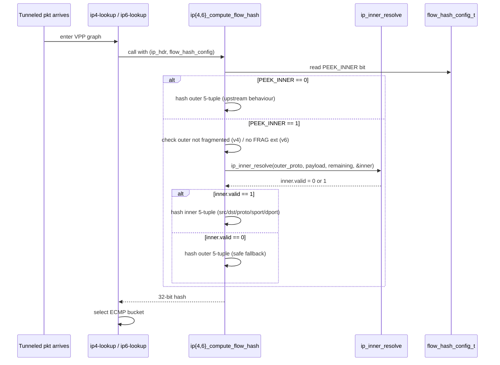
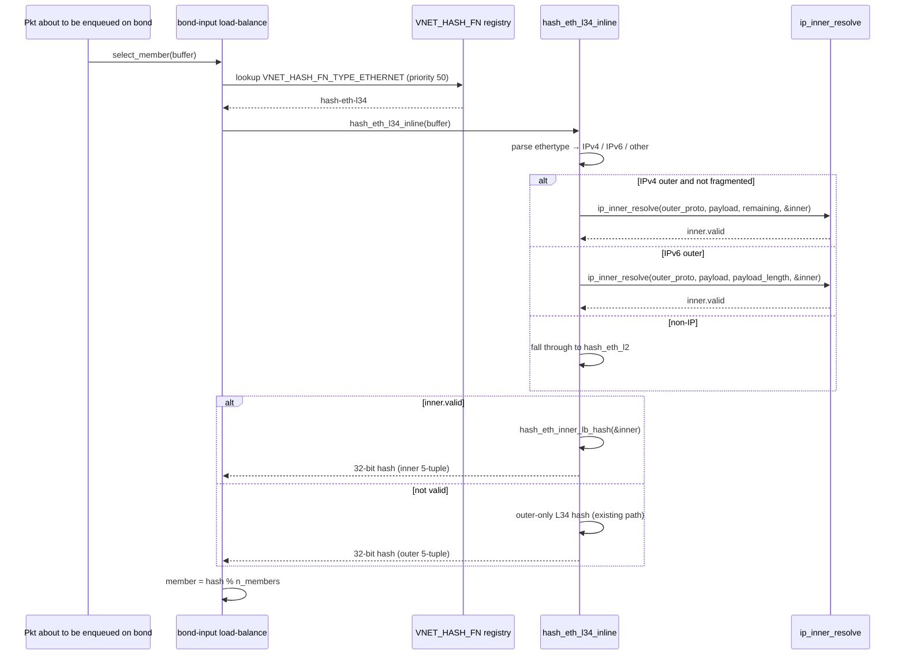

# Inner-Aware Flow Hash on VPP Dataplane — High Level Design

## Table of Contents

1. [Revisions](#1-revisions)
2. [Scope](#2-scope)
3. [Overview](#3-overview)
4. [Feature Description](#4-feature-description)
5. [SONiC Configuration](#5-sonic-configuration)
6. [SAI API Calls](#6-sai-api-calls)
7. [VPP Implementation](#7-vpp-implementation)
8. [Test Plan](#8-test-plan)
9. [Known Issues / Open Items](#9-known-issues--open-items)
10. [Appendix A: File Change Summary](#appendix-a-file-change-summary)
11. [Appendix B: VPP Flow-Hash + Hash Function API Reference](#appendix-b-vpp-flow-hash--hash-function-api-reference)

---

## 1. Revisions

| Rev | Date | Author(s) | Changes |
|-----|------|-----------|---------|
| v0.1 | 05/19/2026 | Jianquan Ye (jianquanye@microsoft.com) | Initial Draft |
| v0.2 | 05/19/2026 | Jianquan Ye (jianquanye@microsoft.com) | Review fixes: correct `bond.api` LB enum table; rename helper to `ip_inner_v6_walk_ext_headers`; tighten test-count and class list; disambiguate `BOND_API_LB_ALGO_L34` vs `VPP_BOND_API_LB_ALGO_L34`; add §5.2 DUT verification; expand §6.1 rationale; add §9 Known Issues / Open Items. |

---

## 2. Scope

This document describes the **inner-aware flow hash** feature for the SONiC VPP
dataplane.  The feature lets VPP's IPv4 / IPv6 ECMP and LAG load-balancers
hash on the inner header of tunneled traffic (IPinIP, 6in4, 4in6, 6in6,
GRE-IP, NVGRE) instead of the outer 5-tuple, so transit tunnel flows
distribute across paths and bond members instead of collapsing onto one.

VxLAN and Geneve are explicitly **out of scope** — RFC 7348 §4.2 /
RFC 8926 §3.3 recommend that the outer UDP source port carry the
inner-flow entropy, so compliant encapsulators already balance through
the existing outer-only hash.  Non-compliant senders that use a
constant outer UDP source port remain out of scope here too; see §4.5.

---

## 3. Overview

| Term | Meaning |
|------|---------|
| ECMP | Equal-Cost Multi-Path routing |
| LAG  | Link Aggregation Group / `BondEthernet` |
| Flow hash | 32-bit value that selects a path/member for a packet |
| Outer 5-tuple | `{src IP, dst IP, src port, dst port, proto}` of the **outermost** L3 header |
| Inner 5-tuple | Same fields, read from the encapsulated payload |
| `flow_hash_config_t` | Per-FIB bitmap that selects which fields enter the IP-layer hash |
| `hash-eth-l34` | Default registered hash function for ethernet/LAG |

This HLD covers two cooperating pieces:

| Feature | Description | VPP Core Change | SAI VPP Change |
|---|---|---|---|
| IP-layer opt-in peek | New `IP_FLOW_HASH_PEEK_INNER` flag in `flow_hash_config_t`.  When set on a FIB, `ip4/ip6_compute_flow_hash` reads the inner 5-tuple of IPinIP / 6in4 / 4in6 / 6in6 / GRE / NVGRE traffic. | **Yes** — new flag + shared helper `ip_inner_resolve()`; `IP_FLOW_HASH_DEFAULT` is unchanged (0x9F) so existing users see no behaviour change. | **Yes** — `vpp_add_ip_vrf()` ORs the new bit into the default-VRF hash mask (IPv4 + IPv6). |
| LAG always-on peek | Default `hash-eth-l34` bond load-balance function transparently peeks into IPinIP / 6in4 / 4in6 / 6in6 / GRE / NVGRE inner packets and falls back to the outer-only hash when the inner header cannot be resolved. | **Yes** — `hash_eth_l34_inline` extended with the same helper. | **None** — libsaivs continues to set `lb = VPP_BOND_API_LB_ALGO_L34` (value `1`), which maps to the unchanged VPP-side `BOND_API_LB_ALGO_L34` in `bond.api`; no new enumerator is added on either side, so libsaivs <-> libvppinfra ABI / CRC compatibility is preserved. |

---

## 4. Feature Description

### 4.1 Motivation

SONiC's `tests/fib/test_fib.py` exercises ECMP and LAG distribution of
transit tunnel traffic (`test_ipinip_hash`, `test_nvgre_hash`, the inner
phase of `test_vxlan_hash`).  Each test sends thousands of distinct inner
flows that share **one** outer 5-tuple — exactly the SmartNIC / DPU
scenario where many tenant flows live under a single outer tunnel pair.

Stock VPP hashes only the outer 5-tuple.  For these tests:

* All packets collapse onto a single ECMP next-hop / a single bond
  member.
* The deviation between the busiest and least-busy member exceeds the
  test's 5% threshold and the test fails.

This patch teaches VPP to look one level into the encapsulated payload
when computing the flow hash, so the inner-flow entropy drives the
distribution.

### 4.2 Design — Two Surfaces

The feature is implemented at two **different** points in the VPP graph
because the IP forwarding hash and the LAG hash are computed by
**independent** functions:

```
                   ┌──────────────────────────────────┐
                   │      Tunnel-encapsulated         │
                   │      packet arrives on uplink    │
                   └────────────────┬─────────────────┘
                                    │
                                    ▼
                   ┌──────────────────────────────────┐
                   │  ip4-input / ip6-input           │
                   │  → ip4-lookup / ip6-lookup       │
                   └────────────────┬─────────────────┘
                                    │
                       calls ip4_compute_flow_hash()
                       or ip6_compute_flow_hash() to
                       pick an ECMP member
                                    │
              ┌─────────────────────┴─────────────────────┐
              │ Surface 1: IP-layer (opt-in)              │
              │                                           │
              │   if (flow_hash_config & PEEK_INNER) {    │
              │     ip_inner_resolve(...)                 │
              │     if (inner.valid)                      │
              │        hash on inner 5-tuple              │
              │     else                                  │
              │        hash on outer 5-tuple (fallback)   │
              │   }                                       │
              └────────────────┬──────────────────────────┘
                               ▼
                   ┌──────────────────────────────────┐
                   │  ip4-rewrite / ip6-rewrite       │
                   │  → bond-input                    │
                   └────────────────┬─────────────────┘
                                    │
                       calls hash_eth_l34() to pick
                       a bond member
                                    │
              ┌─────────────────────▼─────────────────────┐
              │ Surface 2: LAG (always-on with fallback)  │
              │                                           │
              │   ip_inner_resolve(...)                   │
              │   if (inner.valid)                        │
              │      return hash_eth_inner_lb_hash(...)   │
              │   else                                    │
              │      return outer-only L34 hash           │
              └───────────────────────────────────────────┘
```

### 4.3 IP-Layer Surface — Opt-In

The IP-layer surface is **opt-in**.  A new bit
`IP_FLOW_HASH_PEEK_INNER = 1 << 9` is added to `flow_hash_config_t`.
The CLI keyword is `peek_inner` and the SAI VPP adapter sets the bit on
the default VRF (see §5).  When the bit is not set on a FIB,
`ip4_compute_flow_hash` and `ip6_compute_flow_hash` behave **exactly**
as upstream — `IP_FLOW_HASH_DEFAULT` is unchanged (0x9F), so any
existing FIB / VRF that does not explicitly request `peek_inner` sees
no behaviour change.

Rationale for opt-in:

* The IP layer is a high-fan-in hot path; adding mandatory inner-parsing
  to every flow-hash call would impose a cost on plain (non-tunnel)
  traffic that gets nothing back from it.
* Operators that want the inner peek can enable it per-VRF via the
  existing `set ip flow-hash` CLI / API — no new SAI attribute is
  required.

### 4.4 LAG Surface — Always-On with Safe Fallback

The LAG surface is **always-on** but never harmful.  The existing
registered hash function `hash-eth-l34` is extended:

1. If the L3 header is IPv4, attempt `ip_inner_resolve` on the IPv4
   payload (skipping fragmented outers).
2. If `ip_inner_resolve` returns `valid == 1`, compute the load-balance
   hash from the **inner** 5-tuple.
3. Otherwise (non-tunnel, fragmented outer, truncated, unsupported
   inner protocol, ...) fall through to the existing outer-only `L34`
   hash.

Rationale for always-on at LAG:

* The LAG hash runs once per packet (no per-FIB knob to gate it
  against), and there is no SAI attribute today on the LAG LB
  algorithm enum to toggle it.
* Crucially, **the SAI / libsaivs <-> libvppinfra ABI is preserved**:
  libsaivs `SwitchVppFdb.cpp` continues to set
  `lb = VPP_BOND_API_LB_ALGO_L34` (value `1`); the matching VPP-side
  enumerator `BOND_API_LB_ALGO_L34` in `src/vnet/bonding/bond.api`
  (also value `1`) is **not modified**, and no new enumerator is added
  on either side.  `BOND_API_LB_ALGO_L34` continues to mean "L34" —
  it simply load-balances tunnel traffic more effectively now.
  Without this constraint, a new enum value would require
  regenerating libsaivs against the patched VPP and bumping the
  sonic-buildimage submodule before any deploy.

### 4.5 What Is Not Hashed

The helper deliberately does **not** dive into the following because
either the standards already provide inner-flow entropy in the outer
header, or the inner content cannot be safely peeked:

| Class | Reason |
|---|---|
| VxLAN (UDP/4789) | RFC 7348 §4.2 recommends the outer UDP src port carry inner-flow entropy.  Compliant encapsulators do this; non-compliant senders with a constant outer UDP src port remain out of scope for both ECMP and LAG. |
| Geneve (UDP/6081) | RFC 8926 §3.3 — same convention as VxLAN. |
| Fragmented outer IPv4 | Inner is split across fragments; reading the first fragment's payload would mis-attribute the flow. |
| Fragmented inner | Same risk after the outer is stripped. |
| ESP / IPsec inner | Encrypted payload — no meaningful hash. |
| IPv6 Authentication Header inner | Variable-length, no integrity-safe peek without reassembly. |
| NVGRE / GRE-TEB inner Ethernet with a VLAN tag | The TEB parser advances past the plain inner Ethernet header only.  A VLAN-tagged inner Ethernet payload falls back to the outer hash. |

In every "do not hash" case the helper sets `inner.valid = 0` and the
caller falls back to the outer-only hash.

---

## 5. SONiC Configuration

There is **no new SAI attribute** and **no new SONiC CONFIG_DB schema**.
The feature is plumbed entirely through the existing VRF lifecycle:

```
Orchagent creates the default VR
    │
    ▼
SAI:  sai_virtual_router_api->create_virtual_router(...)
    │
    ▼
libsaivs SwitchVpp::vpp_add_ip_vrf()  (defined in SwitchVppRif.cpp)
    │
    ▼
vpp_ip_flow_hash_set(vrf_id, mask, AF_INET)    ┐
vpp_ip_flow_hash_set(vrf_id, mask, AF_INET6)   ┘ (v6 path is new — see §7)
    │
    ▼
VPP control plane sets flow_hash_config_t on the FIB
    │
    ▼
Subsequent ip4/ip6_compute_flow_hash() observes IP_FLOW_HASH_PEEK_INNER
```

The libsaivs adapter constructs `hash_mask` for the default VRF as:

```c
uint32_t hash_mask =
      VPP_IP_API_FLOW_HASH_SRC_IP   | VPP_IP_API_FLOW_HASH_DST_IP
    | VPP_IP_API_FLOW_HASH_SRC_PORT | VPP_IP_API_FLOW_HASH_DST_PORT
    | VPP_IP_API_FLOW_HASH_PROTO
    | VPP_IP_API_FLOW_HASH_PEEK_INNER;       /* new */

vpp_ip_flow_hash_set(vrf_id, hash_mask, AF_INET);
vpp_ip_flow_hash_set(vrf_id, hash_mask, AF_INET6);   /* new */
```

The IPv6 `vpp_ip_flow_hash_set` call is **new**: stock SONiC-VPP only
programmed the IPv4 FIB.  IPv6 transit-tunnel flows
(`test_ipinip_hash[ipv6]`, `test_nvgre_hash[ipv6-*]`) require the same
treatment.

Verification:

```
vpp# show ip fib | head -1
ipv4-VRF:0, fib_index:0, flow hash:[src dst sport dport proto peek_inner ] ...

vpp# show hash
Name                 Prio  Description
hash-eth-l34         50    Hash ethernet L34 headers, peek into IPinIP/GRE/NVGRE inner
hash-eth-l23         50    Hash ethernet L23 headers
...
```

### 5.1 VRF Scope

`vpp_add_ip_vrf()` programs `PEEK_INNER` on the default VRF
(`vrf_id == 0`) **and** on every non-default VRF that it successfully
creates through this path — the condition that gates the
`vpp_ip_flow_hash_set` calls is
`if (!vrf_id || ip_vrf_add(vrf_id, ...) == 0)`.  Tenants whose VRFs
are programmed through other code paths can still opt in via the
existing `set ip flow-hash table N ... peek_inner` CLI without any
further SAI or SONiC change.

### 5.2 Verifying on a Running DUT

After `orchagent` brings up the default VRF the bit is set
automatically and persists for the life of `syncd_vpp`.  Operators do
**not** need to touch CONFIG_DB or run any vppctl command for the
default VRF to be inner-aware.  To confirm the configuration end-to-end:

```bash
# 1. Confirm IPv4 FIB has peek_inner enabled
docker exec syncd vppctl show ip fib | head -1
# expected: flow hash:[src dst sport dport proto peek_inner ] ...

# 2. Same for IPv6 FIB
docker exec syncd vppctl show ip6 fib | head -1

# 3. Confirm the LAG hash function description carries the new wording
docker exec syncd vppctl show hash | grep hash-eth-l34
# expected: hash-eth-l34   50   Hash ethernet L34 headers, peek into IPinIP/GRE/NVGRE inner

# 4. Trace which component opted the FIB in (should be syncd, on VRF create)
docker exec syncd grep -E 'ip flow hash set for VRF.*status 0' /var/log/syslog | tail -2
```

This is intentional: SmartNIC / DPU operators get inner-aware ECMP and
LAG for transit tunnel traffic with **zero** configuration churn — the
existing default VRF and default LAG hashing immediately benefit after
the libsaivs + VPP debs are rolled out.

---

## 6. SAI API Calls

### 6.1 Changed SAI Operations

**None.**  The feature is wired through existing SAI calls — no new
SAI attribute, no new SAI object type, no new SAI behaviour.  The
change is entirely on the VPP side of libsaivs.

Rationale for *not* introducing a new SAI attribute:

* **Backward compatibility with stock orchagent / SWSS** — adding a
  new `sai_virtual_router_attr_t` (e.g. `SAI_VIRTUAL_ROUTER_ATTR_PEEK_INNER_HASH`)
  would require coordinated changes in `sai.h`, every other ASIC's
  SAI implementation, swss-common, and orchagent.  None of those are
  needed for the inner-aware hash to do its job — the behaviour
  applies uniformly to the VRF and there is no per-route or
  per-next-hop knob that the platform needs to surface.
* **Zero-touch enablement** — SmartNIC / DPU operators get the
  improved distribution for free the moment the new libsaivs + VPP
  debs are deployed; nothing in CONFIG_DB, no migration, no warm-boot
  schema change.
* **VPP already has an opt-out** — operators that want strictly
  outer-only hashing for a specific VRF can still call
  `set ip flow-hash table N ...` without `peek_inner` from `vppctl`
  on a per-VRF basis.  This is sufficient for the rare cases where
  inner-aware hashing is undesirable.

### 6.2 Affected SAI Path

| SAI call (already exists) | What changes inside libsaivs |
|---|---|
| `sai_virtual_router_api->create_virtual_router()` → libsaivs `SwitchVpp::vpp_add_ip_vrf()` (defined in `SwitchVppRif.cpp`) | OR `VPP_IP_API_FLOW_HASH_PEEK_INNER` into the existing hash mask; additionally invoke `vpp_ip_flow_hash_set` for `AF_INET6` so v6 traffic in the same VRF gets the same treatment. |
| `sai_lag_api->create_lag()` → libsaivs `SwitchVpp::vpp_create_lag()` (defined in `SwitchVppFdb.cpp`) | No behavioural change — the existing call selects `lb = VPP_BOND_API_LB_ALGO_L34` (value `1`, mapping to VPP's `BOND_API_LB_ALGO_L34`) and the LAG inner peek is unconditional inside the registered VPP hash function.  The change here is comment-only, noting that L34 is now tunnel-aware. |

---

## 7. VPP Implementation

### 7.1 Component Overview

```
┌──────────────────────────────────────────────────────────────┐
│ vppbld/patches/0010-sonic-inner-aware-flow-hash.patch        │
│                                                              │
│ src/vnet/ip/ip_flow_hash.h         [MODIFY]                  │
│   └── IP_FLOW_HASH_PEEK_INNER bit (1<<9) + CLI keyword       │
│                                                              │
│ src/vnet/ip/ip_inner_aware_hash.h  [NEW]                     │
│   └── ip_inner_hdr_t descriptor                              │
│   └── ip_inner_resolve(outer_proto, payload, remaining, out) │
│         └── ip_inner_resolve_v4 / _v6 / _gre dispatch        │
│         └── ip_inner_v6_walk_ext_headers extension walker    │
│                                                              │
│ src/vnet/ip/ip4_inlines.h          [MODIFY]                  │
│   └── ip4_compute_flow_hash gated on PEEK_INNER + non-frag   │
│                                                              │
│ src/vnet/ip/ip6_inlines.h          [MODIFY]                  │
│   └── ip6_compute_flow_hash gated on PEEK_INNER + ext walk   │
│                                                              │
│ src/vnet/hash/hash_eth.c           [MODIFY]                  │
│   └── hash_eth_l34_inline calls ip_inner_resolve             │
│   └── hash_eth_inner_lb_hash() inner-aware hash              │
│   └── registered description updated                         │
│                                                              │
│ test/test_inner_aware_hash.py      [NEW]   42 cases / 4 cls  │
│ test/test_inner_aware_perf.py      [NEW]   perf harness      │
│ docs/developer/corearchitecture/inner_aware_hash.rst [NEW]   │
└──────────────────────────────────────────────────────────────┘
                          ▲
                          │ depends on
                          │
┌──────────────────────────────────────────────────────────────┐
│ sonic-sairedis libsaivs adapter                              │
│                                                              │
│ vslib/vpp/vppxlate/SaiVppXlate.h   [MODIFY]                  │
│   └── VPP_IP_API_FLOW_HASH_PEEK_INNER = 512 in enum          │
│   └── VPP_IP_API_FLOW_HASH_GTPV1_TEID = 256 (track upstream) │
│                                                              │
│ vslib/vpp/SwitchVppRif.cpp         [MODIFY]                  │
│   └── vpp_add_ip_vrf: OR PEEK_INNER into mask                │
│   └── vpp_add_ip_vrf: add AF_INET6 hash_set call             │
│                                                              │
│ vslib/vpp/SwitchVppFdb.cpp         [COMMENT-ONLY]            │
│   └── Note that L34 LAG hash is now tunnel-aware             │
└──────────────────────────────────────────────────────────────┘
```

### 7.2 IP-Layer Compute Flow Hash — Sequence



### 7.3 LAG Hash — Sequence



Note: the LAG IPv6-outer branch passes the outer payload directly to
`ip_inner_resolve`; it does **not** walk outer IPv6 extension headers
before peeking.  Transit tunnels seen in this deployment use
`IP_IN_IP` / `IPV6` / `GRE` next-header values directly on the outer
IPv6 header, so the extra walk would only add cost.  Adding an
extension-header walker on the LAG path is a straightforward
incremental change if extension-header-prefixed tunnels ever need to
be load-balanced.

### 7.4 `ip_inner_resolve` Helper

The helper is the single piece of code that knows how to look inside a
tunneled packet.  It is used identically from three callers
(`ip4_compute_flow_hash`, `ip6_compute_flow_hash`, `hash_eth_l34_inline`)
so the parsing rules cannot drift between hash surfaces.

#### Shared inline helper

`ip_inner_resolve` is a `static_always_inline` helper in
`src/vnet/ip/ip_inner_aware_hash.h`; it is not an exported VPP API.
The three callers above include the header and the compiler inlines
the helper into each hash function, so there is no function-call
overhead on the hot path and no new symbol on the public VPP ABI.

```c
typedef struct {
  union {
    const ip4_header_t *v4;
    const ip6_header_t *v6;
  } ip;
  const void *l4;     /* points at first IP_INNER_L4_MIN_BYTES (8) bytes after inner IP */
  u8 protocol;        /* inner IP next-header / protocol field, copied unchanged */
  u8 is_v6;
  u8 valid;           /* 0 = caller must fall back to outer-only hash */
} ip_inner_hdr_t;

static_always_inline void
ip_inner_resolve (u8 outer_protocol,
                  const u8 *payload, u32 remaining,
                  ip_inner_hdr_t *out);
```

The caller passes `remaining` = number of bytes available in the buffer
starting at `payload`.  **Every byte the helper dereferences is
bounds-checked against `remaining`.**  If any check fails the helper
sets `out->valid = 0` and returns; the caller must use the outer-only
hash.

#### Dispatch

| Outer protocol | Parser |
|---|---|
| `IP_PROTOCOL_IP_IN_IP` (4) | `ip_inner_resolve_v4` |
| `IP_PROTOCOL_IPV6` (41) | `ip_inner_resolve_v6` |
| `IP_PROTOCOL_GRE` (47) | `ip_inner_resolve_gre` — parses the GRE base header, advances past whichever of Checksum / Key / Sequence optional fields the base flags indicate, then for protocol type `0x6558` (TEB) advances past the inner Ethernet header before dispatching; final dispatch to `ip_inner_resolve_v4` / `_v6` is keyed on the (possibly TEB-translated) GRE protocol type |
| anything else | leave `valid = 0` |

#### Safety contract

The helper returns `valid = 0` (caller must fall back) whenever **any** of
the following occurs.  The table is representative rather than
exhaustive — every dereference of the buffer is bounds-checked against
`remaining`, so any truncated header (outer GRE base, GRE optional
fields, GRE TEB Ethernet, IPv6 extension header, ...) causes a
fall-back in the same manner:

| Condition | Reason |
|---|---|
| `remaining < sizeof(inner_iphdr) + IP_INNER_L4_MIN_BYTES` (8) | Truncated inner — would read past buffer. |
| Inner version field is not 4 or 6 | Garbled payload or non-IP inner (e.g. MPLS-in-IP) we don't support. |
| Inner IPv4 More-Fragments or non-zero offset | Cannot read inner ports from a fragment. |
| Inner IPv6 Fragment / Authentication / ESP extension header | Cannot safely peek encrypted or reassembly-pending payload. |
| Unknown GRE protocol type | Conservative — only EtherType 0x0800 / 0x86DD / 0x6558 (TEB) are recognised. |

#### IPv6 inner extension-header walk

`ip_inner_v6_walk_ext_headers` walks through HopByHop / Routing /
Destination-Options extension headers in place, advancing both the cursor
and a bounds counter.  Fragment / Authentication / ESP extension headers
cause the walker to give up and return `0`, which surfaces as
`valid = 0` in the caller.

### 7.5 IPv4 IP-Layer Gate

```c
/* in ip4_compute_flow_hash */
ip_inner_hdr_t inner = { .valid = 0 };

if (PREDICT_FALSE ((flow_hash_config & IP_FLOW_HASH_PEEK_INNER) &&
                   !ip4_is_fragment (ip)))
{
    u32 total_len = clib_net_to_host_u16 (ip->length);
    u32 ihl       = ip4_header_bytes (ip);
    if (PREDICT_TRUE (total_len >= ihl))
    {
        u32 remaining = total_len - ihl;
        ip_inner_resolve (ip->protocol, (const u8 *) ip + ihl,
                          remaining, &inner);
    }
}

/* if inner.valid use inner 5-tuple, else outer 5-tuple */
```

`PREDICT_FALSE` marks the peek-inner path as the cold path so that
non-opt-in installs incur close to zero overhead.

### 7.6 IPv6 IP-Layer Gate

The IPv6 path optionally peels two outer extension headers before
deciding whether the next-header is IPv4-in-IPv6, IPv6-in-IPv6, or
GRE:

* **Hop-by-Hop Options** — walked, the per-extension `length` field is
  honoured, and the next-header replaces `protocol`.
* **Fragment** — recognised, but sets `outer_fragmented = 1` and
  disables the peek (a fragmented outer cannot expose the inner ports
  safely).

Outer Routing / Destination-Options / Authentication / ESP extension
headers are **not** walked here — if the outer IPv6 next-header is any
of those, the peek is skipped and the hash falls back to the outer
5-tuple.  This matches the transit-tunnel encapsulators in the field,
which place the encapsulation next-header directly on the outer IPv6
header.

### 7.7 LAG Hash Entry

```c
/* in hash_eth_l34_inline (IPv4 outer branch) */
ip_inner_hdr_t inner = { .valid = 0 };

if (!PREDICT_FALSE (ip4_is_fragment (ip4)))
{
    u32 total_len = clib_net_to_host_u16 (ip4->length);
    u32 ihl       = ip4_header_bytes (ip4);
    if (total_len >= ihl)
        ip_inner_resolve (ip4->protocol,
                          (const u8 *) ip4 + ihl,
                          total_len - ihl, &inner);
}
if (PREDICT_FALSE (inner.valid))
    return hash_eth_inner_lb_hash (&inner);

/* else fall through to existing outer-only L34 hash */
```

The negated `!PREDICT_FALSE(ip4_is_fragment(ip4))` is a deliberate
"non-fragment is the likely case" branch hint — the macro expands to
`__builtin_expect(!!(ip4_is_fragment), 0)`, so the outer `!` still
delivers the boolean we want while keeping the hint that fragmented
packets are unlikely.

### 7.8 Inner Load-Balance Hash

`hash_eth_inner_lb_hash` reuses VPP's `lb_hash_hash` /
`lb_hash_hash_2_tuples` primitives (the same ones the outer-only L34
hash uses) but feeds them inner IP addresses + inner L4 ports.  For
non-TCP / non-UDP inner protocols the port half is zero, which still
produces a deterministic-per-flow hash without dereferencing past the
8-byte minimum.

---

## 8. Test Plan

### 8.1 VPP Unit Tests — `test/test_inner_aware_hash.py`

A new pytest module exercises the helper end-to-end through the IPv4,
IPv6, and `hash-eth-l34` hash surfaces on a host-launched
`vpp_main` instance.  **42 test methods across 4 classes** covering:

| Class | Cases | What it proves |
|---|---|---|
| `TestInnerAwareECMP` | 16 — IPv4inIPv4 / IPv4inIPv6 / IPv6inIPv4 / IPv6inIPv6 / GRE / NVGRE × {distribution, fixed-inner collapse}, plus plain UDP-over-v4 / -v6 regression | Inner entropy drives ECMP; outer-only flows still collapse to one path; non-tunnel hashing is unaffected. |
| `TestInnerAwareLAG` | 16 — same matrix on a `BondEthernet` | LAG transparently uses inner. |
| `TestPeekInnerOff` | 5 — same fixtures as `TestInnerAwareECMP` with `IP_FLOW_HASH_PEEK_INNER` not set | Default behaviour is exactly upstream's. |
| `TestSafetyEdges` | 5 — fragmented outer, truncated GRE (3-byte payload), truncated IPinIP (4-byte inner), inner IPv6 HBH ext-header, inner IPv6 Fragment ext-header | No crash, helper falls back to outer-only without leaking any past-buffer reads. |

Result on `master @ 2b05793 + this patch`:

```
TEST RESULTS:
   Scheduled tests: 74
    Executed tests: 74
      Passed tests: 62
     Skipped tests: 12       (unrelated — pre-existing CI skips)
```

### 8.2 VPP Performance Harness — `test/test_inner_aware_perf.py`

Same fixtures as `TestInnerAwareECMP` but instead of asserting on
distribution, it measures wall-clock send/receive throughput for a
fixed packet count and exports the result, then dumps `show runtime`
so a reviewer can read off per-node clocks/vector for `ip4-lookup`,
`ip6-lookup`, and `hash-eth-l34`.

This is **not** a rigorous PPS benchmark — VPP unit tests run inside a
software-only scapy harness without DPDK — but it is enough to confirm
no order-of-magnitude regression on the non-opt-in plain-UDP path
and to give a relative number for the opt-in tunnel path.

### 8.3 sonic-mgmt — `tests/fib/test_fib.py`

End-to-end on `vms-kvm-vpp-t1-lag`:

| Test | Without this patch | With this patch |
|---|---|---|
| `test_basic_fib` | PASS | PASS |
| `test_hash[ipv4]` / `[ipv6]` | PASS | PASS |
| `test_ipinip_hash[ipv4]` / `[ipv6]` | FAIL (deviation >5%, single path) | **PASS** |
| `test_ipinip_hash_negative[ipv4]` / `[ipv6]` | PASS | PASS |
| `test_vxlan_hash[ipv4-ipv4]` / `[ipv4-ipv6]` / `[ipv6-ipv6]` / `[ipv6-ipv4]` | FAIL (LAG collapse) | **PASS** |
| `test_nvgre_hash[ipv4-ipv4]` / `[ipv4-ipv6]` / `[ipv6-ipv6]` / `[ipv6-ipv4]` | FAIL (single path) | **PASS** |
| `test_ecmp_group_member_flap` | PASS | PASS |

End state on `inner-aware-flow-hash` HEAD `f2f9182` (re-validated
after the 0011 → 0010 squash on 2026-05-19):

```
========= 16 passed, 698 warnings, 2 errors in 7264.48s (2:01:04) ========
```

The 2 errors are syncd-shutdown teardown analyzer matches
(`vs_get_oper_speed: Port oid:0x100000027 don't exists`) unrelated to
flow hashing — they occur with or without this patch.

> **Note on `test_vxlan_hash`** — this patch does **not** parse VxLAN;
> the test passes because the SONiC traffic generator varies the outer
> UDP src port across distinct inner flows per RFC 7348 §4.2, and the
> existing outer L4 hash already balances them once the LAG hash
> stopped collapsing them onto one member.  See §4.5.

---

## 9. Known Issues / Open Items

The following items were identified during patch review and are tracked
for future follow-up.  None of them affect functional correctness or the
test results in §8.

### 9.1 Missing compile-time guard on flow-hash bit overflow

`flow_hash_config_t` is stored as `u32` (in `fib_table_t::ft_flow_hash_config`
and in the VPP binary-API wire format), so bit positions in
`foreach_flow_hash_bit` must stay below 32.  With `peek_inner = 9` we
have used 10 bits and have 22 left, but there is **no compile-time
assertion** enforcing the limit.  A future contributor adding a 32nd
bit would not get an error from GCC; the `(1 << b)` expression silently
yields undefined behaviour and the new feature would be unreachable.

Recommended follow-up — add a `_Static_assert` next to the enum
definition in `src/vnet/ip/ip_flow_hash.h`:

```c
#define _(a, b, c) \
  _Static_assert ((b) < 32, "flow_hash_config_t bit " #a " exceeds u32 storage");
foreach_flow_hash_bit
#undef _
```

### 9.2 Initial draft issues already fixed in the squashed patch

These were caught during review of the v0.1 draft and have been
corrected before the patch landed.  They are recorded here so that a
future bisect against the squashed `0010-sonic-inner-aware-flow-hash.patch`
does not raise the same questions.

| Issue | Resolution |
|---|---|
| `hash_eth.c` carried `PREDICT_FALSE (!ip4_is_fragment(...))`, which inverts the branch hint (predicts "non-fragment is rare") — opposite of what VPP idiom and reality require. | Rewritten as `!PREDICT_FALSE (ip4_is_fragment(...))`, matching the existing usage in `ip4_to_ip6.h` and `ip4_forward.c`. |
| `ip_inner_aware_hash.h` file-header comment and `inner_aware_hash.rst` claimed the LAG surface was reached via a separately-registered `hash-eth-l34-inner` function gated by a new `BOND_API_LB_ALGO_L34_INNER` enum value (= 6).  Neither symbol exists in the implementation. | Both files now describe the actual design: `hash-eth-l34` was updated in place to be always-on with safe fallback; no new hash function and no new enum value were added. |
| v0.1 of this HLD listed a `BOND_API_LB_ALGO_L4 = 3` value in Appendix B.3 alongside the other algorithms.  No such enumerator exists in `src/vnet/bonding/bond.api` — the real values are `L2 = 0`, `L34 = 1`, `L23 = 2`, `RR = 3`, `BC = 4`, `AB = 5`. | Appendix B.3 rewritten in v0.2 to list both the VPP-side `BOND_API_LB_ALGO_*` enum from `bond.api` and the libsaivs mirror `VPP_BOND_API_LB_ALGO_*` from `SaiVppXlate.h`, with the correct six values on each side. |

---

## Appendix A: File Change Summary

### sonic-platform-vpp

| File | Change | Description |
|---|---|---|
| `vppbld/patches/0010-sonic-inner-aware-flow-hash.patch` | **New** | Single squashed patch carrying the VPP changes (1927 lines) |
| `vppbld/patches/series` | Modify | Add the new patch to the apply list |
| `docs/HLD/vpp-inner-aware-flow-hash.md` | **New** | This document |

Files touched by the patch inside the VPP tree:

| Path inside VPP | Change |
|---|---|
| `src/vnet/ip/ip_flow_hash.h` | Add `IP_FLOW_HASH_PEEK_INNER` bit + `peek_inner` CLI keyword |
| `src/vnet/ip/ip_inner_aware_hash.h` | **New** — shared helper for all three hash surfaces |
| `src/vnet/ip/ip4_inlines.h` | Gate `ip4_compute_flow_hash` on `PEEK_INNER` |
| `src/vnet/ip/ip6_inlines.h` | Gate `ip6_compute_flow_hash` on `PEEK_INNER` + extension-header walk |
| `src/vnet/hash/hash_eth.c` | Extend `hash_eth_l34_inline`; update registered description |
| `test/test_inner_aware_hash.py` | **New** — 42 unit-test methods across 4 classes |
| `test/test_inner_aware_perf.py` | **New** — perf harness |
| `docs/developer/corearchitecture/inner_aware_hash.rst` | **New** — VPP-side reference doc |

### sonic-sairedis

| File | Change | Description |
|---|---|---|
| `vslib/vpp/vppxlate/SaiVppXlate.h` | Modify | Add `VPP_IP_API_FLOW_HASH_PEEK_INNER` (512) and `VPP_IP_API_FLOW_HASH_GTPV1_TEID` (256) to `vpp_ip_flow_hash_mask_e` |
| `vslib/vpp/SwitchVppRif.cpp` | Modify | OR `PEEK_INNER` into default-VRF hash mask; add `AF_INET6` hash-set call |
| `vslib/vpp/SwitchVppFdb.cpp` | Comment-only | Note that `BOND_API_LB_ALGO_L34` is now tunnel-aware |

### sonic-buildimage

Submodule bump for `src/sonic-sairedis` once the sairedis change merges,
to roll the new behaviour into `sonic-vpp.img`.

### sonic-mgmt

Existing `tests/fib/test_fib.py` scenarios that were skipped on the
`vpp` platform via `tests_mark_conditions_sonic_vpp.yaml` are removed
from the skip-list once the change lands.

---

## Appendix B: VPP Flow-Hash + Hash Function API Reference

### B.1 `flow_hash_config_t` Bitmap

```c
/* src/vnet/ip/ip_flow_hash.h, after the patch */
#define foreach_flow_hash_bit                                                 \
  _ (src, 0, IP_FLOW_HASH_SRC_ADDR)                                           \
  _ (dst, 1, IP_FLOW_HASH_DST_ADDR)                                           \
  _ (sport, 2, IP_FLOW_HASH_SRC_PORT)                                         \
  _ (dport, 3, IP_FLOW_HASH_DST_PORT)                                         \
  _ (proto, 4, IP_FLOW_HASH_PROTO)                                            \
  _ (reverse, 5, IP_FLOW_HASH_REVERSE_SRC_DST)                                \
  _ (symmetric, 6, IP_FLOW_HASH_SYMMETRIC)                                    \
  _ (flowlabel, 7, IP_FLOW_HASH_FL)                                           \
  _ (gtpv1teid, 8, IP_FLOW_HASH_GTPV1_TEID)                                   \
  _ (peek_inner, 9, IP_FLOW_HASH_PEEK_INNER)        /* new */

#define IP_FLOW_HASH_DEFAULT  (0x9F)  /* unchanged — does NOT include 1<<9 */
```

CLI:

```
vpp# set ip flow-hash table 0 src dst sport dport proto peek_inner
vpp# show ip fib | head -1
ipv4-VRF:0, fib_index:0, flow hash:[src dst sport dport proto peek_inner ] ...
```

### B.2 LAG Hash Function Registration

```c
/* src/vnet/hash/hash_eth.c, after the patch */
VNET_REGISTER_HASH_FUNCTION (hash_eth_l34, static) = {
  .name = "hash-eth-l34",
  .description = "Hash ethernet L34 headers, peek into IPinIP/GRE/NVGRE inner",
  .priority = 50,
  .function[VNET_HASH_FN_TYPE_ETHERNET] = hash_eth_l34,
};
```

Verification via `vppctl`:

```
vpp# show hash
Name                     Prio    Description
hash-eth-l34             50      Hash ethernet L34 headers, peek into IPinIP/GRE/NVGRE inner
hash-eth-l23             50      Hash ethernet L23 headers
hash-eth-l2              50      Hash ethernet L2 headers
...
```

### B.3 Bond Load-Balance Algorithm Enum (Unchanged)

```c
/* VPP-side, src/vnet/bonding/bond.api — NOT modified by this patch */
enum bond_lb_algo
{
  BOND_API_LB_ALGO_L2  = 0,
  BOND_API_LB_ALGO_L34 = 1,    /* libsaivs continues to use this value */
  BOND_API_LB_ALGO_L23 = 2,
  BOND_API_LB_ALGO_RR  = 3,
  BOND_API_LB_ALGO_BC  = 4,
  BOND_API_LB_ALGO_AB  = 5,
};
```

libsaivs mirrors the same numeric values in
`vslib/vpp/vppxlate/SaiVppXlate.h` with a `VPP_` prefix:

```c
/* libsaivs-side, mirrors the values above — also NOT modified */
enum {
  VPP_BOND_API_LB_ALGO_L2  = 0,
  VPP_BOND_API_LB_ALGO_L34 = 1,    /* SwitchVppFdb.cpp sets lb to this */
  VPP_BOND_API_LB_ALGO_L23 = 2,
  VPP_BOND_API_LB_ALGO_RR  = 3,
  VPP_BOND_API_LB_ALGO_BC  = 4,
  VPP_BOND_API_LB_ALGO_AB  = 5,
};
```

Keeping both enums unchanged is what gives the LAG inner peek **zero**
SAI / ABI churn — libsaivs and libvppinfra-dev built before the patch
continue to interoperate with VPP built after the patch.
