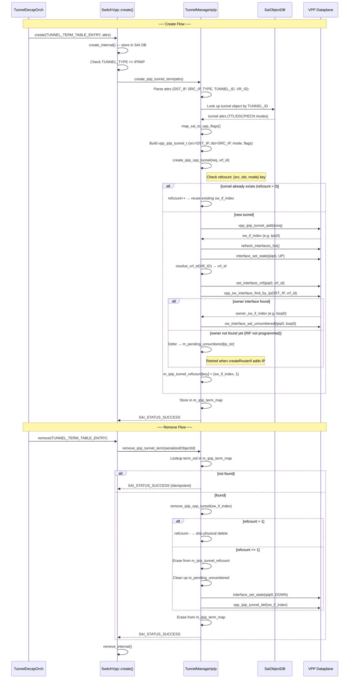
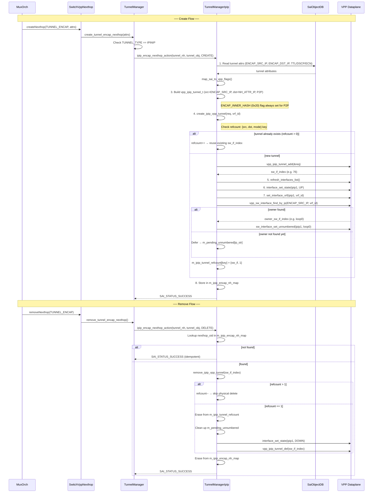
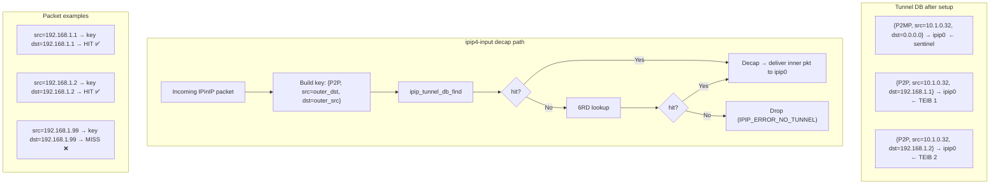
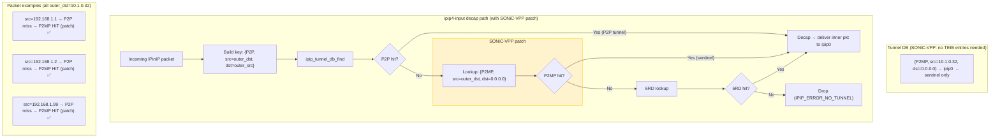

# IPinIP Tunnel on VPP Dataplane — High Level Design

## Table of Contents

1. [Revisions](#1-revisions)
2. [Scope](#2-scope)
3. [Overview](#3-overview)
4. [Feature Description](#4-feature-description)
5. [SONiC Configuration](#5-sonic-configuration)
6. [SAI API Calls](#6-sai-api-calls)
7. [VPP Implementation](#7-vpp-implementation)
8. [VPP P2MP Tunnel SONiC Adaptation](#8-vpp-p2mp-tunnel-sonic-adaptation)
9. [Appendix A: File Change Summary](#appendix-a-file-change-summary)
10. [Appendix B: VPP IPIP API Reference](#appendix-b-vpp-ipip-api-reference)

---

## 1. Revisions

| Rev | Date | Author(s) | Changes |
|-----|------|-----------|---------|
|v0.1 | 04/12/2026 | Longxiang Lyu (lolv@microsoft.com) | Initial Draft |

---

## 2. Scope

This document describes the IPinIP (IPv4/IPv6) tunnel support for SONiC VPP.

---

## 3. Overview

| Term | Meaning                          |
| ---- | -------------------------------- |
| TEIB | Tunnel Endpoint Information Base |

This HLD covers IPinIP tunnel support for the VPP dataplane in SONiC, including both **decapsulation** (P2MP/P2P) and **encapsulation** (P2P) paths.

- **Decap**: Handles P2MP and P2P decap tunnels triggered by `SAI_OBJECT_TYPE_TUNNEL_TERM_TABLE_ENTRY`, used by `TunnelDecapOrch` for features such as MuxCable/Dualtor.
- **Encap**: Handles P2P encap tunnels triggered by `SAI_NEXT_HOP_TYPE_TUNNEL_ENCAP` nexthops, used by `MuxOrch` for active-standby DualToR traffic steering.

| Feature | Description | VPP Core Change | SAI VPP Change |
|---|---|---|---|
| IPinIP Decap (P2MP) | Decapsulate IPinIP packets matching a local DST IP and any SRC IP | Yes — P2MP lookup fix in `ipip4-input` | Yes |
| IPinIP Decap (P2P) | Decapsulate IPinIP packets from a specific peer | None — native IPIP | Yes |
| IPinIP Encap (P2P) | Encapsulate packets and send through IPinIP tunnel | None — native IPIP | Yes |

---

## 4. Feature Description

### 4.1 Decap — How It Works

SONiC creates IPinIP decap tunnels to handle encapsulated traffic arriving at
the switch. The typical use case is:

1. A remote peer encapsulates a packet with an outer IP header (src=peer, dst=our loopback)
2. The packet arrives at the switch's underlay interface
3. SONiC VPP dataplane matches the outer DST IP against a SONiC tunnel decapsulation term entry
4. SONiC VPP dataplane strips the outer IP header (decapsulation)
5. The inner packet is forwarded normally via the overlay FIB

```
Encapsulated packet arrives
│
┌─────────────────────────────────────────────────────────┐
│  SONiC VPP Dataplane                                    │
│                                                         │
│  ┌──────────────┐     ┌──────────────────────┐          │
│  │ ip4-input    │────>│ ipip4-input          │          │
│  │              │     │ (tunnel lookup)      │          │
│  └──────────────┘     └──────────┬───────────┘          │
│                                  │ match: strip outer IP│
│                                  ▼                      │
│                       ┌──────────────────────┐          │
│                       │ ip4-input (inner pkt)│          │
│                       │ route via overlay FIB│          │
│                       └──────────┬───────────┘          │
│                                  ▼                      │
│                       ┌──────────────────────┐          │
│                       │ ip4-rewrite → tx     │          │
│                       └──────────────────────┘          │
│                                                         │
└─────────────────────────────────────────────────────────┘
```

### 4.2 Encap — How It Works

SONiC creates IPinIP encap tunnels to steer traffic through a P2P tunnel to a
specific peer. The typical use case is MuxCable/Dualtor active-standby, where
the standby ToR must forward traffic through the IPinIP tunnel to the active ToR.

1. `MuxOrch` creates a P2P tunnel object with `SAI_TUNNEL_ATTR_ENCAP_SRC_IP` and `SAI_TUNNEL_ATTR_ENCAP_DST_IP`
2. A `TUNNEL_ENCAP` nexthop is created referencing the tunnel + destination IP
3. Routes are programmed to use this tunnel nexthop
4. Matching packets are encapsulated with the outer IP header and forwarded

```
Packet to encap destination
│
┌─────────────────────────────────────────────────────────┐
│  SONiC VPP Dataplane                                    │
│                                                         │
│  ┌──────────────┐     ┌──────────────────────┐          │
│  │ ip4-lookup   │────>│ ipN-midchain         │          │
│  │ (route hit)  │     │ (tunnel adj)         │          │
│  └──────────────┘     └──────────┬───────────┘          │
│                                  │ add outer IP header  │
│                                  ▼                      │
│                       ┌──────────────────────┐          │
│                       │ ipip4-encap          │          │
│                       │ (src=ENCAP_SRC_IP    │          │
│                       │  dst=ENCAP_DST_IP)   │          │
│                       └──────────┬───────────┘          │
│                                  ▼                      │
│                       ┌──────────────────────┐          │
│                       │ adj-midchain-tx      │          │
│                       │ → ip4-rewrite → tx   │          │
│                       └──────────────────────┘          │
│                                                         │
└─────────────────────────────────────────────────────────┘
```

### 4.3 SAI Object Model — Decap

Two SAI objects are involved:

```
SAI_OBJECT_TYPE_TUNNEL (metadata — defines TTL/DSCP/ECN modes)
│
└── SAI_OBJECT_TYPE_TUNNEL_TERM_TABLE_ENTRY (actionable — triggers decap)
    ├── SAI_TUNNEL_TERM_TABLE_ENTRY_ATTR_VR_ID             = virtual router for overlay
    ├── SAI_TUNNEL_TERM_TABLE_ENTRY_ATTR_TYPE              = P2MP (any source) or P2P (specific peer)
    ├── SAI_TUNNEL_TERM_TABLE_ENTRY_ATTR_DST_IP            = our loopback IP (match outer dst)
    ├── SAI_TUNNEL_TERM_TABLE_ENTRY_ATTR_SRC_IP            = remote peer IP (P2P only)
    ├── SAI_TUNNEL_TERM_TABLE_ENTRY_ATTR_TUNNEL_TYPE       = SAI_TUNNEL_TYPE_IPINIP
    └── SAI_TUNNEL_TERM_TABLE_ENTRY_ATTR_ACTION_TUNNEL_ID  = reference to tunnel object above
```

The **tunnel object** is metadata only — it defines encap/decap behavior (TTL/DSCP/ECN modes) but does not trigger any dataplane programming.

The **tunnel term table entry** is the actionable object that tells the dataplane to decapsulate matching packets.

### 4.4 SAI Object Model — Encap

Three SAI objects are involved:

```
SAI_OBJECT_TYPE_TUNNEL (defines tunnel endpoints + TTL/DSCP modes)
│   ├── SAI_TUNNEL_ATTR_TYPE                 = SAI_TUNNEL_TYPE_IPINIP
│   ├── SAI_TUNNEL_ATTR_PEER_MODE            = SAI_TUNNEL_PEER_MODE_P2P
│   ├── SAI_TUNNEL_ATTR_ENCAP_SRC_IP         = local endpoint (our loopback IP)
│   ├── SAI_TUNNEL_ATTR_ENCAP_DST_IP         = remote peer IP
│   ├── SAI_TUNNEL_ATTR_ENCAP_TTL_MODE       = PIPE_MODEL / UNIFORM_MODEL
│   ├── SAI_TUNNEL_ATTR_ENCAP_DSCP_MODE      = PIPE_MODEL / UNIFORM_MODEL
│   ├── SAI_TUNNEL_ATTR_OVERLAY_INTERFACE     = loopback RIF
│   └── SAI_TUNNEL_ATTR_UNDERLAY_INTERFACE    = underlay RIF
│
└── SAI_OBJECT_TYPE_NEXT_HOP (actionable — triggers encap for routes)
    ├── SAI_NEXT_HOP_ATTR_TYPE        = SAI_NEXT_HOP_TYPE_TUNNEL_ENCAP
    ├── SAI_NEXT_HOP_ATTR_IP          = tunnel destination IP (peer endpoint, becomes outer dst)
    └── SAI_NEXT_HOP_ATTR_TUNNEL_ID   = reference to tunnel object above
```

The **tunnel object** defines the P2P endpoints and QoS modes. For encap, the tunnel object carries `ENCAP_SRC_IP` (our loopback) which becomes the outer header source IP. The **nexthop's** `SAI_NEXT_HOP_ATTR_IP` provides the peer endpoint IP that becomes the outer header destination — this is the same value as the tunnel's `ENCAP_DST_IP` in the MuxOrch DualToR use case, but the VPP implementation reads it from the nexthop object.

The **tunnel encap nexthop** is the actionable object — routes pointing to this nexthop will have their packets encapsulated through the tunnel. `MuxOrch` creates these nexthops for active-standby traffic steering.

---

## 5. SONiC Configuration

### 5.1 Decap — ASIC_DB State

After orchagent processes the APP_DB entries, the following objects appear in ASIC_DB:

**Tunnel object** (SAI_OBJECT_TYPE_TUNNEL):
```
 "SAI_TUNNEL_ATTR_TYPE"            = "SAI_TUNNEL_TYPE_IPINIP"
 "SAI_TUNNEL_ATTR_OVERLAY_INTERFACE"  = <loopback RIF OID>
 "SAI_TUNNEL_ATTR_UNDERLAY_INTERFACE" = <underlay RIF OID>
 "SAI_TUNNEL_ATTR_DECAP_ECN_MODE"    = "SAI_TUNNEL_DECAP_ECN_MODE_COPY_FROM_OUTER"
 "SAI_TUNNEL_ATTR_DECAP_TTL_MODE"    = "SAI_TUNNEL_TTL_MODE_PIPE_MODEL"
 "SAI_TUNNEL_ATTR_DECAP_DSCP_MODE"   = "SAI_TUNNEL_DSCP_MODE_PIPE_MODEL"
```

**Tunnel term entry** (SAI_OBJECT_TYPE_TUNNEL_TERM_TABLE_ENTRY):
```
 "SAI_TUNNEL_TERM_TABLE_ENTRY_ATTR_VR_ID"           = <virtual router OID>
 "SAI_TUNNEL_TERM_TABLE_ENTRY_ATTR_TYPE"             = "SAI_TUNNEL_TERM_TABLE_ENTRY_TYPE_P2MP"
 "SAI_TUNNEL_TERM_TABLE_ENTRY_ATTR_TUNNEL_TYPE"      = "SAI_TUNNEL_TYPE_IPINIP"
 "SAI_TUNNEL_TERM_TABLE_ENTRY_ATTR_ACTION_TUNNEL_ID" = <tunnel OID>
 "SAI_TUNNEL_TERM_TABLE_ENTRY_ATTR_DST_IP"           = "10.1.0.32"
```

### 5.2 Encap — ASIC_DB State

When `MuxOrch` creates a P2P encap tunnel:

**P2P Tunnel object** (SAI_OBJECT_TYPE_TUNNEL):
```
 "SAI_TUNNEL_ATTR_TYPE"                = "SAI_TUNNEL_TYPE_IPINIP"
 "SAI_TUNNEL_ATTR_PEER_MODE"           = "SAI_TUNNEL_PEER_MODE_P2P"
 "SAI_TUNNEL_ATTR_ENCAP_SRC_IP"        = "10.1.0.32"
 "SAI_TUNNEL_ATTR_ENCAP_DST_IP"        = "10.1.0.33"
 "SAI_TUNNEL_ATTR_ENCAP_TTL_MODE"      = "SAI_TUNNEL_TTL_MODE_PIPE_MODEL"
 "SAI_TUNNEL_ATTR_ENCAP_DSCP_MODE"     = "SAI_TUNNEL_DSCP_MODE_PIPE_MODEL"
 "SAI_TUNNEL_ATTR_OVERLAY_INTERFACE"    = <loopback RIF OID>
 "SAI_TUNNEL_ATTR_UNDERLAY_INTERFACE"   = <underlay RIF OID>
```

**Tunnel encap nexthop** (SAI_OBJECT_TYPE_NEXT_HOP):
```
 "SAI_NEXT_HOP_ATTR_TYPE"      = "SAI_NEXT_HOP_TYPE_TUNNEL_ENCAP"
 "SAI_NEXT_HOP_ATTR_IP"        = "192.168.0.100"
 "SAI_NEXT_HOP_ATTR_TUNNEL_ID" = <P2P tunnel OID>
```

---

## 6. SAI API Calls

### 6.1 Decap — Create/Remove Tunnel Object

```c
sai_attribute_t attrs[] = {
    { SAI_TUNNEL_ATTR_TYPE,
      .value.s32 = SAI_TUNNEL_TYPE_IPINIP },
    { SAI_TUNNEL_ATTR_OVERLAY_INTERFACE,
      .value.oid = overlay_rif_oid },
    { SAI_TUNNEL_ATTR_UNDERLAY_INTERFACE,
      .value.oid = underlay_rif_oid },
    { SAI_TUNNEL_ATTR_DECAP_ECN_MODE,
      .value.s32 = SAI_TUNNEL_DECAP_ECN_MODE_COPY_FROM_OUTER },
    { SAI_TUNNEL_ATTR_DECAP_TTL_MODE,
      .value.s32 = SAI_TUNNEL_TTL_MODE_PIPE_MODEL },
    { SAI_TUNNEL_ATTR_DECAP_DSCP_MODE,
      .value.s32 = SAI_TUNNEL_DSCP_MODE_PIPE_MODEL },
};
sai_tunnel_api->create_tunnel(&tunnel_oid, switch_id, 6, attrs);
sai_tunnel_api->remove_tunnel(tunnel_oid);
```

The decap tunnel object is metadata only — it stores TTL/DSCP/ECN modes in the SAI object DB but does not program VPP. All VPP programming happens when the tunnel term table entry is created (section 6.2).

### 6.2 Decap — Create/Remove Tunnel Term Table Entry

Created per decap endpoint. This triggers VPP dataplane programming:

```c
sai_attribute_t attrs[] = {
    { SAI_TUNNEL_TERM_TABLE_ENTRY_ATTR_VR_ID,
      .value.oid = vr_oid },
    { SAI_TUNNEL_TERM_TABLE_ENTRY_ATTR_TYPE,
      .value.s32 = SAI_TUNNEL_TERM_TABLE_ENTRY_TYPE_P2MP },
    { SAI_TUNNEL_TERM_TABLE_ENTRY_ATTR_TUNNEL_TYPE,
      .value.s32 = SAI_TUNNEL_TYPE_IPINIP },
    { SAI_TUNNEL_TERM_TABLE_ENTRY_ATTR_ACTION_TUNNEL_ID,
      .value.oid = tunnel_oid },
    { SAI_TUNNEL_TERM_TABLE_ENTRY_ATTR_DST_IP,
      .value.ipaddr = { .addr_family = SAI_IP_ADDR_FAMILY_IPV4,
                         .addr.ip4 = 0x200A0A0A /* 10.1.0.32 */ } },
};
sai_tunnel_api->create_tunnel_term_table_entry(&term_oid, switch_id, 5, attrs);
sai_tunnel_api->remove_tunnel_term_table_entry(term_oid);
```

### 6.3 Encap — Create/Remove P2P Encap Tunnel Object and Tunnel Encap Nexthop

Created by `MuxOrch` for MuxCable/Dualtor:

```c
sai_attribute_t attrs[] = {
    { SAI_TUNNEL_ATTR_TYPE,
      .value.s32 = SAI_TUNNEL_TYPE_IPINIP },
    { SAI_TUNNEL_ATTR_PEER_MODE,
      .value.s32 = SAI_TUNNEL_PEER_MODE_P2P },
    { SAI_TUNNEL_ATTR_OVERLAY_INTERFACE,
      .value.oid = overlay_rif_oid },
    { SAI_TUNNEL_ATTR_UNDERLAY_INTERFACE,
      .value.oid = underlay_rif_oid },
    { SAI_TUNNEL_ATTR_ENCAP_SRC_IP,
      .value.ipaddr = src_ip },              // 10.1.0.32 (local loopback)
    { SAI_TUNNEL_ATTR_ENCAP_DST_IP,
      .value.ipaddr = dst_ip },              // 10.1.0.33 (peer loopback)
    { SAI_TUNNEL_ATTR_ENCAP_TTL_MODE,
      .value.s32 = SAI_TUNNEL_TTL_MODE_PIPE_MODEL },
    { SAI_TUNNEL_ATTR_ENCAP_DSCP_MODE,
      .value.s32 = SAI_TUNNEL_DSCP_MODE_PIPE_MODEL },
};
sai_tunnel_api->create_tunnel(&tunnel_oid, switch_id, 8, attrs);
sai_attribute_t attrs[] = {
    { SAI_NEXT_HOP_ATTR_TYPE,
      .value.s32 = SAI_NEXT_HOP_TYPE_TUNNEL_ENCAP },
    { SAI_NEXT_HOP_ATTR_IP,
      .value.ipaddr = dst_ip },              // inner destination IP
    { SAI_NEXT_HOP_ATTR_TUNNEL_ID,
      .value.oid = tunnel_oid },             // reference to P2P tunnel above
};
sai_next_hop_api->create_next_hop(&nh_oid, switch_id, 3, attrs);
sai_next_hop_api->remove_next_hop(nh_oid);
sai_tunnel_api->remove_tunnel(tunnel_oid);
```

---

## 7. VPP Implementation

### 7.1 Component Overview

```
SONiC Orchestration (TunnelDecapOrch / MuxOrch)
│
▼
SAI API (libsaivpp)
│
▼
┌──────────────────────────────────────────────────────┐
│ src/sonic-sairedis/vslib/vpp/                        │
│                                                      │
│ SwitchVpp.cpp (create / remove dispatch)             │
│ SwitchVppNexthop.cpp (nexthop create dispatch)       │
│ │                                                    │
│ ├── TunnelManager.h [MODIFY]                         │
│ │   └── TunnelManagerIpIp class                      │
│ │       ├── IpIpTunnelVPPData struct                 │
│ │       ├── IpIpTunnelKey / IpIpTunnelRef (dedup)    │
│ │       ├── PendingUnnumbered struct                 │
│ │       ├── create_ipip_tunnel_term()   (decap)      │
│ │       ├── remove_ipip_tunnel_term()   (decap)      │
│ │       ├── ipip_encap_nexthop_action() (encap)      │
│ │       ├── get_tunnel_if()             (encap)      │
│ │       ├── create_ipip_vpp_tunnel()    (shared)     │
│ │       ├── remove_ipip_vpp_tunnel()    (shared)     │
│ │       └── retry_pending_unnumbered()  (deferred)   │
│ │                                                    │
│ ├── TunnelManager.cpp [MODIFY]                       │
│ │   ├── map_sai_to_vpp_flags()                       │
│ │   ├── create_ipip_vpp_tunnel()  (refcount + dedup) │
│ │   ├── remove_ipip_vpp_tunnel()  (refcount guard)   │
│ │   ├── create_ipip_tunnel_term()                    │
│ │   ├── remove_ipip_tunnel_term()                    │
│ │   ├── ipip_encap_nexthop_action()                  │
│ │   └── retry_pending_unnumbered()                   │
│ │                                                    │
│ ├── SwitchVppRif.cpp [MODIFY]                        │
│ │   └── calls retry_pending_unnumbered() after IP    │
│ │       address add on physical/loopback interfaces  │
│ │                                                    │
│ └── vppxlate/                                        │
│     ├── SaiVppXlate.h [MODIFY]                       │
│     │   ├── vpp_ipip_tunnel_t struct                 │
│     │   ├── vpp_ipip_tunnel_add()                    │
│     │   ├── vpp_ipip_tunnel_del()                    │
│     │   ├── sw_interface_set_unnumbered()            │
│     │   └── vpp_sw_interface_find_by_ip(ip, vrf)     │
│     └── SaiVppXlate.c [MODIFY]                       │
│         └── implement all wrappers above             │
└──────────────────────────────────────────────────────┘
```

### 7.2 Decap WorkFlow


### 7.3 Encap WorkFlow




### 7.4 SAI → VPP Flag Mapping

`map_sai_to_vpp_flags()` reads tunnel object attributes and maps to VPP `tunnel_encap_decap_flags`:

| SAI Attribute | SAI Value | VPP Flag | Bit |
|---|---|---|---|
| `SAI_TUNNEL_ATTR_DECAP_ECN_MODE` | `SAI_TUNNEL_DECAP_ECN_MODE_COPY_FROM_OUTER` | `TUNNEL_API_ENCAP_DECAP_FLAG_DECAP_COPY_ECN` | 0x10 |
| `SAI_TUNNEL_ATTR_DECAP_TTL_MODE` | `SAI_TUNNEL_TTL_MODE_UNIFORM_MODEL` | `TUNNEL_API_ENCAP_DECAP_FLAG_ENCAP_COPY_HOP_LIMIT` | 0x40 |
| `SAI_TUNNEL_ATTR_DECAP_DSCP_MODE` | `SAI_TUNNEL_DSCP_MODE_UNIFORM_MODEL` | `TUNNEL_API_ENCAP_DECAP_FLAG_ENCAP_COPY_DSCP` | 0x04 |
| `SAI_TUNNEL_ATTR_ENCAP_TTL_MODE` | `SAI_TUNNEL_TTL_MODE_UNIFORM_MODEL` | `TUNNEL_API_ENCAP_DECAP_FLAG_ENCAP_COPY_HOP_LIMIT` | 0x40 |
| `SAI_TUNNEL_ATTR_ENCAP_DSCP_MODE` | `SAI_TUNNEL_DSCP_MODE_UNIFORM_MODEL` | `TUNNEL_API_ENCAP_DECAP_FLAG_ENCAP_COPY_DSCP` | 0x04 |
| `SAI_TUNNEL_ATTR_ENCAP_ECN_MODE` | `SAI_TUNNEL_ENCAP_ECN_MODE_USER_DEFINED` | `TUNNEL_API_ENCAP_DECAP_FLAG_ENCAP_COPY_ECN` | 0x08 |
| *(P2P tunnels only)* | *(always set)* | `TUNNEL_API_ENCAP_DECAP_FLAG_ENCAP_INNER_HASH` | 0x20 |

**Note**: The `ENCAP_INNER_HASH` flag (0x20) is unconditionally added for all P2P tunnels (both decap P2P terms and encap nexthops). It causes VPP to hash on the inner 5-tuple for ECMP load balancing instead of the outer header.

### 7.5 Tunnel Deduplication (Refcount)

Both decap (`create_ipip_tunnel_term`) and encap (`ipip_encap_nexthop_action`) paths share a common `create_ipip_vpp_tunnel()` / `remove_ipip_vpp_tunnel()` pair that implements **refcount-based deduplication**.

**Problem:** Multiple SAI objects (e.g., multiple tunnel term entries or multiple encap nexthops) can map to the same VPP IPIP tunnel `{src, dst, mode}`. Creating duplicate VPP tunnels with the same key would fail.

**Solution:** A dedup map `m_ipip_tunnel_refcount` keyed by `IpIpTunnelKey{src, dst, mode}`:

```
create_ipip_vpp_tunnel(req, vrf_id, &sw_if_index):
  key = {req.src, req.dst, req.mode}
  if key in m_ipip_tunnel_refcount:
      refcount++
      sw_if_index = existing sw_if_index
      return SUCCESS  // no VPP API call
  else:
      vpp_ipip_tunnel_add(...)
      ... bring UP, assign VRF, set unnumbered ...
      m_ipip_tunnel_refcount[key] = {sw_if_index, refcount=1}

remove_ipip_vpp_tunnel(sw_if_index):
  find entry by sw_if_index in m_ipip_tunnel_refcount
  if --refcount > 0:
      return SUCCESS  // tunnel still in use
  else:
      erase from refcount map
      interface DOWN + vpp_ipip_tunnel_del()
```

### 7.6 Deferred Unnumbered Interface Setup

**Problem:** When an IPIP tunnel is created, it needs to borrow its IP address from the interface owning the tunnel source IP (e.g., `Loopback0`). However, the tunnel term may be created before the loopback RIF's IP address is programmed in VPP — `vpp_sw_interface_find_by_ip()` returns `-ENOENT`.

**Solution:** A `m_pending_unnumbered` multimap defers the `sw_interface_set_unnumbered` call:

1. **On tunnel create:** If `vpp_sw_interface_find_by_ip()` fails, store a `PendingUnnumbered{sw_if_index, src_address, vrf_id}` entry keyed by the IP string.
2. **On RIF IP add:** After `interface_ip_address_add_del()` succeeds in `SwitchVppRif.cpp`, call `m_tunnel_mgr_ipip.retry_pending_unnumbered(ip_prefix.prefix_addr)`.
3. **On retry:** `retry_pending_unnumbered()` re-calls `vpp_sw_interface_find_by_ip()` (which now succeeds), applies `sw_interface_set_unnumbered()` for all pending tunnels, and erases completed entries.

This handles the ordering dependency between `TunnelDecapOrch` (creates tunnels early) and `IntfsOrch` (assigns IPs to loopback later).

### 7.7 VPP Translation Changes

**File**: `vslib/vpp/vppxlate/SaiVppXlate.h` / `SaiVppXlate.c`

The following struct and C-level VPP API wrappers are added to the SAI-to-VPP translation layer:

#### Struct: `vpp_ipip_tunnel_t`

`vpp_ipip_tunnel_t` is the struct passed to `vpp_ipip_tunnel_add()`. It mirrors the fields of VPP's `IPIP_ADD_TUNNEL` API message:

```c
typedef struct _vpp_ipip_tunnel {
    vpp_ip_addr_t src_address;   // local endpoint IP
    vpp_ip_addr_t dst_address;   // remote peer IP (0.0.0.0 for P2MP)
    uint32_t      table_id;      // underlay VRF
    uint8_t       flags;         // tunnel_encap_decap_flags from map_sai_to_vpp_flags()
    uint8_t       mode;          // 0 = P2P, 1 = P2MP
    uint8_t       dscp;          // fixed DSCP value
    uint32_t      instance;      // tunnel instance (~0 for auto-assign)
} vpp_ipip_tunnel_t;
```

#### New / Modified Functions

| Function | VPP API Message | Description |
|---|---|---|
| `vpp_ipip_tunnel_add(vpp_ipip_tunnel_t *tunnel, uint32_t *sw_if_index)` | `IPIP_ADD_TUNNEL` | Creates an IPIP tunnel interface in VPP. Returns the allocated `sw_if_index` (e.g. `ipip0`). |
| `vpp_ipip_tunnel_del(uint32_t sw_if_index)` | `IPIP_DEL_TUNNEL` | Deletes an IPIP tunnel interface by its `sw_if_index`. |
| `sw_interface_set_unnumbered(uint32_t unnumbered_sw_if_index, uint32_t ip_sw_if_index, bool is_add)` | `SW_INTERFACE_SET_UNNUMBERED` | Configures an unnumbered interface: `unnumbered_sw_if_index` borrows its IP from `ip_sw_if_index`. |
| `vpp_sw_interface_find_by_ip(vpp_ip_addr_t *search_ip, uint32_t vrf_id, uint32_t *out_sw_if_index)` | `IP_ADDRESS_DUMP` | Finds the `sw_if_index` of the interface owning a given IP address within the specified VRF. Iterates all known interfaces from `interface_name_by_sw_index` hash via per-interface `IP_ADDRESS_DUMP` queries. Returns `-ENOENT` if no match. |

#### `vpp_sw_interface_find_by_ip` — Implementation Note

The function finds the interface owning the IP address by:

1. Collecting all known `sw_if_index` values from the `interface_name_by_sw_index` clib hash into a `vec`.
2. Iterating each interface individually, sending `IP_ADDRESS_DUMP` per interface.
3. The reply handler (`vl_api_ip_address_details_t_handler`) compares the dumped address against the search target; on match it records the `sw_if_index`.

---

## 8. VPP P2MP Tunnel SONiC Adaptation

### 8.1 VPP P2MP Design

VPP's internal IPIP tunnel database (`src/vnet/ipip/ipip.c`) is a hash map keyed by `ipip_tunnel_key_t`:

```c
typedef struct {
    ip46_address_t src;        // tunnel source (local endpoint)
    ip46_address_t dst;        // tunnel destination (0.0.0.0 for P2MP/6RD)
    u32            fib_index;
    ipip_transport_t transport; // IP4 or IP6
    ipip_mode_t    mode;       // P2P, P2MP, or 6RD
} ipip_tunnel_key_t;
```

VPP supports three IPIP tunnel modes:

| Mode | `dst` field | Lookup match | Use case |
|---|---|---|---|
| **P2P** | remote IP | exact (src, dst, P2P) | Single fixed remote peer |
| **P2MP** | `0.0.0.0` | control-plane sentinel only | Multiple remote peers via TEIB |
| **6RD** | `0.0.0.0` | wildcard (src only, 6RD) | IPv6 rapid deployment |

#### Design: P2MP tunnel + TEIB (Tunnel Endpoint Information Base)

A P2MP tunnel is created with `dst = 0.0.0.0` and `mode = TUNNEL_API_MODE_MP`. The resulting `{P2MP, dst=0.0.0.0}` DB entry is a **control-plane sentinel** (used by `ipip_tunnel_db_find_by_sw_if_index` bookkeeping) — the data-plane **never** looks up P2MP-mode keys.

Each remote peer is registered via a **TEIB entry**. Its creation function `ipip_teib_mk_key()` inserts a **P2P-mode key** into the tunnel DB using the TEIB `nh` as `key.dst`:

```c
ipip_mk_key_i(transport, IPIP_MODE_P2P,
              &t->tunnel_src,       // our local IP
              &nh->fp_addr,         // TEIB nh = underlay nexthop IP
              fib_index, key);
ipip_tunnel_db_add(t, &key);
```

TEIB addresses: **peer** = overlay IP (encap adjacency target), **nh** = underlay IP (decap DB key, must equal `outer_pkt.src`).

On decap, `ipip4-input` always builds a P2P-mode key from each packet's outer headers. A hit means the sender has a TEIB entry; a miss falls through to 6RD, then drops. This is an **allowlist** model — unknown peers are rejected.

#### Example and Walkthrough

```
vpp# create ipip tunnel src 10.1.0.32 dst 0.0.0.0 p2mp   → ipip0
vpp# create teib ipip0 peer 10.10.10.1 nh 192.168.1.1
vpp# create teib ipip0 peer 10.10.10.2 nh 192.168.1.2
```



Removing a TEIB entry (`delete teib ipip0 peer 10.10.10.1`) removes that peer's P2P key, making packets from its nh drop immediately.

### 8.2 SAI vs VPP Semantic Mismatch

| | SAI P2MP tunnel term | VPP P2MP tunnel |
|---|---|---|
| Match rule | `dst_ip == any source` | per-peer TEIB key `{P2P, dst=nh}` |
| Unknown peer | decaps freely | drops |
| Per-peer registration | not required | **required** via TEIB |

SONiC creates a single P2MP decap tunnel term entry that expects **any** encapsulated packet destined for the decap term dest IP to be decapsulated, regardless of the sender. VPP requires each sender to be explicitly registered via TEIB.

### 8.3 SONiC-VPP Adaptation

To bridge the semantic gap, the SONiC-VPP implementation patches the VPP core to add a P2MP wildcard fallback in the decap lookup - no more TEIBs required. This trades VPP's per-peer allowlist security for SAI-compatible permissive decap.

```
vpp# create ipip tunnel src 10.1.0.32 dst 0.0.0.0 p2mp   → ipip0
```



---

## Appendix A: File Change Summary

### sonic-sairedis

| File | Change | Description |
|---|---|---|
| `vslib/vpp/SwitchVpp.cpp` | Modify | Dispatch create/remove for `SAI_OBJECT_TYPE_TUNNEL_TERM_TABLE_ENTRY` to `TunnelManagerIpIp` (decap) |
| `vslib/vpp/SwitchVpp.h` | Modify | Add `TunnelManagerIpIp m_tunnel_mgr_ipip` member |
| `vslib/vpp/SwitchVppNexthop.cpp` | Modify | Dispatch `SAI_NEXT_HOP_TYPE_TUNNEL_ENCAP` for IPIP tunnels to `TunnelManagerIpIp` (encap) |
| `vslib/vpp/TunnelManager.h` | Modify | Add `IpIpTunnelVPPData` class, `TunnelManagerIpIp` class with decap + encap methods |
| `vslib/vpp/TunnelManager.cpp` | Modify | Implement decap (`create/remove_ipip_tunnel_term`), encap (`ipip_encap_nexthop_action`), `map_sai_to_vpp_flags()` |
| `vslib/vpp/vppxlate/SaiVppXlate.h` | Modify | Add `vpp_ipip_tunnel_t`, `vpp_ipip_tunnel_add/del()`, `sw_interface_set_unnumbered()`, `vpp_sw_interface_find_by_ip()` |
| `vslib/vpp/vppxlate/SaiVppXlate.c` | Modify | Implement VPP API wrappers for IPIP tunnel, unnumbered, and IP lookup |

### sonic-platform-vpp

| File | Change | Description |
|---|---|---|
| `vppbld/patches/0008-ipip-fix-P2MP-tunnel-lookup.patch` | **New** | Fix VPP P2MP tunnel lookup order in `ipip4-input` node |
| `vppbld/patches/series` | Modify | Add patch to quilt series |
| `docs/HLD/vpp-ipiptunnel.md` | **New** | This document |

---

## Appendix B: VPP IPIP API Reference

### IPIP Tunnel API (`ipip.api`)

```c
define ipip_add_tunnel {
    vl_api_ipip_tunnel_t tunnel;
};

define ipip_add_tunnel_reply {
    i32 retval;
    vl_api_interface_index_t sw_if_index;
};

define ipip_del_tunnel {
    vl_api_interface_index_t sw_if_index;
};

typedef ipip_tunnel {
    u32 instance;
    vl_api_address_t src;
    vl_api_address_t dst;
    vl_api_interface_index_t sw_if_index;
    u32 table_id;
    vl_api_tunnel_encap_decap_flags_t flags;
    vl_api_tunnel_mode_t mode;
    vl_api_ip_dscp_t dscp;
};
```

### Tunnel Mode

```c
enum tunnel_mode : u8 {
    TUNNEL_API_MODE_P2P = 0,    // point-to-point (specific src+dst)
    TUNNEL_API_MODE_MP = 1,     // multipoint (src only, dst=0.0.0.0)
};
```

### Tunnel Encap/Decap Flags

```c
enum tunnel_encap_decap_flags : u8 {
    TUNNEL_API_ENCAP_DECAP_FLAG_NONE            = 0x0,
    TUNNEL_API_ENCAP_DECAP_FLAG_ENCAP_COPY_DSCP = 0x04,
    TUNNEL_API_ENCAP_DECAP_FLAG_ENCAP_COPY_ECN  = 0x08,
    TUNNEL_API_ENCAP_DECAP_FLAG_DECAP_COPY_ECN  = 0x10,
    TUNNEL_API_ENCAP_DECAP_FLAG_ENCAP_COPY_HOP_LIMIT = 0x40,
};
```

### SW Interface Unnumbered API

```c
define sw_interface_set_unnumbered {
    vl_api_interface_index_t sw_if_index;         // unnumbered interface (ipip0)
    vl_api_interface_index_t unnumbered_sw_if_index; // IP donor (bvi1000)
    bool is_add;
};
```
