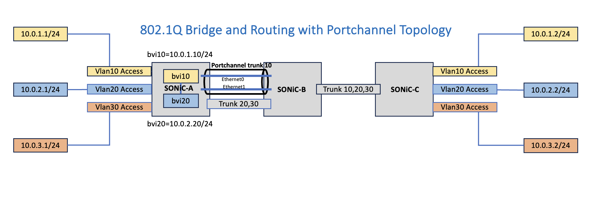

# SONIC VPP LAG Support
Rev v0.2

<br/>
<br/>

## Table of Contents

1. [Revisions](#item-1)
2. [Scope](#item-2)
3. [Definitions/Abbreviations](#item-3)
4. [Introduction](#item-4)
5. [LAG and Bridging](#item-5)
6. [LACP Support](#item-6)
7. [LAG L3 Support](#item-7)
8. [TODOs](#item-8)

<br/>
<br/>

<a id="item-1"></a>
## Revisions

| Rev | Date | Author(s) | Changes |
|-----|------|-----------|---------|
|v0.1 | 25/02/2024 | Bendrapu Balareddy (Cisco), Sameer Nanajkar (Cisco) | LAG & Bridging Support |
|v0.2 | 17/12/2024 | Akeel Ali (Cisco) | LACP & L3 Support |


<br/>
<br/>

<a id="item-2"></a>
## Scope
This document describes the high level design of integrating LAG between SONIC and VPP. It covers:
 - LAG and 802.1Q bridging
 - LACP

<br/>

<a id="item-3"></a>
## Definitions/Abbreviations
**VPP**: Vector Packet Processing (VPP) technology based high performance packet processing stack that can run on commodity CPUs. For more details see [What is VPP](https://wiki.fd.io/view/VPP/What_is_VPP%3F)

**LAG**:  Ling Aggregation Group


<br/>
<br/>

<a id="item-4"></a>
## Introduction
LAG functionality is supported in SONiC with port channel interfaces. 
VPP port channel supports modes as active-standby, active-active or LACP mode. But SONiC does not have a way program
this through configuration. Hence the portchannel mode as default active-active by giving ROUND_ROBIN value. Similarly
VPP supports different load balancing algorithms for distributing the traffic in active-active mode. But again SONIC
does not support a way to configure any load balancing algorithm, hence it's programmed as BOND_API_LB_ALGO_L2 by default.

Some parameters the SONIC supports are not supported by VPP. The attributes like min-links for portchannel group, fast-rate
etc are not supported by VPP.


 
<a id="item-5"></a>
## LAG and Bridging
 

SONiC supports port channel interfaces. These interfaces can be configured for layer routing or as members of a vlan
 - Access port
   config vlan member add -u <portname> creates an un tagged bridge port. This will be translated to vpp in two steps
   1. creates a bridge with given vlan id as bridge id if the bridge with given id doesnot exist.
   2. set the port as member of bridge with appropriate tag rewrite
 - Trunk port
   config vlan member add  <portname> creates a tagged port bridge port. This will be translated to vpp in three steps
   1. creates a bridge with given vlan id as bridge id if the bridge with given aid does not exist.
   2. vpp trunk port operation is achieved through vlan subinterface. A subinterface is created for this vlan id. Note
      that this subinterface is only specific to vpp and does not appear in SONiC control plane data bases.
   3. set the vlan subinterface as bridge port

<a id="item-6"></a>
## LACP Support

In the current implementation, the PortChannel is reported down because the LACP packets generated by SONiC are dropped by VPP and not forwarded to the peer.
This section explores how we can support LACP in SONiC-VPP. 
<br/>
<br/>
Both SONiC and VPP can run LACP. If we choose to run LACP in VPP, the PortChannel interface in SONiC will not be reported up.
Instead, we need to let SONiC run LACP and instruct VPP to carry SONiC's LACP packets without generating or consuming them.

To achieve this, we can use the VPP [linux-cp plugin](https://s3-docs.fd.io/vpp/22.06/developer/plugins/lcp.html) to mirror packets between the member tap interfaces (on host) 
and the corresponding VPP phy interface.

However, the linux-cp plugin does not currently support LACP packets. We will need to add support in VPP to use this plugin for this purpose.

As an experiment, I  added a new node to the plugin (fashioned after lip_punt_node) that can punt and inject packets (between host and phy), then registered it with ethernet-input to handle ETHERNET_TYPE_SLOW_PROTOCOLS packets. This resulted in the injected SONiC LACP packets successfully forwarded and then punted to the peer SONiC device, allowing the PortChannel to come up and the LACP protocol to run successfully.

Also note that that the lacp plugin should not be enabled, nor should we configure the BondEthernet in lacp mode to ensure VPP does not run its own LACP protocol. Instead, we configure the BondEthernet in `VPP_BOND_API_MODE_XOR` so that we can use the loadbalancing algorithms (`VPP_BOND_API_LB_ALGO_L23` or `VPP_BOND_API_LB_ALGO_L34`).

### Next
- Productize the VPP linux-cp change to support LACP packets, socialize it with the VPP community and upstream it --> WIP, see VPP Review: https://gerrit.fd.io/r/c/vpp/+/42124

<a id="item-7"></a>
## LAG L3 Support

### Configuring IP
Currently, adding an ip address to a PortChannel is not supported.
This is the SAI update we get for applying an address:

    2024-11-27.22:47:22.421304|c|SAI_OBJECT_TYPE_ROUTE_ENTRY:{"dest":"10.0.1.1/32","switch_id":"oid:0x21000000000000","vr":"oid:0x3000000000022"}|SAI_ROUTE_ENTRY_ATTR_PACKET_ACTION=SAI_PACKET_ACTION_FORWARD|SAI_ROUTE_ENTRY_ATTR_NEXT_HOP_ID=oid:0x1000000000001

The SONiC-VPP SAI code which handles this call (`vpp_add_del_intf_ip_addr_norif`) uses the `ip` command's output to derive the interface to which this address belongs as there is no indication of the interface in the SAI update (we get the CPU port id, which is common for all). For a PortChannel, we can derive the PortChannelX name in the same way, but we won't know the VPP BondEthernetY associated with it so that we can configure the IP in VPP (X and Y are not equal). When the LAG is created, we don't get any attributes with the SAI call, ie. we don't even get the PortChannelX name. This presents a challenge in applying the IP address based on the current design.

As part of my experiment, I added code to detect which PortChannelX we are dealing with during LAG create (also using the `ip` command, by scanning for the newly added PortChannel in the output). I then make sure the BondEthernet is created with the same bond_id (ie. set X=Y). This way, we can easily derive the BondEthernet in question from the PortChannel when applying the IP address to VPP in `vpp_add_del_intf_ip_addr_norif`.

### Ping

ARP resolution was failing as the ARP packets were not punted to SONiC. They are received on the member interface in VPP, processed as part of the BondEthernet in bond-input, and not punted as no linux-cp pair exists for the bond interface

As such, we need to call `configure_lcp_pair` for the BondEthernet interface to create a tap interface to which the ARP packets are punted. There are two issues here:

1. This call needs to be done after the first member is added to ensure the mac address of the tap interface matches that of the BondEthernet & member interfaces.
   
2. While other interfaces in SONiC are actually tap interfaces themselves (eg. the Ethernet interfaces), the PortChannel is not a tap interface and is already created by teamd before the SAI call. Attempting to delete it and delegating its creation (as a tap) to the lcp plugin (as it is done for a Loopback interface) does not work for a PortChannel as there is state maintained based on the original intf index elsewhere in the system. 

To resolve (1), we defer calling `configure_lcp_pair` until the first member is added, and then delete the pair when the LAG itself is deleted

Addressing (2) is a little more complicated. The solution that worked is to use the Traffic Control (tc) utility in the syncd container to create a filter and mirror packets from the tap interface to the PortChannel. This resolves the ARP entry and ping. However, we notice the ping packets are duplicated in this case, so we can limit the filter to only mirror ARP and ND packets.

```
tc qdisc add dev <bond-tap-interface> ingress
tc filter add dev <bond-tap-interface> parent ffff: \
   protocol arp prio 2 u32 \
   match u32 0 0 flowid 1:1 \
   action mirred ingress mirror dev <port-channel-interface>
```


### Next
- Experiment with tc filtering to nail down select traffic mirroring or explore alternative designs.

<a id="item-8"></a>
## TODOs

So far, with the abovementioned changes, the PortChannel comes up, and v4/v6 ping work. However, in addition to productizing the solution above, there are additional items to be addressed:

- Support for PortChannel subinterfaces
- Test variations: add/remove members, v4/v6/subif/multiple-portchannel tests
- Occasional PortCannel configuration failure when all configs copy/pasted at once.  
- orchagent crash when running tcpdump on PortChannel 
- Loadbalancing algorithm selection and transition

## References

[SONiC system architecture](https://github.com/sonic-net/SONiC/wiki/Architecture)\
[What is VPP](https://s3-docs.fd.io/vpp/23.06/)

