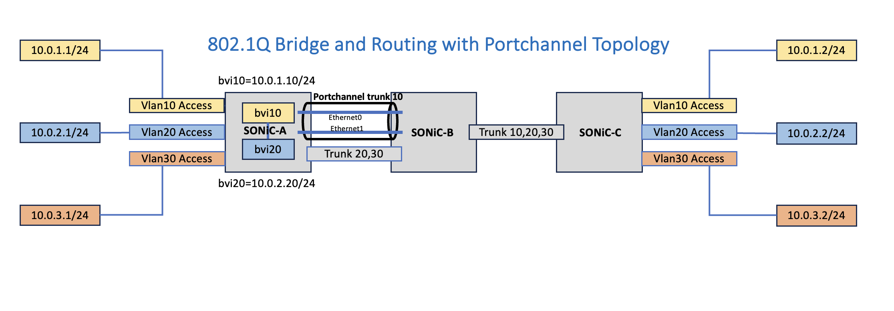

# SONIC VPP LAG Support
Rev v0.2

<br/>
<br/>

## Table of Contents

1. [Revisions](#item-1)
2. [Scope](#item-2)
3. [Definitions/Abbreviations](#item-3)
4. [Introduction](#item-4)
5. [LAG and Bridging](#item-5)
6. [LACP Support](#item-6)
7. [LAG L3 Support](#item-7)
8. [LAG Subinterface](#item-8)
9. [Status](#item-9)

<br/>
<br/>

<a id="item-1"></a>
## Revisions

| Rev | Date | Author(s) | Changes |
|-----|------|-----------|---------|
|v0.1 | 25/02/2024 | Bendrapu Balareddy (Cisco), Sameer Nanajkar (Cisco) | LAG & Bridging Support |
|v0.2 | 17/12/2024 | Akeel Ali (Cisco) | LACP & L3 Support |
|v0.3 | 25/05/2026 | Bojun Feng, Lun Yue (Microsoft) | LAG Subinterface — basic sub-port path |


<br/>
<br/>

<a id="item-2"></a>
## Scope
This document describes the high level design of integrating LAG between SONIC and VPP. It covers:
 - LAG and 802.1Q bridging
 - LACP
 - LAG L3 (PortChannel with IP)
 - LAG Subinterface (PortChannel\<id\>.\<vlan\>)

<br/>

<a id="item-3"></a>
## Definitions/Abbreviations
**VPP**: Vector Packet Processing (VPP) technology based high performance packet processing stack that can run on commodity CPUs. For more details see [What is VPP](https://wiki.fd.io/view/VPP/What_is_VPP%3F)

**LAG**:  Ling Aggregation Group


<br/>
<br/>

<a id="item-4"></a>
## Introduction
LAG functionality is supported in SONiC with port channel interfaces. 
VPP port channel supports modes as active-standby, active-active or LACP mode. But SONiC does not have a way program
this through configuration. Hence the portchannel mode as default active-active by giving ROUND_ROBIN value. Similarly
VPP supports different load balancing algorithms for distributing the traffic in active-active mode. But again SONIC
does not support a way to configure any load balancing algorithm, hence it's programmed as BOND_API_LB_ALGO_L2 by default.

Some parameters the SONIC supports are not supported by VPP. The attributes like min-links for portchannel group, fast-rate
etc are not supported by VPP.


 
<a id="item-5"></a>
## LAG and Bridging
 

SONiC supports port channel interfaces. These interfaces can be configured for layer routing or as members of a vlan
 - Access port
   config vlan member add -u <portname> creates an un tagged bridge port. This will be translated to vpp in two steps
   1. creates a bridge with given vlan id as bridge id if the bridge with given id doesnot exist.
   2. set the port as member of bridge with appropriate tag rewrite
 - Trunk port
   config vlan member add  <portname> creates a tagged port bridge port. This will be translated to vpp in three steps
   1. creates a bridge with given vlan id as bridge id if the bridge with given aid does not exist.
   2. vpp trunk port operation is achieved through vlan subinterface. A subinterface is created for this vlan id. Note
      that this subinterface is only specific to vpp and does not appear in SONiC control plane data bases.
   3. set the vlan subinterface as bridge port

<a id="item-6"></a>
## LACP Support

Initially, the PortChannel was reported down because the LACP packets generated by SONiC were dropped by VPP and not forwarded to the peer.
This section explores how LACP was implemented in SONiC-VPP.
<br/>
<br/>
Both SONiC and VPP can run LACP. If we choose to run LACP in VPP, the PortChannel interface in SONiC will not be reported up.
Instead, we need to let SONiC run LACP and instruct VPP to carry SONiC's LACP packets without generating or consuming them.

To achieve this, we can use the VPP [linux-cp plugin](https://s3-docs.fd.io/vpp/22.06/developer/plugins/lcp.html) to create a connection between the member tap interfaces (on host) and the corresponding VPP phy interface.

However, the linux-cp plugin did not support LACP packets.
Support was added to the VPP plugin as part of this project to allow for punting and injecting packets of any ethertype (including LACP).
See this Gerrit for details of the change:  https://gerrit.fd.io/r/c/vpp/+/42124

Note that that the lacp plugin should not be enabled, nor should we configure the BondEthernet in lacp mode to ensure VPP does not run its own LACP protocol. Instead, we configure the BondEthernet in `VPP_BOND_API_MODE_XOR` so that we can use the loadbalancing algorithms (`VPP_BOND_API_LB_ALGO_L23` or `VPP_BOND_API_LB_ALGO_L34`).

<a id="item-7"></a>
## LAG L3 Support

### Configuring IP
Adding an ip address to a PortChannel was not originally supported.
This is the SAI update we get for applying an address:

    2024-11-27.22:47:22.421304|c|SAI_OBJECT_TYPE_ROUTE_ENTRY:{"dest":"10.0.1.1/32","switch_id":"oid:0x21000000000000","vr":"oid:0x3000000000022"}|SAI_ROUTE_ENTRY_ATTR_PACKET_ACTION=SAI_PACKET_ACTION_FORWARD|SAI_ROUTE_ENTRY_ATTR_NEXT_HOP_ID=oid:0x1000000000001

The SONiC-VPP SAI code which handles this call (`vpp_add_del_intf_ip_addr_norif`) uses the `ip` command's output to derive the interface to which this address belongs as there is no indication of the interface in the SAI update (we get the CPU port id, which is common for all). For a PortChannel, we can derive the PortChannelX name in the same way, but we won't know the VPP BondEthernetY associated with it so that we can configure the IP in VPP (X and Y are not equal). When the LAG is created, we don't get any attributes with the SAI call, ie. we don't even get the PortChannelX name. This presents a challenge in applying the IP address based on the current design.

To resolve this, code was added to detect which PortChannelX we are dealing with during LAG create (also using the `ip` command, by scanning for the newly added PortChannel in the output). We then make sure the BondEthernet is created with the same bond_id (ie. set X=Y). This way, we can easily derive the BondEthernet in question from the PortChannel when applying the IP address to VPP in `vpp_add_del_intf_ip_addr_norif`.

### Ping

ARP resolution was failing as the ARP packets were not punted to SONiC. They are received on the member interface in VPP, processed as part of the BondEthernet in bond-input, and not punted as no linux-cp pair exists for the bond interface

As such, we need to call `configure_lcp_pair` for the BondEthernet interface to create a tap interface to which the ARP packets are punted. There are two issues here:

1. This call needs to be done after the first member is added to ensure the mac address of the tap interface matches that of the BondEthernet & member interfaces.

2. While other interfaces in SONiC are actually tap interfaces themselves (eg. the Ethernet interfaces), the PortChannel is not a tap interface and is already created by teamd before the SAI call. Attempting to delete it and delegating its creation (as a tap) to the lcp plugin (as it is done for a Loopback interface) does not work for a PortChannel as there is state maintained based on the original intf index elsewhere in the system. 

To resolve (1), we defer calling `configure_lcp_pair` until the first member is added, and then delete the pair when the LAG itself is deleted

Addressing (2) is a little more complicated. The solution that worked is to use the Traffic Control (tc) utility in the syncd container to create a filter and redirect packets from the tap interface to the PortChannel. This resolves the ARP entry and ping. 

```
tc qdisc add dev <bond-tap-interface> ingress
tc filter add dev <bond-tap-interface> parent ffff: \
   protocol arp prio 2 u32 \
   match u32 0 0 flowid 1:1 \
   action mirred ingress redirect dev <port-channel-interface>
```


<a id="item-8"></a>
## LAG Subinterface

PortChannel subinterfaces are tagged L3 interfaces on top of a LAG (`PortChannel<id>.<vlan>`), used for example by the t1-lag topology where every LAG carries multiple `/30` peering subnets, one per VLAN.

A LAG subinterface has three coupled names that must stay consistent: `PortChannel<id>.<vlan>` (the SONiC L3 kernel netdev that teamd creates and that the IP lives on), `BondEthernet<id>.<vlan>` (the VPP sub-interface on the bond), and `be<id>.<vlan>` (the LCP host, a VLAN child of the dummy tap `be<id>`). On `SAI_ROUTER_INTERFACE_TYPE_SUB_PORT` create, `vpp_get_hwif_name` must return `BondEthernet<id>.<vlan>`; returning the parent bond name causes every subsequent SAI call on the sub-interface (IP add, neighbor add, delete) to operate on the wrong VPP object.

### Plumbing

For a non-LAG sub-port (`Ethernet0.10`) the LCP host can simply be the SONiC L3 netdev itself, because it sits on top of the VPP-created tap `tap4096`. That does not work for a LAG sub-port: `PortChannel<id>.<vlan>` is a teamd VLAN child, not a VPP tap, and VPP linux-cp can only punt to a kernel netdev backed by a VPP tap.

The design pairs the VPP sub-interface with `be<id>.<vlan>` (a VLAN child of the dummy tap `be<id>` that already exists for the parent LAG), and then bridges that LCP host to the SONiC L3 netdev `PortChannel<id>.<vlan>` with a bidirectional `tc mirred` redirect. The ingress redirect (`be<id>.<vlan>` → `PortChannel<id>.<vlan>`) carries VPP-punted ARP/ICMP frames to the netdev that holds the IP, so the kernel handles them normally. The egress redirect (`PortChannel<id>.<vlan>` → `be<id>.<vlan>`) carries kernel-originated frames into VPP via the LCP tap, where the linux-cp cross-connect forwards them to `BondEthernet<id>.<vlan>`. Both directions are mandatory: a one-direction-only bridge silently breaks LAG sub-port ping, and failure of either direction rolls back the LCP pair and VPP sub-interface so the SAI RIF create fails cleanly.

`lcp-auto-subint` is disabled in `startup.conf.tmpl` so sairedis owns sub-port LCP pair creation end-to-end — the pair and the tc bridge go in together as part of one SAI RIF create. Leaving it enabled lets VPP create the pair on `create_subif` before the tc bridge is in place, leaving ARP replies VPP punts to `be<id>.<vlan>` with no path to `PortChannel<id>.<vlan>` (where the IP lives); the kernel ARP table on `PortChannel<id>.<vlan>` stays empty and `addNeighbor` for sub-port-over-LAG fails (the original "Bug 6: LAG sub-port 0/8 addNeighbor").

### RIF IP and ARP

The RIF IP is programmed by the same `vpp_add_del_intf_ip_addr_norif` flow used for PortChannel L3 ([Configuring IP](#item-7)), extended to recognise `BondEthernet<id>.<vlan>` names so the IP lands on the sub-interface rather than on the parent bond. VPP returns `ADDRESS_IN_USE (-105)` when orchagent re-issues the same IP add on `config reload` or on transient connected-route remove/add cycles; the handler treats `-105` as success on add, and the transient remove path no longer clears VPP's RIF IP, so a single `config reload` does not permanently lose sub-interface IP state.

The kernel ignores unsolicited ARP replies on a sub-port netdev by default (`arp_accept = 0`), which would otherwise break the VPP → kernel population path on the LCP host. `vslib/vpp` sets `net.ipv4.conf.<sub-port-netdev>.arp_accept = 1` on RIF create, and pre-warms the VPP neighbor table on RIF IP add so the first packet does not have to wait for resolution.

### Known limitations

DUT-originated ARP on a LAG sub-port can still fail to install a neighbor into the VPP sub-interface RIF in a small number of PTF cases that depend on DUT-initiated traffic (i.e. where no prior ingress packet seeds the kernel ARP table). Non-LAG (`port`) sub-port equivalents do not exhibit the same failure pattern, which suggests the issue lies in the LAG-specific plumbing — most likely somewhere along the bidirectional `tc mirred` bridge or the kernel → VPP propagation that sits on top of it. A diagnostic pass and targeted fix will be tracked in a follow-up PR.

<br/>
<br/>


<a id="item-9"></a>
## Status


Item | Done | Remaining
--- | --- | ---
LACP punt/inject support in VPP | Merged in VPP https://gerrit.fd.io/r/c/vpp/+/42124  |
Add IP to PortChannel | Coded solution using `ip` command to detect newly added PortChannel and create BondEthernet with same id | <li>Complete review and commit</li>
Ping between PortChannels | Coded solution using `tc` utility to redirect traffic between tap and Sonic intf | <li>(Future) Explore alternative design using common punt port (Potentially larger project)</li>
Testing | Bring-up, ping of PortChannel with 2 members, add/remove members, v4/v6/multiple-members, multiple-portchannels, L2 traffic |
Sonic-mgmt t1-28-lag testing | Brought-up t1-28-lag TOPO. Ran LAG tests | <li> Debug and fix failing LAG TCs </li>
Hashing algo selection | Coded using XOR & L3L4 | (Optional, TBD) Ability to switchover between L2L3 and L3L4 depending on presence of IP (or other scheme)
(T0-lag) PortChannel Subinterfaces | <li>Hwif naming `BondEthernet<id>.<vlan>`</li><li>Explicit LCP pair `BondEthernet<id>.<vlan>` ↔ `be<id>.<vlan>` plus bidirectional `tc mirred` bridge `be<id>.<vlan>` ↔ `PortChannel<id>.<vlan>` (with `lcp-auto-subint=disabled` so sairedis is the sole producer of the pair)</li><li>RIF IP programming on VPP sub-interface, idempotent on `-105`, preserved across transient remove cycles</li><li>`arp_accept=1` and VPP neighbor pre-warm on sub-port RIF create</li><li>PTF `t1-lag-vpp`: basic `[port_in_lag]` sub-port routing PASS</li> | <li>DUT-originated ARP on LAG sub-port can still fail to install reply in sub-interface RIF — affects a few cross-port / balancing PTF cases; follow-up to diagnose where in the tc bridge / kernel → VPP propagation the ARP is lost</li><li>SVI variants (sonic-buildimage #26936) and IPinIP tunneling (sairedis #1860) — separate features</li>


## References

[SONiC system architecture](https://github.com/sonic-net/SONiC/wiki/Architecture)\
[What is VPP](https://s3-docs.fd.io/vpp/23.06/)

