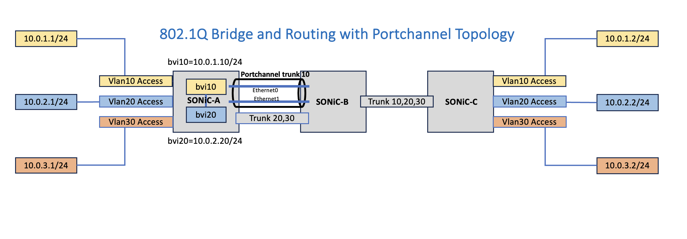

# LAG 8021q bridging Test



SONiC-A connections
```
Host1-10.0.1.1/24--Ethernet0|-bvi10-10.0.1.10/24-|PortChannel10-trunk1 vlan 10 [members-Ethernet4,5]
Host2-10.0.2.1/24--Ethernet1|-bvi20-10.0.2.20/24-| Ethernet3-trunk vlan20
Host3-10.0.3.1/24--Ethernet2|------SONiC-A-------| Ethernet3-trunk vlan30
```


SONiC-B connections
```
 PortChannel10-trunk1 vlan 10 [members-Ethernet2,3] |SONiC-B|Ethernet1 trunk2 vlan 10
                            Ethernet0-trunk vlan20] |SONiC-B|Ethernet1 trunk2 vlan 20
                            Ethernet0-trunk  vlan30 |SONiC-B|Ethernet1 trunk2 vlan 30
```

SONiC-C connections
```
Ethernet3 trunk2 vlan 10|SONIC-C|Ethernet0-------|Host4-10.0.1.2/24
Ethernet3 trunk2 vlan 20|SONIC-C|Ethernet1-------|Host5-10.0.2.2/24
Ethernet3 trunk2 vlan 30|SONiC-C|Ethernet2-------|Host6-10.0.3.2/24
```

Pre-requisites for testing

Make sure the docker is installed on the Linux system. iproute2 and sudo packages should be installed.
    
Load container images
```
docker load < docker-sonic-vpp.gz
```

Check if images are listed 
```
docker images | grep "sonic-vpp\|pause"
```

Get the script to create and run the sonic container from the sonic-platform-vpp repo if you have not cloned the repo.
```
wget https://raw.githubusercontent.com/sonic-net/sonic-platform-vpp/main/start_sonic_vpp.sh 
```
Set the execute bits of the downloaded script file
```
chmod +x start_sonic_vpp.sh

```
Else if you have already cloned the sonic-platform-repo you can copy the script to the local directory and use it.

On the host create veth interface pairs for vpp and host 

```
sudo ip link add name veth_ac1 type veth peer name ac1
sudo ip link add name veth_ac2 type veth peer name ac2
sudo ip link add name veth_ac3 type veth peer name ac3
sudo ip link add name veth_ac4 type veth peer name ac4
sudo ip link add name veth_ac5 type veth peer name ac5
sudo ip link add name veth_ac6 type veth peer name ac6
sudo ip link add name veth_pc_member1 type veth peer name pc_member1
sudo ip link add name veth_pc_member2 type veth peer name pc_member2
sudo ip link add name veth_trunk1 type veth peer name trunk1
sudo ip link add name veth_trunk2 type veth peer name trunk2

```

Create network namespace for end hosts and inject one end of veth pair

```
sudo ip netns add host-1.0
sudo ip netns add host-2.0
sudo ip netns add host-3.0
sudo ip netns add host-4.0
sudo ip netns add host-5.0
sudo ip netns add host-6.0
sudo ip link set dev veth_ac1 netns host-1.0
sudo ip link set dev veth_ac2 netns host-2.0
sudo ip link set dev veth_ac3 netns host-3.0
sudo ip link set dev veth_ac4 netns host-4.0
sudo ip link set dev veth_ac5 netns host-5.0
sudo ip link set dev veth_ac6 netns host-6.0
```

Configure IP addresses inside the host net namepaces

```
sudo ip netns exec host-1.0 bash
ip link set dev veth_ac1 up
ip addr add 10.0.1.1/24 dev veth_ac1
ip addr add fd12:3456:789a:1::2/64 dev veth_ac1
ip route add 10.0.2.0/24 via 10.0.1.10
ip address show
ip route show
exit

sudo ip netns exec host-2.0 bash
ip link set dev veth_ac2 up
ip addr add 10.0.2.1/24 dev veth_ac2
ip addr add fd12:3456:789a:2::2/64 dev veth_ac2
ip route add 10.0.1.0/24 via 10.0.2.20
ip address show
ip route show
exit

sudo ip netns exec host-3.0 bash
ip link set dev veth_ac3 up
ip addr add 10.0.3.1/24 dev veth_ac3
ip addr add fd12:3456:789a:3::2/64 dev veth_ac3
ip address show
ip route show
exit

sudo ip netns exec host-4.0 bash
ip link set dev veth_ac4 up
ip addr add 10.0.1.2/24 dev veth_ac4
ip addr add fd12:3456:789a:1::3/64 dev veth_ac4
ip route add 10.0.2.0/24 via 10.0.1.10
ip address show
ip route show
exit

sudo ip netns exec host-5.0 bash
ip link set dev veth_ac5 up
ip addr add 10.0.2.2/24 dev veth_ac5
ip addr add fd12:3456:789a:2::3/64 dev veth_ac5
ip route add 10.0.1.0/24 via 10.0.2.20
ip address show
ip route show
exit

sudo ip netns exec host-6.0 bash
ip link set dev veth_ac6 up
ip addr add 10.0.3.2/24 dev veth_ac6
ip addr add fd12:3456:789a:3::3/64 dev veth_ac6
ip address show
ip route show
exit
```

Now start the sonic container and pass the veth interfaces to sonic-vpp
```
sudo ./start_sonic_vpp.sh start -n SONIC-A -i ac1,ac2,ac3,trunk1,pc_member1,pc_member2
```

start the second sonic container and pass the veth interfaces to sonic-vpp
```
sudo ./start_sonic_vpp.sh start -n SONIC-B -i veth_trunk1,veth_trunk2,veth_pc_member1,veth_pc_member2
```

start the third sonic container and pass the veth interfaces to sonic-vpp
```
sudo ./start_sonic_vpp.sh start -n SONIC-C -i ac4,ac5,ac6,trunk2
```

Get into SONIC-A container and configure vlan and vlan bridging

SONIC-A:
```
docker exec -it SONIC-A /bin/bash
show interface status
config interface startup Ethernet0
config interface startup Ethernet1
config interface startup Ethernet2
config interface startup Ethernet3
config interface startup Ethernet4
config interface startup Ethernet5

config portchannel add PortChannel10
config portchannel member add PortChannel10 Ethernet4
config portchannel member add PortChannel10 Ethernet5

config vlan add 10
config vlan member add -u 10 Ethernet0
config vlan member add  10 PortChannel10

config vlan add 20
config vlan member add -u 20 Ethernet1
config vlan member add  20 Ethernet3

config vlan add 30
config vlan member add -u 30 Ethernet2
config vlan member add  30 Ethernet3

config interface ip add Vlan10 10.0.1.10/24
config interface ip add Vlan20 10.0.2.20/24
```

Get into SONIC-B container and configure vlan, vlan bridging

SONIC-B:
```
docker exec -it SONIC-B /bin/bash
show interface status
config interface startup Ethernet0
config interface startup Ethernet1
config interface startup Ethernet2
config interface startup Ethernet3

config portchannel add PortChannel10
config portchannel member add PortChannel10 Ethernet2
config portchannel member add PortChannel10 Ethernet3

config vlan add 10
config vlan member add 10 PortChannel10
config vlan member add 10 Ethernet1

config vlan add 20
config vlan member add 20 Ethernet0
config vlan member add 20 Ethernet1

config vlan add 30
config vlan member add 30 Ethernet0
config vlan member add 30 Ethernet1
```

Get into SONIC-C container and configure vlan, vlan bridging

SONIC-C:
```
docker exec -it SONIC-C /bin/bash
show interface status
config interface startup Ethernet0
config interface startup Ethernet1
config interface startup Ethernet2
config interface startup Ethernet3

config vlan add 10
config vlan member add -u 10 Ethernet0
config vlan member add  10 Ethernet3

config vlan add 20
config vlan member add -u 20 Ethernet1
config vlan member add  20 Ethernet3

config vlan add 30
config vlan member add -u 30 Ethernet2
config vlan member add  30 Ethernet3
```

Test the SONiC vlan briding function across 3 VLAN bridge domains

```
sudo ip netns exec host-1.0 bash
ping -c5  10.0.1.2 -- same bridge domain
ping -c5  10.0.2.1 -- route to different bridge domain
ping -c5  10.0.2.2 -- route to different bridge domain
ping -c5  10.0.3.1 -- ping fails
ping -c5  10.0.3.2 -- ping fails
exit

sudo ip netns exec host-2.0 bash
ping -c5  10.0.2.2 -- same bridge domain
ping -c5  10.0.1.1 -- route to different bridge domain
ping -c5  10.0.1.2 -- route to different bridge domain
ping -c5  10.0.3.1 -- ping fails as no routing for this
ping -c5  10.0.3.2 -- ping fail as no routing for this
exit

sudo ip netns exec host-3.0 bash
ping -c5  10.0.3.2
ping6 fd12:3456:789a:3::3 -c 5
ping -c5  10.0.1.1 -- ping fails as no routing for this
ping -c5  10.0.1.2 -- ping fails as no routing for this
ping -c5  10.0.2.1 -- ping fails as no routing for this
ping -c5  10.0.2.2 -- ping fails as no routing for this
exit

sudo ip netns exec host-4.0 bash
ping -c5  10.0.1.1
ping -c5  10.0.2.1 -- route to different bridge domain
ping -c5  10.0.2.2 -- route to different bridge domain
ping -c5  10.0.3.1 -- ping fails as no routing for this
ping -c5  10.0.3.2 -- ping fails as no routing for this
exit

sudo ip netns exec host-5.0 bash
ping -c5  10.0.2.1
ping -c5  10.0.1.1 -- route to different bridge domain
ping -c5  10.0.1.2 -- route to different bridge domain
ping -c5  10.0.3.1 -- ping fails as no routing for this
ping -c5  10.0.3.2 -- ping fails as no routing for this
exit

sudo ip netns exec host-6.0 bash
ping -c5  10.0.3.1
ping6 -c5 fd12:3456:789a:3::3
ping -c5  10.0.1.1 -- ping fails as no routing for this
ping -c5  10.0.1.2 -- ping fails as no routing for this
ping -c5  10.0.2.1 -- ping fails as no routing for this
ping -c5  10.0.2.2 -- ping fails as no routing for this
exit

```

You should see the ping reachability from host1 to host4, host2 to host5 and host3 to host6. 

Use below command to stop the sonic-vpp containers
```
sudo ./start_sonic_vpp.sh stop -n sonic-br1
sudo ./start_sonic_vpp.sh stop -n sonic-br2
sudo ./start_sonic_vpp.sh stop -n sonic-br3
```

Show command outputs sonic-br1
```
show interface status
```
```
  Interface        Lanes    Speed    MTU    FEC          Alias    Vlan    Oper    Admin    Type    Asym PFC
  +--------------------------------------------------------------------------------------------------------+
  Ethernet0  25,26,27,28     100G   9100    N/A   fortyGigE0/0  routed      up     down     N/A         N/A
  Ethernet1  29,30,31,32     100G   9100    N/A   fortyGigE0/4  routed      up     down     N/A         N/A
  Ethernet2  33,34,35,36     100G   9100    N/A   fortyGigE0/8  routed      up     down     N/A         N/A
  Ethernet3  37,38,39,40     100G   9100    N/A  fortyGigE0/12  routed      up     down     N/A         N/A
  Ethernet4  45,46,47,48     100G   9100    N/A  fortyGigE0/16  routed      up     down     N/A         N/A
  Ethernet5  41,42,43,44     100G   9100    N/A  fortyGigE0/20  routed      up     down     N/A         N/A
```
```
show vlan brief
```
```
+-----------+--------------+---------------+----------------+-------------+
|   VLAN ID | IP Address   | Ports         | Port Tagging   | Proxy ARP   |
+===========+==============+===============+================+=============+
|        10 | 10.0.1.10/24 | Ethernet0     | untagged       | disabled    |
|           |              | PortChannel10 | tagged         |             |
+-----------+--------------+---------------+----------------+-------------+
|        20 | 10.0.2.20/24 | Ethernet1     | untagged       | disabled    |
|           |              | Ethernet3     | tagged         |             |
+-----------+--------------+---------------+----------------+-------------+
|        30 |              | Ethernet2     | untagged       | disabled    |
|           |              | Ethernet3     | tagged         |             |
+-----------+--------------+---------------+----------------+-------------+
```
```
show vlan config
```
```
Name      VID  Member     Mode
------  -----  ---------  --------
Vlan10     10  Ethernet0      untagged
Vlan10     10  PortChannel10  tagged
Vlan20     20  Ethernet1      untagged
Vlan20     20  Ethernet3      tagged
Vlan30     30  Ethernet2      untagged
Vlan30     30  Ethernet3      tagged
```
```
vppctl show bridge
```
```
  BD-ID   Index   BSN  Age(min)  Learning  U-Forwrd   UU-Flood   Flooding  ARP-Term  arp-ufwd Learn-co Learn-li   BVI-Intf 
   10       1      0     off        on        on       flood        on       off       off        0    16777216     N/A    
   20       2      0     off        on        on       flood        on       off       off        0    16777216     N/A    
   30       3      0     off        on        on       flood        on       off       off        1    16777216     N/A    
```
```
vppctl show bridge 10 detail
```
```
  BD-ID   Index   BSN  Age(min)  Learning  U-Forwrd   UU-Flood   Flooding  ARP-Term  arp-ufwd Learn-co Learn-li   BVI-Intf 
   10       1      0     off        on        on       flood        on        on       off        0    16777216    bvi10   
span-l2-input l2-input-classify l2-input-feat-arc l2-policer-classify l2-input-acl vpath-input-l2 l2-ip-qos-record l2-input-vtr l2-learn l2-rw l2-fwd l2-flood arp-term-l2bd l2-flood l2-output 

           Interface           If-idx ISN  SHG  BVI  TxFlood        VLAN-Tag-Rewrite       
             bvi10               19    1    0    *      *            push-1 dot1q 10       
           host-ac1              1     1    0    -      *            push-1 dot1q 10       
       BondEthernet0.10          14    1    0    -      *                 none             

  IP4/IP6 to MAC table for ARP Termination
```
```
vppctl show bridge 20 detail
```
```
  BD-ID   Index   BSN  Age(min)  Learning  U-Forwrd   UU-Flood   Flooding  ARP-Term  arp-ufwd Learn-co Learn-li   BVI-Intf 
   20       2      0     off        on        on       flood        on        on       off        0    16777216    bvi20   
span-l2-input l2-input-classify l2-input-feat-arc l2-policer-classify l2-input-acl vpath-input-l2 l2-ip-qos-record l2-input-vtr l2-learn l2-rw l2-fwd l2-flood arp-term-l2bd l2-flood l2-output 

           Interface           If-idx ISN  SHG  BVI  TxFlood        VLAN-Tag-Rewrite       
             bvi20               20    1    0    *      *            push-1 dot1q 20       
           host-ac2              2     1    0    -      *            push-1 dot1q 20       
        host-trunk1.20           15    1    0    -      *                 none             

  IP4/IP6 to MAC table for ARP Termination
```
```
vppctl show bridge 30 detail
```
```
  BD-ID   Index   BSN  Age(min)  Learning  U-Forwrd   UU-Flood   Flooding  ARP-Term  arp-ufwd Learn-co Learn-li   BVI-Intf 
   30       3      0     off        on        on       flood        on       off       off        0    16777216     N/A    
span-l2-input l2-input-classify l2-input-feat-arc l2-policer-classify l2-input-acl vpath-input-l2 l2-ip-qos-record l2-input-vtr l2-learn l2-rw l2-fwd l2-flood l2-flood l2-output 

           Interface           If-idx ISN  SHG  BVI  TxFlood        VLAN-Tag-Rewrite       
           host-ac3              3     1    0    -      *            push-1 dot1q 30       
        host-trunk1.30           17    1    0    -      *                 none             
```
```
vppctl show ip4 neighbors
```
```

    Time                       IP                    Flags      Ethernet              Interface       
  17703.4524                10.0.1.2                   D    52:84:76:96:2c:b7 bvi10
  17717.2684                10.0.1.1                   D    6e:21:47:49:58:49 bvi10
  17693.9802                10.0.2.1                   D    da:9c:93:33:db:af bvi20
  17717.0202                10.0.2.2                   D    7e:ef:f5:5c:0f:2a bvi20
```
```
vppctl show interfaces
```
```
              Name               Idx    State  MTU (L3/IP4/IP6/MPLS)     Counter          Count     
BondEthernet0                     13     up          9000/0/0/0     
BondEthernet0.10                  14     up           0/0/0/0       
bvi10                             19     up          9000/0/0/0     
bvi20                             20     up          9000/0/0/0     
host-ac1                          1      up          9122/0/0/0     
host-ac2                          2      up          9122/0/0/0     
host-ac3                          3      up          9122/0/0/0     
host-pc_member1                   5      up          9122/0/0/0     
host-pc_member2                   6      up          9122/0/0/0     
host-trunk1                       4      up          9122/0/0/0     
host-trunk1.20                    15     up           0/0/0/0       
host-trunk1.30                    17     up           0/0/0/0       
local0                            0     down          0/0/0/0       
tap1                              8      up          9000/0/0/0     
tap2                              7      up          9000/0/0/0     
tap3                              9      up          9000/0/0/0     
tap4                              10     up          9000/0/0/0     
tap4.20                           16     up           0/0/0/0       
tap4.30                           18     up           0/0/0/0       
tap5                              12     up          9000/0/0/0     
tap6                              11     up          9000/0/0/0     
```
```
ip addr show
```
```
60: Vlan10@Bridge: <BROADCAST,MULTICAST,UP,LOWER_UP> mtu 9100 qdisc noqueue state UP group default qlen 1000
    link/ether 02:42:ac:11:00:05 brd ff:ff:ff:ff:ff:ff
    inet 10.0.1.10/24 brd 10.0.1.255 scope global Vlan10
       valid_lft forever preferred_lft forever
    inet6 fd12:3456:789a:1::1/64 scope global
       valid_lft forever preferred_lft forever
    inet6 fe80::42:acff:fe11:5/64 scope link
       valid_lft forever preferred_lft forever
61: Vlan20@Bridge: <BROADCAST,MULTICAST,UP,LOWER_UP> mtu 9100 qdisc noqueue state UP group default qlen 1000
    link/ether 02:42:ac:11:00:05 brd ff:ff:ff:ff:ff:ff
    inet 10.0.2.20/24 brd 10.0.2.255 scope global Vlan20
       valid_lft forever preferred_lft forever
    inet6 fd12:3456:789a:2::1/64 scope global
       valid_lft forever preferred_lft forever
    inet6 fe80::42:acff:fe11:5/64 scope link
       valid_lft forever preferred_lft forever
```

```
vppctl show ip fib
```
```

ipv4-VRF:0, fib_index:0, flow hash:[src dst sport dport proto flowlabel ] epoch:0 flags:none locks:[adjacency:1, default-route:1, ]
0.0.0.0/0
  unicast-ip4-chain
  [@0]: dpo-load-balance: [proto:ip4 index:1 buckets:1 uRPF:0 to:[0:0]]
    [0] [@0]: dpo-drop ip4
0.0.0.0/32
  unicast-ip4-chain
  [@0]: dpo-load-balance: [proto:ip4 index:2 buckets:1 uRPF:1 to:[0:0]]
    [0] [@0]: dpo-drop ip4
10.0.1.0/32
  unicast-ip4-chain
  [@0]: dpo-load-balance: [proto:ip4 index:9 buckets:1 uRPF:9 to:[0:0]]
    [0] [@0]: dpo-drop ip4
10.0.1.1/32
  unicast-ip4-chain
  [@0]: dpo-load-balance: [proto:ip4 index:17 buckets:1 uRPF:20 to:[5:420]]
    [0] [@5]: ipv4 via 10.0.1.1 bvi10: mtu:9000 next:10 flags:[] 6e21474958490242ac1100050800
10.0.1.2/32
  unicast-ip4-chain
  [@0]: dpo-load-balance: [proto:ip4 index:19 buckets:1 uRPF:22 to:[1:84]]
    [0] [@5]: ipv4 via 10.0.1.2 bvi10: mtu:9000 next:10 flags:[] 528476962cb70242ac1100050800
10.0.1.0/24
  unicast-ip4-chain
  [@0]: dpo-load-balance: [proto:ip4 index:8 buckets:1 uRPF:8 to:[2:168]]
    [0] [@4]: ipv4-glean: [src:10.0.1.0/24] bvi10: mtu:9000 next:1 flags:[] ffffffffffff0242ac1100050806
10.0.1.10/32
  unicast-ip4-chain
  [@0]: dpo-load-balance: [proto:ip4 index:11 buckets:1 uRPF:13 to:[0:0]]
    [0] [@12]: dpo-receive: 10.0.1.10 on bvi10
10.0.1.255/32
  unicast-ip4-chain
  [@0]: dpo-load-balance: [proto:ip4 index:10 buckets:1 uRPF:11 to:[0:0]]
    [0] [@0]: dpo-drop ip4
10.0.2.0/32
  unicast-ip4-chain
  [@0]: dpo-load-balance: [proto:ip4 index:13 buckets:1 uRPF:15 to:[0:0]]
    [0] [@0]: dpo-drop ip4
10.0.2.1/32
  unicast-ip4-chain
  [@0]: dpo-load-balance: [proto:ip4 index:18 buckets:1 uRPF:21 to:[1:84]]
    [0] [@5]: ipv4 via 10.0.2.1 bvi20: mtu:9000 next:9 flags:[] da9c9333dbaf0242ac1100050800
10.0.2.2/32
  unicast-ip4-chain
  [@0]: dpo-load-balance: [proto:ip4 index:16 buckets:1 uRPF:18 to:[6:504]]
    [0] [@5]: ipv4 via 10.0.2.2 bvi20: mtu:9000 next:9 flags:[] 7eeff55c0f2a0242ac1100050800
10.0.2.0/24
  unicast-ip4-chain
  [@0]: dpo-load-balance: [proto:ip4 index:12 buckets:1 uRPF:14 to:[2:168]]
    [0] [@4]: ipv4-glean: [src:10.0.2.0/24] bvi20: mtu:9000 next:2 flags:[] ffffffffffff0242ac1100050806
10.0.2.20/32
  unicast-ip4-chain
  [@0]: dpo-load-balance: [proto:ip4 index:15 buckets:1 uRPF:19 to:[0:0]]
    [0] [@12]: dpo-receive: 10.0.2.20 on bvi20
10.0.2.255/32
  unicast-ip4-chain
  [@0]: dpo-load-balance: [proto:ip4 index:14 buckets:1 uRPF:17 to:[0:0]]
    [0] [@0]: dpo-drop ip4
224.0.0.0/4
  unicast-ip4-chain
  [@0]: dpo-load-balance: [proto:ip4 index:4 buckets:1 uRPF:3 to:[0:0]]
    [0] [@0]: dpo-drop ip4
240.0.0.0/4
  unicast-ip4-chain
  [@0]: dpo-load-balance: [proto:ip4 index:3 buckets:1 uRPF:2 to:[0:0]]
    [0] [@0]: dpo-drop ip4
255.255.255.255/32
  unicast-ip4-chain
  [@0]: dpo-load-balance: [proto:ip4 index:5 buckets:1 uRPF:4 to:[0:0]]
    [0] [@0]: dpo-drop ip4
```

```
check the connectivity on portchannel interface

ping 10.0.1.2
PING 10.0.1.2 (10.0.1.2) 56(84) bytes of data.
64 bytes from 10.0.1.2: icmp_seq=1 ttl=64 time=27.7 ms
64 bytes from 10.0.1.2: icmp_seq=2 ttl=64 time=41.6 ms

check the packets on portchannel member interfaces

shutdown one member interface of portchannel, verify the connectivity still fine and verify portchannel member counters
shutdown second member interface of portchannel, verify the connectivity is lost  and verify portchannel member counters
bring up second member interface of portchannel back, verify the connectivity is restored and verify portchannel member counters
bring up other member interface of portchannel back, verify the connectivity is restored and verify portchannel member counters
```
Verification of packet on VPP data plane for vlan tagging
Start the ping and then do show trace

```
vppctl
trace add af-packet-input 10
show trace
```
