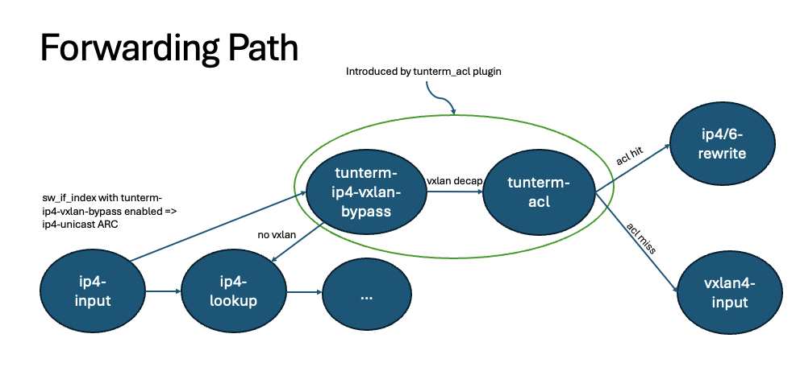

=======================
Tunterm ACL Plugin README
=======================

Overview
--------
The Tunterm ACL plugin is a self-contained plugin that applies ACL after Tunnel Decapsulation.

It is currently designed to support a single specific use-case:

IPv4 VxLAN tunnel termination and classification based on inner DST IPv4/6 fields, followed by a redirect action using ip4/6-rewrite.

Plugin Structure
----------------
The Tunterm ACL plugin consists of the following main parts:

1. `tunterm_acl.api/tunterm_acl_api.c`: This file contains the tunterm-acl ACL API and handlers to setup and attach the classifier/sessions using an ACL-like API.

2. `tunterm_acl_node.c`: This file contains the tunterm-acl node that performs the classification and redirect logic. Please note that at this point, there are no performance considerations implemented.

3. `tunterm_acl_decap.c`: This file is a copy of the ip4-vxlan-bypass node, but instead of forwarding to vxlan4-input, it forwards to tunterm-acl.

4. `tunterm_acl_redirect.c`: This file is a copy of the ip-session-redirect functions, augmented with additional functionality required for the plugin.

5. `tunterm_acl_cli.c`: This file provides CLI capability, allowing you to see which interfaces have tunterm-acl enabled.

6. `test_tunterm_acl.py`: This file contains unit tests that cover various positive and negative use-cases.

Requirements
------------
In order to use the Tunterm ACL plugin, the `vxlan_main` structure from the `vxlan` plugin must be exported:

.. code-block:: c

	__clib_export vxlan_main_t vxlan_main;

Functionality
-------------
The plugin introduces the following nodes and functionality:

Generalization Considerations
-----------------------------
If there is a need to generalize the plugin, the following considerations and work-items should be addressed:

1. Modify vxlan bypass to allow for tunterm-acl insertion before vxlan4-input, while ensuring minimal impact on bypass performance.

2. Add support for additional tunnel types, as currently only v4-vxlan-bypass is supported.

3. Augment the ip-session-redirect plugin directly to support the added functionality and use it directly, instead of creating a copy.

4. Enhance the ACL fields and actions to support additional fields, permit/deny actions, and explore the possibility of using the classifier API instead of a custom node.

5. Implement performance considerations and enhancements to optimize the plugin's performance.

Please note that the above considerations are suggestions and may require further analysis and implementation.
