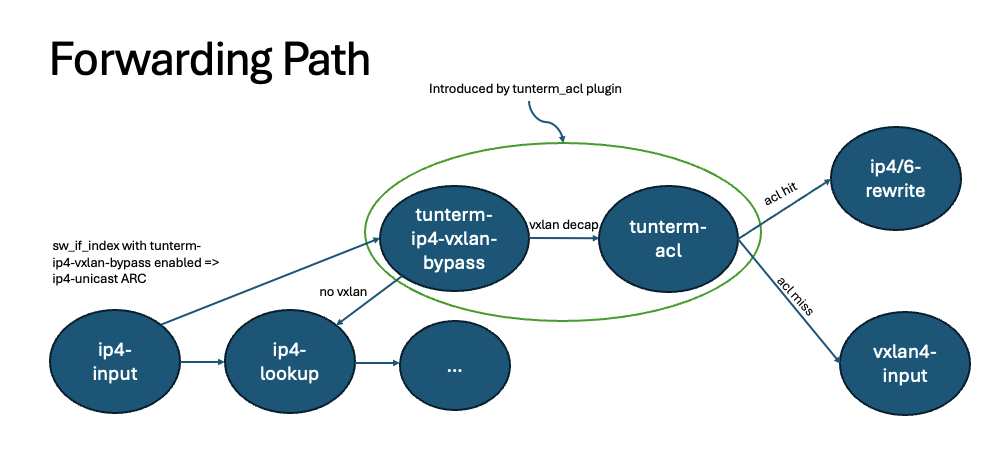

=======================
Tunterm ACL Plugin README
=======================

Overview
--------
The Tunterm ACL plugin is a self-contained plugin that applies ACL after Tunnel Decapsulation.

It is currently designed to support a single specific use-case:

IPv4 VxLAN tunnel termination and classification based on inner DST IPv4/6 fields, followed by a redirect action via a VPP FIB path.

Plugin API
----------
The Tunterm ACL plugin provides an API similar to the acl plugin API:

1. `tunterm_acl_add_replace`: Create or replace an existing tunterm acl in-place.

2. `tunterm_acl_del`: Delete a tunterm acl.

3. `tunterm_acl_interface_add_del`: Add/remove a tunterm acl index to/from an interface.

Plugin Structure
----------------
The Tunterm ACL plugin consists of the following main parts:

1. `tunterm_acl.api/tunterm_acl_api.c`: This file contains the tunterm-acl ACL API and handlers to setup and attach the classifier/sessions using an ACL-like API.

2. `tunterm_acl_node.c`: This file contains the tunterm-acl node that performs the classification and redirect logic. Please note that at this point, there are no performance considerations implemented.

3. `tunterm_acl_decap.c`: This file is a copy of the ip4-vxlan-bypass node, but instead of forwarding to vxlan4-input, it forwards to tunterm-acl.

4. `tunterm_acl_redirect.c`: This file is a copy of the ip-session-redirect functions, augmented with additional functionality required for the plugin.

5. `tunterm_acl_cli.c`: This file provides CLI capability, allowing you to see which interfaces have tunterm-acl enabled.

6. `test_tunterm_acl.py`: This file contains unit tests that cover various positive and negative use-cases.

Requirements
------------
In order to use the Tunterm ACL plugin, the `vxlan_main` structure from the `vxlan` plugin must be exported:

.. code-block:: c

	__clib_export vxlan_main_t vxlan_main;

Functionality
-------------
The plugin introduces the following nodes and functionality:

Enhancements
-----------------------------
Following are some enhancements that can be made to the plugin:

1. Add multi-path redirect support

2. Add multi-v4/v6 tunterm ACL support on a single interface

3. Add VPP performance optimizations to tunterm-acl node

4. Add v6 outer vxlan bypass support

5. Expose tunterm-acl stats via API
